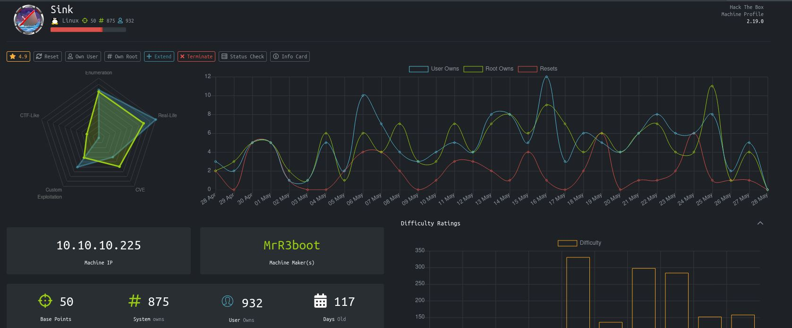

# Sink - HackTheBox
Linux, 50 Base Points, Insane

## Machine


 
## Sink Solution

### User 1

So let's start with ```nmap``` scanning:

```console
┌─[evyatar@parrot]─[/hackthebox/Sink]
└──╼ $ nmap -sC -sV -oA nmap/Sink 10.10.10.225
# Nmap 7.80 scan initiated Sun May 23 01:42:00 2021 as: nmap -sC -sV -oA nmap/Sink 10.10.10.225
Nmap scan report for 10.10.10.225
Host is up (0.21s latency).
Not shown: 899 closed ports, 100 filtered ports
PORT   STATE SERVICE VERSION
22/tcp open  ssh     OpenSSH 8.2p1 Ubuntu 4ubuntu0.1 (Ubuntu Linux; protocol 2.0)
Service Info: OS: Linux; CPE: cpe:/o:linux:linux_kernel

Service detection performed. Please report any incorrect results at https://nmap.org/submit/ .
# Nmap done at Sun May 23 01:43:08 2021 -- 1 IP address (1 host up) scanned in 68.01 seconds

```

## Sink is still active machine - [Full writeup](Sink-Writeup.pdf) avaliable with root hash password only.

Telegram: [@evyatar9](https://t.me/evyatar9)

Discord: [evyatar9](https://discordapp.com/users/812805349815091251)