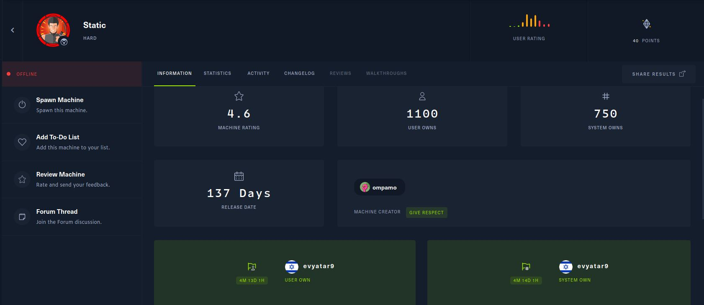

# Static - HackTheBox - Writeup
Linux, 40 Base Points, Hard

## Machine



## Static Solution

### User

Let's start with ```nmap``` scanning:

```console
┌─[evyatar@parrot]─[/hackthebox/Static]
└──╼ $ nmap -sV -sC -oA nmap/Static 10.10.10.246
Starting Nmap 7.80 ( https://nmap.org ) at 2021-10-30 22:11 IDT
Unable to split netmask from target expression: "nmap/Static"
Nmap scan report for 10.10.10.246
Host is up (0.19s latency).
Not shown: 997 filtered ports
PORT     STATE SERVICE VERSION
22/tcp   open  ssh     OpenSSH 7.9p1 Debian 10+deb10u2 (protocol 2.0)
| ssh-hostkey: 
|   2048 16:bb:a0:a1:20:b7:82:4d:d2:9f:35:52:f4:2e:6c:90 (RSA)
|   256 ca:ad:63:8f:30:ee:66:b1:37:9d:c5:eb:4d:44:d9:2b (ECDSA)
|_  256 2d:43:bc:4e:b3:33:c9:82:4e:de:b6:5e:10:ca:a7:c5 (ED25519)
2222/tcp open  ssh     OpenSSH 7.6p1 Ubuntu 4ubuntu0.3 (Ubuntu Linux; protocol 2.0)
| ssh-hostkey: 
|   2048 a9:a4:5c:e3:a9:05:54:b1:1c:ae:1b:b7:61:ac:76:d6 (RSA)
|   256 c9:58:53:93:b3:90:9e:a0:08:aa:48:be:5e:c4:0a:94 (ECDSA)
|_  256 c7:07:2b:07:43:4f:ab:c8:da:57:7f:ea:b5:50:21:bd (ED25519)
8080/tcp open  http    Apache httpd 2.4.38 ((Debian))
| http-robots.txt: 2 disallowed entries 
|_/vpn/ /.ftp_uploads/
|_http-server-header: Apache/2.4.38 (Debian)
|_http-title: Site doesn't have a title (text/html; charset=UTF-8).
Service Info: OS: Linux; CPE: cpe:/o:linux:linux_kernel

```

By observing port ```8080``` we get a blank page.

## Static is still active machine - [Full writeup](Static-Writeup.pdf) available with root hash password only.

Telegram: [@evyatar9](https://t.me/evyatar9)

Discord: [evyatar9](https://discordapp.com/users/812805349815091251)


