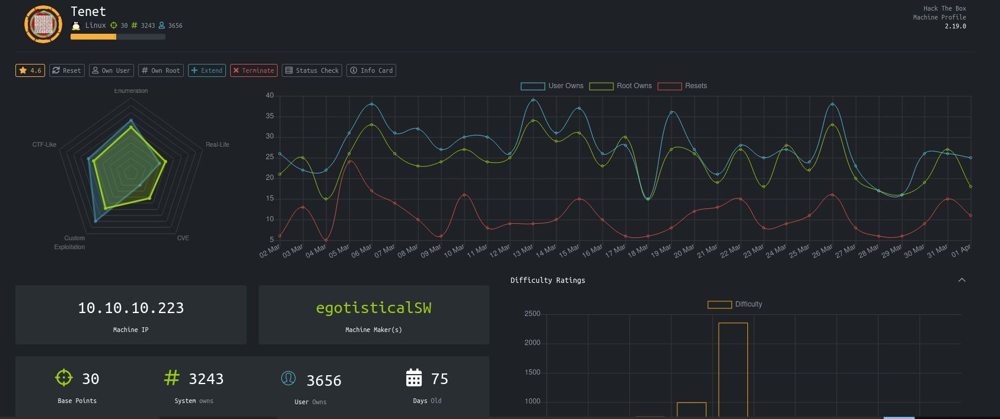
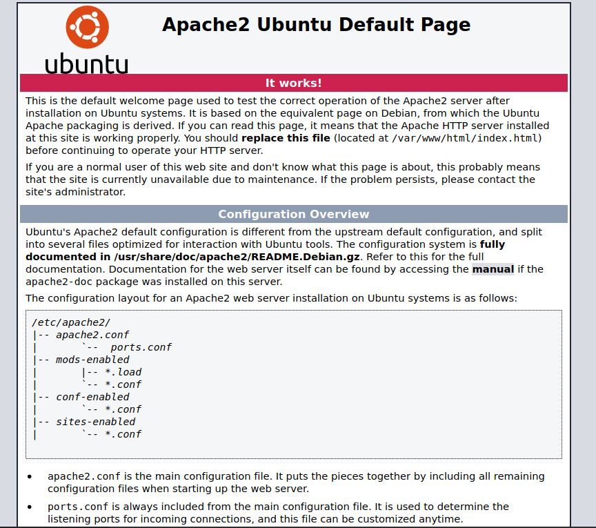

# Tenet - HackTheBox
Linux, 30 Base Points, Medium

## Machine


 
## Tenet Solution

### User

So let's start with ```nmap``` scanning:

```console
┌─[evyatar@parrot]─[/hackthebox/Tenet]
└──╼ $nmap -sC -sV -oA nmap/Tenet 10.10.10.223
Starting Nmap 7.80 ( https://nmap.org ) at 2021-04-01 21:06 IDT
Nmap scan report for 10.10.10.223
Host is up (0.078s latency).
Not shown: 997 closed ports
PORT     STATE    SERVICE     VERSION
22/tcp   open     ssh         OpenSSH 7.6p1 Ubuntu 4ubuntu0.3 (Ubuntu Linux; protocol 2.0)
| ssh-hostkey: 
|   2048 cc:ca:43:d4:4c:e7:4e:bf:26:f4:27:ea:b8:75:a8:f8 (RSA)
|   256 85:f3:ac:ba:1a:6a:03:59:e2:7e:86:47:e7:3e:3c:00 (ECDSA)
|_  256 e7:e9:9a:dd:c3:4a:2f:7a:e1:e0:5d:a2:b0:ca:44:a8 (ED25519)
80/tcp   open     http        Apache httpd 2.4.29 ((Ubuntu))
|_http-server-header: Apache/2.4.29 (Ubuntu)
|_http-title: Apache2 Ubuntu Default Page: It works
2725/tcp filtered msolap-ptp2
Service Info: OS: Linux; CPE: cpe:/o:linux:linux_kernel

Service detection performed. Please report any incorrect results at https://nmap.org/submit/ .
Nmap done: 1 IP address (1 host up) scanned in 12.33 second

```

Let's try to observe port 80:



Nothing juicy.

By running [gobuster](https://github.com/OJ/gobuster) as follow:
```console
┌─[evyatar@parrot]─[/hackthebox/Tenet]
└──╼ $gobuster dir -u http://10.10.10.223 -x php,log,txt -w /usr/share/dirbuster/wordlists/directory-list-2.3-medium.txt --wildcard -o gob
===============================================================
Gobuster v3.0.1
by OJ Reeves (@TheColonial) & Christian Mehlmauer (@_FireFart_)
===============================================================
[+] Url:            http://10.10.10.223
[+] Threads:        10
[+] Wordlist:       /usr/share/dirbuster/wordlists/directory-list-2.3-medium.txt
[+] Status codes:   200,204,301,302,307,401,403
[+] User Agent:     gobuster/3.0.1
[+] Extensions:     log,txt,php
[+] Timeout:        10s
===============================================================
2021/04/01 21:10:15 Starting gobuster
===============================================================
/users.txt (Status: 200)
/wordpress (Status: 301)
...
```

## Tenet is still active machine - [Full writeup](Tenet-Writeup.pdf) avaliable with root password only.

Telegram: [@evyatar9](https://t.me/evyatar9)

Discord: [evyatar9](https://discordapp.com/users/812805349815091251)