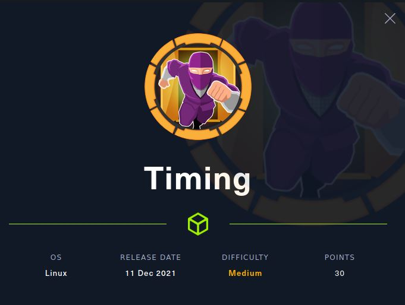
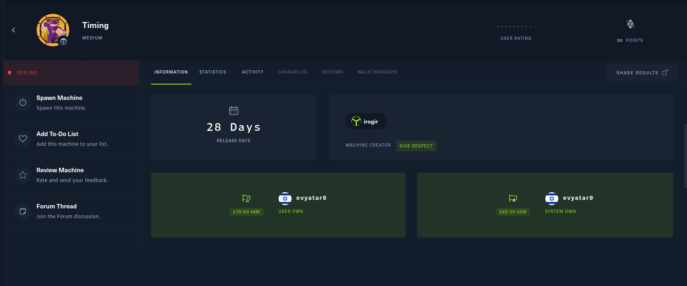

# Timing - HackTheBox - Writeup
Linux, 30 Base Points, Medium



## Machine



## Timing Solution

### User

Let's start with ```nmap``` scanning:

```console
┌─[evyatar@parrot]─[/hackthebox/Timing]
└──╼ $ nmap -sV -sC -oA nmap/Timing 10.10.11.135
Starting Nmap 7.80 ( https://nmap.org ) at 2021-12-24 00:41 IST
Nmap scan report for 10.10.11.135
Host is up (0.23s latency).
Not shown: 998 closed ports
PORT   STATE SERVICE VERSION
22/tcp open  ssh     OpenSSH 7.6p1 Ubuntu 4ubuntu0.5 (Ubuntu Linux; protocol 2.0)
| ssh-hostkey: 
|   2048 d2:5c:40:d7:c9:fe:ff:a8:83:c3:6e:cd:60:11:d2:eb (RSA)
|   256 18:c9:f7:b9:27:36:a1:16:59:23:35:84:34:31:b3:ad (ECDSA)
|_  256 a2:2d:ee:db:4e:bf:f9:3f:8b:d4:cf:b4:12:d8:20:f2 (ED25519)
80/tcp open  http    Apache httpd 2.4.29 ((Ubuntu))
| http-cookie-flags: 
|   /: 
|     PHPSESSID: 
|_      httponly flag not set
|_http-server-header: Apache/2.4.29 (Ubuntu)
| http-title: Simple WebApp
|_Requested resource was ./login.php
Service Info: OS: Linux; CPE: cpe:/o:linux:linux_kernel

```

By observing port 80 we get the following web page:


## Timing is still active machine - [Full writeup](Timing-Writeup.pdf) available with root hash password only.

Telegram: [@evyatar9](https://t.me/evyatar9)

Discord: [evyatar9](https://discordapp.com/users/812805349815091251)

